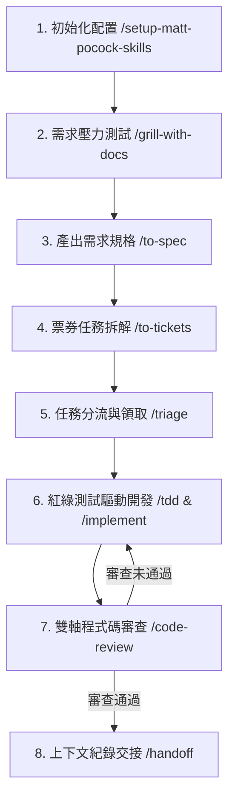

# 🛠️ Matt Pocock Agent Skills (繁體中文版)

本目錄已完整導入並建置 **Matt Pocock Agent Skills** 官方最新版之 26 個穩定版技能，所有說明與指令均已翻譯為高質量**繁體中文**，並統一對重要與關鍵技術名詞採用 `中文 (Original English)` 雙語標註格式。

> **設計哲學**：這些技能旨在幫助開發團隊與 AI Agent 建立高強度的邊界對齊與溝通機制，徹底杜絕缺乏規範的盲目編碼 (Vibe Coding)，將數十年工程經驗轉化為可重複執行的 Agent 護欄。

---

## 📂 安裝技能檔案清單 (26 穩定版技能)

### 🛠️ 工程開發 (`.agents/skills/engineering/` - 17 個技能)

- [ask-matt](./engineering/ask-matt/SKILL.md) — 諮詢 Matt Pocock 思維 (Ask Matt)
- [code-review](./engineering/code-review/SKILL.md) — 程式碼審查 (Code Review)
- [codebase-design](./engineering/codebase-design/SKILL.md) — 程式碼庫架構設計 (Codebase Design)
- [diagnosing-bugs](./engineering/diagnosing-bugs/SKILL.md) — 錯誤診斷與排錯 (Diagnosing Bugs)
- [domain-modeling](./engineering/domain-modeling/SKILL.md) — 領域模型建構 (Domain Modeling)
- [grill-with-docs](./engineering/grill-with-docs/SKILL.md) — 結合文件進行深度審視 (Grill with Docs)
- [implement](./engineering/implement/SKILL.md) — 任務實作 (Implement)
- [improve-codebase-architecture](./engineering/improve-codebase-architecture/SKILL.md) — 改善程式碼庫架構 (Improve Codebase Architecture)
- [prototype](./engineering/prototype/SKILL.md) — 快速原型開發 (Prototype)
- [research](./engineering/research/SKILL.md) — 技術調研 (Research)
- [resolving-merge-conflicts](./engineering/resolving-merge-conflicts/SKILL.md) — 解決合併衝突 (Resolving Merge Conflicts)
- [setup-matt-pocock-skills](./engineering/setup-matt-pocock-skills/SKILL.md) — 初始化技能庫設定 (Setup Skills)
- [tdd](./engineering/tdd/SKILL.md) — 測試驅動開發 (Test-Driven Development)
- [to-spec](./engineering/to-spec/SKILL.md) — 轉化為需求規格 (To Spec)
- [to-tickets](./engineering/to-tickets/SKILL.md) — 轉化為任務票券 (To Tickets)
- [triage](./engineering/triage/SKILL.md) — 任務分類與分流 (Triage)
- [wayfinder](./engineering/wayfinder/SKILL.md) — 程式碼庫導覽 (Wayfinder)

### ⚡ 生產力與對齊 (`.agents/skills/productivity/` - 5 個技能)

- [grill-me](./productivity/grill-me/SKILL.md) — 方案高強度拷問 (Grill Me)
- [grilling](./productivity/grilling/SKILL.md) — 拷問面試工作流 (Grilling)
- [handoff](./productivity/handoff/SKILL.md) — 上下文交接 (Handoff)
- [teach](./productivity/teach/SKILL.md) — 概念教學 (Teach)
- [writing-great-skills](./productivity/writing-great-skills/SKILL.md) — 編寫優質技能 (Writing Great Skills)

### 📦 工具與輔助 (`.agents/skills/misc/` - 4 個技能)

- [git-guardrails-claude-code](./misc/git-guardrails-claude-code/SKILL.md) — Git 安全護欄 (Git Guardrails)
- [migrate-to-shoehorn](./misc/migrate-to-shoehorn/SKILL.md) — 遷移至 Shoehorn (Migrate to Shoehorn)
- [scaffold-exercises](./misc/scaffold-exercises/SKILL.md) — 腳手架練習生成 (Scaffold Exercises)
- [setup-pre-commit](./misc/setup-pre-commit/SKILL.md) — 設定 Pre-commit 檢查 (Setup Pre-commit)

---

## 🚀 快速呼叫指引 (Quick Start Guide)

您可以在開發過程中使用以下指令呼叫對應的技能：

- **專案初次設定**：`/setup-matt-pocock-skills`
- **需求審視與壓力測試**：`/grill-me` 或 `/grill-with-docs`
- **測試驅動開發**：`/tdd`
- **程式碼審查**：`/code-review`

---

## 💡 相關適配使用建議 (Adaptation & Usage Recommendations)

1. **防範 Vibe Coding**：不要直接要求 Agent 生成大量未經對齊的程式碼。在大型變更前，一律先執行 `/grill-me` 或 `/grill-with-docs` 逼出隱性假設與邊界案例。
2. **遵守縫隙 (Seam) 測試**：使用 `/tdd` 時，務必先與 Agent 對齊「測試縫隙 (Test Seams)」，只在公開介面切片測試，絕不針對私有內部細節編寫脆性測試。
3. **長會話防禦**：當 Token 或會話過長時，適時執行 `/handoff` 產出交接點脈絡，再開啟新對話，避免 Agent 記憶衰退與幻覺。
4. **Issue 追蹤對齊**：善用 `.scratch/` 本地 Issue 追蹤機制，搭配 `/to-spec` 與 `/to-tickets` 將巨型需求拆解為微小可驗收的獨立單元。

---

## 🔄 閉環工作流程建議 (Closed-Loop Workflow Blueprint)

### 工作流階段解析

1. **對齊階段 (Alignment)**：執行 `/setup-matt-pocock-skills` 定義追蹤器與領域文檔規約。
2. **拷問階段 (Grilling)**：透過 `/grill-with-docs` 精準對齊架構決策 (ADR) 與術語 (Glossary)。
3. **規格化階段 (Specification)**：執行 `/to-spec` 產出具備驗收條件 (Acceptance Criteria) 的 PRD，隨後執行 `/to-tickets` 拆解為單一權責 Ticket。
4. **實作階段 (Implementation)**：經由 `/triage` 領取任務，並全程嚴格遵循 `/tdd`（先紅後綠、單一切片）實作程式碼。
5. **門禁與交付階段 (Gate & Handoff)**：提交前執行 `/code-review` 進行「標準 (Standards)」與「規格 (Spec)」雙軸平行自動化驗收，最終透過 `/handoff` 歸檔完整交接紀錄。
