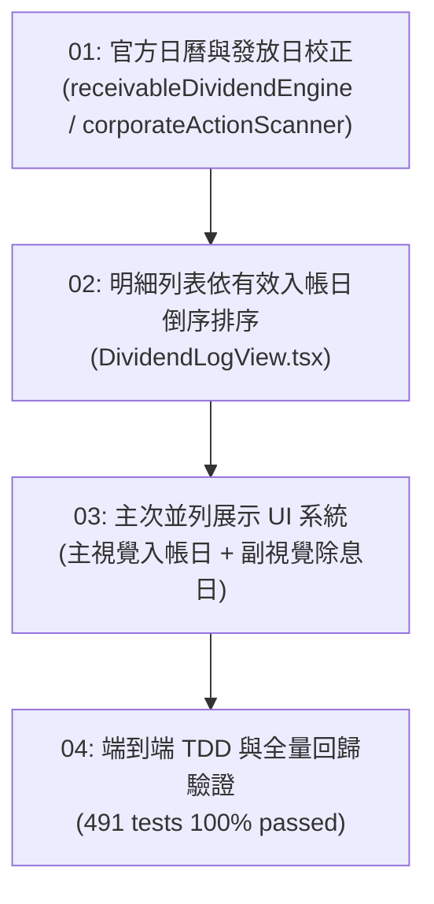

# 任務票券索引清單 (Tickets Index) — v7.6.0

本目錄收錄 [PRD #0076](file:///d:/APP/股票紀錄/docs/specs/0076-dividend-log-view-pay-date-temporal-separation-and-sorting-spec.md) 拆解後之垂直切片任務票券 (Tracer Bullet Tickets)：

| 編號 | 票券標題 | 阻擋依賴 (Blocked by) | 狀態 | 關聯檔案 |
| :--- | :--- | :--- | :---: | :--- |
| **01** | [官方除權息行事曆基準庫與發放日校正](./issues/01-official-dividend-calendar-and-pay-date-alignment.md) | None | `closed` | `receivableDividendEngine.ts`, `corporateActionScanner.ts` |
| **02** | [歷史現金股利明細列表依有效入帳日倒序排序](./issues/02-dividend-log-view-pay-date-temporal-separation-and-sorting.md) | 01 | `closed` | `DividendLogView.tsx` |
| **03** | [入帳日期欄位主次並列展示 UI 系統](./issues/03-dividend-table-primary-secondary-dual-display-ui.md) | 02 | `closed` | `DividendLogView.tsx` |
| **04** | [端到端 TDD 與全專案防禦性回歸驗證](./issues/04-end-to-end-tdd-and-regression-verification.md) | 03 | `closed` | `DividendLogView.test.ts`, `corporateActionScanner.test.ts` |

---

### 依賴拓撲圖 (Dependency Graph)

