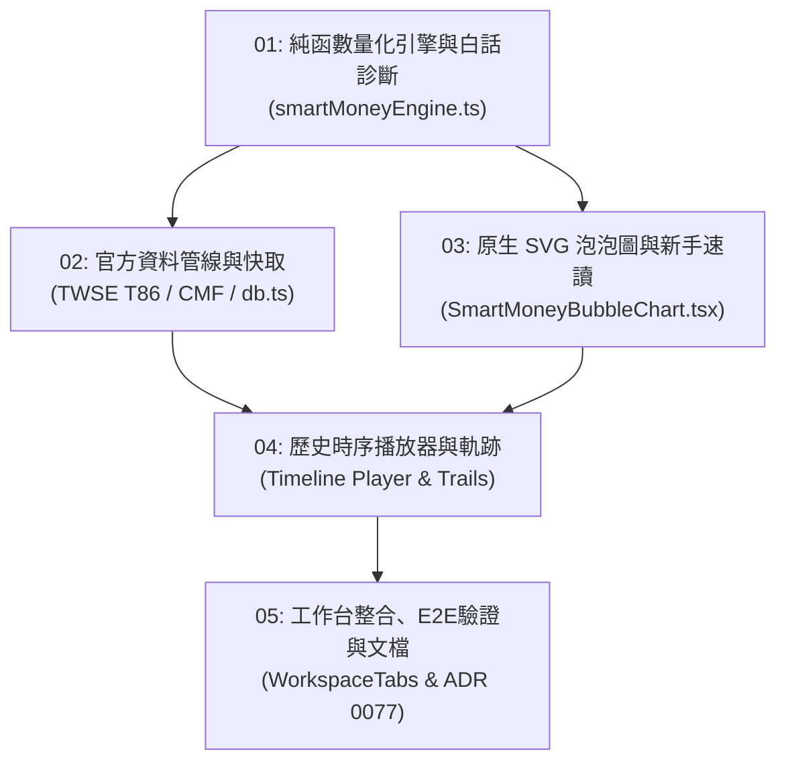

# 任務票券索引清單 (Tickets Index) — v7.7.0

本目錄收錄 [PRD #0077](file:///d:/APP/股票紀錄/docs/specs/0077-smart-money-bubble-view-and-chip-flow-dynamics-spec.md) 拆解後之垂直切片任務票券 (Tracer Bullet Tickets)：

| 編號 | 票券標題 | 阻擋依賴 (Blocked by) | 狀態 | 關聯檔案 |
| :--- | :--- | :--- | :---: | :--- |
| **01** | [純函數量化計算引擎與小白友善診斷器](./issues/01-smart-money-engine-and-beginner-diagnosis.md) | None | `closed` | `smartMoneyEngine.ts`, `smartMoneyEngine.test.ts` |
| **02** | [官方資料管線與本地快取降級](./issues/02-official-data-pipeline-and-indexeddb-cache.md) | 01 | `closed` | `smartMoneyFetcher.ts`, `db.ts` |
| **03** | [原生 SVG 泡泡圖與小白三秒速讀四象限視圖](./issues/03-svg-bubble-chart-and-beginner-friendly-quadrants.md) | 01 | `closed` | `SmartMoneyBubbleChart.tsx` |
| **04** | [歷史時序播放器與彗星位移軌跡](./issues/04-timeline-motion-player-and-trails.md) | 02, 03 | `closed` | `SmartMoneyBubbleChart.tsx`, `ChipsWorkspace.tsx` |
| **05** | [工作台整合、全量驗證與文檔同步](./issues/05-workspace-tabs-integration-and-docs-sync.md) | 04 | `closed` | `WorkspaceTabs.tsx`, `App.tsx`, `CONTEXT.md` |

---

### 依賴拓撲圖 (Dependency Graph)

