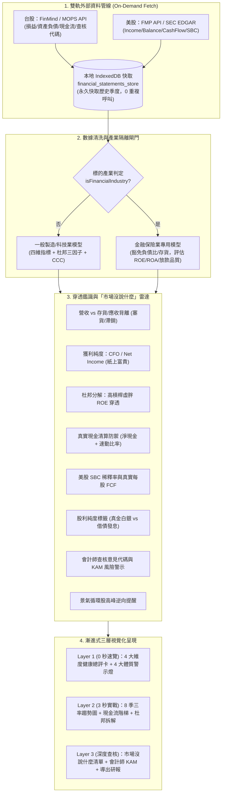

# Spec 0123: 穿透式財報分析儀與財務防雷偵測系統 (Financial Statement Analyzer & Forensic Radar System)

## Problem Statement

當前系統已具備完善的交易帳本、即時報價、主力籌碼（Smart Money）與全能技術指標大腦（Omni Technical Brain），但在基本面與財務報表分析領域仍存在嚴重真空與散戶常見盲點：

1. **財務數據真空與落後指標陷阱**：使用者在評估持倉或新標的時，缺乏結構化的財報分析支援。多數人僅仰賴新聞標題（如「營收創新高」、「EPS 翻倍」），容易在財報公布當天陷入法人「利多出盡 (Sell the News)」的倒貨陷阱。
2. **「市場沒說什麼」的財務粉飾盲點**：
   - **紙上富貴**：淨利創新高，但營業活動現金流 (CFO) 為負或大幅萎縮，獲利全卡在應收帳款與存貨。
   - **塞貨危機**：營收微幅成長，但應收帳款週轉天數 (DSO) 與存貨週轉天數 (DIO) 暴增數十天，未來面臨大額呆帳與跌價損失。
   - **借債配息**：表面殖利率高達 7%~8%，但公司自由現金流 (FCF) 為負，實際上是靠借新債或掏空資本公積發放股利。
   - **股權激勵稀釋 (SBC)**：美股成長型公司宣稱 Non-GAAP 獲利亮眼，但巨額 Stock-Based Compensation 嚴重稀釋老股東每股實質權益。
3. **忽視會計師審查意見與關鍵查核事項 (KAM)**：使用者鮮少閱讀長達數百頁的財報全文，容易忽略非無保留意見、頻繁更換事務所、或是會計師在 KAM 中點名的高風險存貨減損與收入認列爭議。
4. **過度工程化與產業通用破綻**：
   - 若試圖以 OCR/爬蟲解析數百頁 PDF 財報，將導致 API/Token 消耗崩潰、延遲嚴重且頻遭 MOPS 封鎖。
   - 若一視同仁地將「負債比 > 70%」、「存貨週轉天數」套用在銀行、金控等金融股，將引發大批假陽性 (False Positive) 垃圾警報，摧毀使用者信任。
   - 景氣循環股（如海運、記憶體、鋼鐵）在單季財報獲利「滿分」時往往正是股價景氣最高峰，若純看歷史趨勢將誤導使用者高檔接刀。

## Solution

依據 **KISS 原則** 與 **第一性原理**，建立**「雙軌外部數據管線 + 本地 8 季 IndexedDB 快取 + 四大核心指標體系 + 複合鑑識防雷雷達 + 產業屬性隔離防禦」**的穿透式財報分析系統：

### 核心架構：四大基本面維度與複合交叉檢驗體系

本系統全面落實基本面分析的四大核心柱石，並補強關鍵的「複合交叉指標」，杜絕孤立看數據的盲點：

1. **獲利能力 (Profitability - 公司賺不賺錢？)**：
   - 營業收入 (Revenue)、毛利率 (Gross Margin)、營業利益率 (Operating Margin)、稅後淨利與 EPS。
   - **杜邦分析三因子拆解 (DuPont Analysis)**：將 $ROE = \text{淨利率} \times \text{資產週轉率} \times \text{權益乘數}$，一眼識破高 ROE 是本業定價權還是借大錢開槓桿。
2. **安全性與償債結構 (Safety & Solvency - 公司會不會倒閉？)**：
   - 負債比率 (Debt Ratio)、流動比率 (Current Ratio)、速動比率 (Quick Ratio - 剔除變現慢的存貨與預付款)。
   - 利息保障倍數 (Interest Coverage) 與 **真實淨現金水位 (Net Cash = 現金及約當現金 - 有息負債)**。
3. **營運效率與資產品質 (Efficiency & Quality - 公司的錢轉得快不快？)**：
   - 應收帳款週轉天數 (DSO)、存貨週轉天數 (DIO) 與現金轉換週期 ($CCC = DSO + DIO - DPO$)。
4. **現金流健康度 (Cash Flow Reality - 賺到的錢是不是真鈔？)**：
   - 營業現金流量 (CFO)、自由現金流量 ($FCF = CFO - Capex$)、美股扣除 SBC 真實 FCF、現金流量允當比率。
5. **神級複合防禦：資本配置與法人穿透 (Capital Allocation & Quality)**：
   - **股利純度 (Dividend Purity)**：本業 FCF 配息 vs 借債發息 vs 資本公積老本。
   - **市值創造檢驗 (Incremental ROIC)**：每一塊錢未分配留存收益是否轉化為大於 1 塊錢的股東實質價值。



---

## User Stories & Acceptance Scenarios

本系統基於五大典型投資人角色（Personas）構建完整的實戰場景與驗收標準：

---

### Persona A: 退休存股族（高股息與本金安全追求者 - "Dividend & Safety Seeker"）
> **角色特徵**：資金規模大，追求長期穩定的被動現金流，極度恐懼「賺了股息、賠了本金」，最怕踩中「借債發息」或「掏空老本」的虛胖殖利率公司。

* **US-01: 股息發放真金白銀純度驗證 (Dividend Purity Audit)**
  * **As a** 退休存股投資人
  * **I want to** 一眼看到標的過去 4 季的股息來源標籤（`真金白銀 FCF` vs `掏空老本/資本公積` vs `舉債配息`）
  * **So that** 我能避開自由現金流不足、靠借新債維持表面高殖利率的地雷公司，確保配息可持續性。
  * **Acceptance Scenario (Given-When-Then)**:
    * **Given** 某上市櫃公司宣布發放高額現金股利，表面殖利率達 8.5%，但近 4 季營業現金流減資本支出 ($FCF$) 為負值，且負債總額較去年同期上升。
    * **When** 使用者在系統中點開該標的的財報分析面板。
    * **Then** 系統在現金流安全卡片上強制亮起 🟡 **「借債配息警戒」**，明確提示「本期股息發放額大於自由現金流，係透過舉債或消耗帳上現金支應，發放品質脆弱」，並展示 $FCF$ 階梯圖。

* **US-02: 實質淨現金清償能力檢驗 (Net Cash Liquidity Guard)**
  * **As a** 風險厭惡型保守投資者
  * **I want to** 查看標的的「真實淨現金水位 ($Net\ Cash = 現金及約當現金 - 全部有息負債$)」與速動比率
  * **So that** 我能確保公司在突發黑天鵝或信貸凍結時，帳上真金白銀足以清償所有短期債務，絕無週轉不靈下市風險。
  * **Acceptance Scenario (Given-When-Then)**:
    * **Given** 標的資產負債表中流動資產看似充足（流動比率 190%），但其中 60% 為滯銷存貨，帳上有息短期借款大於可用現金。
    * **When** 系統計算安全性維度指標。
    * **Then** 系統扣除存貨與預付款計算出速動比率（< 100%），並計算 $Net\ Cash < 0$，在「安全性與償債結構」燈號標註為黃色警戒，而非單純依賴流動比率給予綠燈。

---

### Persona B: 美股與成長型科技股投資人 ("Tech & Growth Investor")
> **角色特徵**：佈局美股高成長雲端/AI 科技股（如 SaaS、半導體），重視營收擴張動能與定價權，但深受「Non-GAAP 獲利美化」與「股權激勵稀釋」困擾。

* **US-03: 美股股權激勵 (SBC) 穿透與真實每股 FCF (SBC Dilution Penetration)**
  * **As a** 美股科技股投資者
  * **I want to** 查看扣除 Stock-Based Compensation (SBC) 後的「真實股東每股自由現金流 ($Real\ FCF\ per\ Share$)」與 SBC 佔營收比重
  * **So that** 我能看穿 Non-GAAP 的獲利假象，評估員工期權是否正在持續稀釋外部普通股東的實質價值。
  * **Acceptance Scenario (Given-When-Then)**:
    * **Given** 一檔美股雲端運算標的公布最新季報，Non-GAAP EPS 轉正且大幅超越華爾街預期，但該季度 SBC 金額佔總營收比例高達 22%。
    * **When** 使用者切換至該美股標的的財務戰情報告。
    * **Then** 系統在獲利卡片上標註 🟡 **「SBC 稀釋警戒 (22% of Rev)」**，並排展示「GAAP 每股 FCF」與「扣除 SBC 後真實 FCF」，明確提示潛在股本稀釋壓力。

* **US-04: 連續 8 季毛利率護城河走勢 (Gross Margin Moat Tracker)**
  * **As a** 追求成長型企業的投資者
  * **I want to** 觀察過去 8 季的毛利率與營益率連續折線圖，並捕捉兩者變動方向
  * **So that** 我能判斷公司的定價權（毛利率是否上升）與研發營運費用控管能力，及早發現削價競爭的開端。
  * **Acceptance Scenario (Given-When-Then)**:
    * **Given** 某成長股近 2 季營收仍維持 20% 年增，但毛利率已由 55% 連續 3 季滑落至 42%。
    * **When** 使用者查看趨勢圖表。
    * **Then** 系統在獲利能力維度標記「護城河警訊：毛利率連續 3 季萎縮」，提示雖然量在擴大，但產品定價權遭到侵蝕。

---

### Persona C: 深度基本面與鑑識價值投資人 ("Forensic Value Investor")
> **角色特徵**：信奉葛拉漢與查理·蒙格，以嚴格的懷疑論檢視財報，尋找「市場沒說什麼」的財務背離漏洞，絕不上當接刀。

* **US-05: 營收創高 vs 塞貨庫存積壓背離偵測 (Revenue vs DSO/DIO Divergence)**
  * **As a** 專業基本面分析者
  * **I want to** 系統自動比對營收年增率、應收帳款週轉天數 (DSO) 與存貨週轉天數 (DIO)
  * **So that** 當公司透過放寬授信塞貨給經銷商或產品滯銷時，我能第一時間收到「塞貨/滯銷警戒」，避開未來的呆帳暴雷與降價跌價損失。
  * **Acceptance Scenario (Given-When-Then)**:
    * **Given** 某製造業標的 Q2 營收年增 12% 創歷史單季新高，但其應收帳款週轉天數由 65 天暴增至 95 天，存貨週轉天數由 70 天升至 105 天。
    * **When** 鑑識防雷引擎執行背景分析。
    * **Then** 系統在「市場沒說什麼」區塊立即彈出 🔴 **「塞貨滯銷背離：營收增但 DSO 飆增 30 天、DIO 飆增 35 天」**，並給予一星評級警告。

* **US-06: 淨利與營業現金流背離排查 (Cash Flow vs Earnings Quality)**
  * **As a** 鑑識投資者
  * **I want to** 檢驗稅後淨利與營業活動現金流 (CFO) 的匹配度（$CFO / Net\ Income$ 比率）
  * **So that** 當淨利大增但現金流轉負時，系統能揭露「紙上富貴」真相。
  * **Acceptance Scenario (Given-When-Then)**:
    * **Given** 某公司單季淨利潤較去年同期大增 45%，但營業活動現金流 (CFO) 卻呈現淨流出 (-1.2 億元)。
    * **When** 使用者進入體質診斷。
    * **Then** 系統將現金流燈號標為 🔴 **「高危紙上富貴」**，提示獲利主要由應收未收項目或帳面資產重估貢獻，未實際收到真金白銀。

* **US-07: 杜邦分析三因子拆解虛胖 ROE (DuPont High-Leverage Breakdown)**
  * **As a** 價值評估者
  * **I want to** 系統將 ROE 自動拆解為「淨利率 × 資產週轉率 × 權益乘數」
  * **So that** 我能看清一家高 ROE 公司究竟是定價能力強、資產週轉快、還是單純借大錢加槓桿。
  * **Acceptance Scenario (Given-When-Then)**:
    * **Given** 某公司 ROE 高達 22%，但淨利率僅 3%，權益乘數高達 5.5（負債比 82%）。
    * **When** 使用者查看杜邦拆解圖表。
    * **Then** 系統直觀用色彩標示其驅動因子：獲利率（弱）、週轉率（中）、槓桿乘數（極高），並提示「高槓桿推升型 ROE，警惕利率上升風險」。

* **US-08: 會計師查核意見與關鍵查核事項 (KAM) 稽核 (Auditor Opinion & KAM Inspection)**
  * **As a** 防雷審計型投資者
  * **I want to** 查看簽證會計師事務所名稱、查核意見類型（無保留/保留/無法表示意見）與 KAM 關鍵查核事項摘要
  * **So that** 當會計師出具非無保留意見、非四大事務所、或在 KAM 中提及重大存貨減損時，我能獲得最高等級警報。
  * **Acceptance Scenario (Given-When-Then)**:
    * **Given** 某公司年度財報出具「保留意見」，或兩年內無理由變更簽證會計師。
    * **When** 系統剖析外部查核代碼。
    * **Then** 系統總評卡強制降級為 🔴 **「DANGEROUS (重大審計警訊)」**，禁止評為健康等級，並置頂顯示會計師查核意見紅字提醒。

---

### Persona D: 金融股存股族與景氣循環交易者 ("Cyclical & Financial Allocator")
> **角色特徵**：持有金控、銀行股或航運、鋼鐵、塑化、記憶體等強週期性股票，需要專屬的領域邏輯避免常態假警報或高點接刀。

* **US-09: 金融類股指標自動豁免與轉向評估 (Financial Industry Gate & Exemption)**
  * **As a** 銀行與金控股持股人（如持有中信金、富邦金）
  * **I want to** 系統自動識別金融業屬性，自動停用一般製造業的「負債比 > 70% 警告」與「存貨週轉天數」
  * **So that** 系統不會天天對正常經營的金控公司發出瀕臨破產的垃圾假警報，並自動改以 ROE、ROA、淨利年增率與配息能力評估。
  * **Acceptance Scenario (Given-When-Then)**:
    * **Given** 使用者點選代碼為 2891 (中信金) 之持倉標的，其負債比率為 91.5%（包含廣大儲戶存款）。
    * **When** 產業隔離閘門識別其為金融業。
    * **Then** 系統自動標註「🏦 金融保險專用模型」，安全性燈號顯示為「正常（存款負債結構豁免）」，不扣除安全性分數，維持客觀評分。

* **US-10: 景氣循環股高峰財報滿分逆向警報 (Cyclical Peak Contrarian Alert)**
  * **As a** 週期類股交易者（如海運、記憶體）
  * **I want to** 當查詢強週期性標的時，即便其單季營收、毛利、EPS 達到 8 季歷史巔峰
  * **So that** 系統能主動標記「景氣循環頂峰警示」，防止我將歷史最高獲利盲目年化而買在景氣反轉最高峰。
  * **Acceptance Scenario (Given-When-Then)**:
    * **Given** 某航運股公布最新季報，單季 EPS 創歷史新高，ROE 達 40%，各項量化指標全數綠燈。
    * **When** 系統比對其產業代碼為強週期類股。
    * **Then** 系統在健康卡片右上角亮起特殊提示標籤：`⚠️ 景氣循環提醒：目前處於週期高點，單季獲利不宜直接年化，請密切關注運價與產能供需`。

---

### Persona E: 忙碌上班族與極速決策者 ("At-a-Glance Executive")
> **角色特徵**：平時忙於工作，無暇閱讀數萬字財報與數十個圖表，需要 0 秒看懂、3 秒決策的極致體驗。

* **US-11: 0 秒核心戰報卡與四大體質燈號 (0-Second Executive Health Card)**
  * **As a** 時間有限的投資人
  * **I want to** 在打開財報面板的第一秒內，看到一個綜合健康分數 (0~100)、四大維度燈號（獲利、安全、效率、現金）與一句白話總結
  * **So that** 我能在 0 秒內知道這家公司目前是健康、警戒還是危險，無需自己計算或心算。
  * **Acceptance Scenario (Given-When-Then)**:
    * **Given** 使用者在持倉清單中點擊任一股票的財報按鈕。
    * **When** 模態視窗在 500ms 內浮現。
    * **Then** 最頂部 Hero 區塊呈現：
      - 總評分：`88 / 100` (`HEALTHY`)
      - 四大指示燈：獲利 🟢、安全 🟢、效率 🟢、現金 🟢
      - 一句話總評：「本業造血強勁，連續 8 季毛利率穩健擴張，未檢出結構性財務背離」。

* **US-12: 本地 IndexedDB 永久無損快取與零重複消耗 (Offline Persistence & Zero-Cost Guard)**
  * **As a** 重視隱私與系統響應速度的用戶
  * **I want to** 已下載的歷史季度財報永久快取在本地瀏覽器 IndexedDB 中
  * **So that** 再次點開時 0ms 秒出，離線也能查看，且絕不重複發送請求消耗我寶貴的免費 API 配額。
  * **Acceptance Scenario (Given-When-Then)**:
    * **Given** 使用者昨天已查詢過台積電 (2330) 的近 8 季財報，數據已存於 `financial_statements_store`。
    * **When** 使用者今天在無網路連線或重新打開系統時再次點擊 2330。
    * **Then** 系統直接自 IndexedDB 讀取數據並於 0ms 內完成渲染，完全不觸發任何對外 Fetch 請求。

---

## Implementation Decisions

### 1. 外部資料抓取與本地 IndexedDB 永續快取 (Dual Pipeline & Cache)

* **資料管道架構**：
  * **台股管道 (TW)**：整合 `FinMind API`（`TaiwanStockFinancialStatements`、`TaiwanStockBalanceSheet`、`TaiwanStockCashFlowsStatement`）或公開觀測站 OpenAPI，擷取近 8~12 季結構化欄位。
  * **美股管道 (US)**：整合 `FMP API`（`income-statement`、`balance-sheet-statement`、`cash-flow-statement`）或 SEC EDGAR Company Facts API，擷取季度三表與 SBC 欄位。
* **KISS 欄位極簡收斂 (僅收錄 16 個核心欄位)**：
  * **損益 (Income)**：`revenue` (營業收入)、`grossProfit` (營業毛利)、`operatingIncome` (營業利益)、`netIncome` (稅後淨利)、`eps` (每股盈餘)。
  * **資產負債 (Balance Sheet)**：`totalAssets` (總資產)、`totalLiabilities` (總負債)、`totalEquity` (股東權益)、`accountsReceivable` (應收帳款與票據)、`inventory` (存貨)、`cashAndEquivalents` (現金與約當現金)、`shortTermDebt` (短期借款)、`longTermDebt` (長期負債)。
  * **現金流量 (Cash Flow)**：`operatingCashFlow` (營業活動現金流 CFO)、`capitalExpenditure` (資本支出 Capex)、`stockBasedCompensation` (美股股權激勵 SBC)、`dividendPaid` (支付之現金股利)。
* **本地 IndexedDB 儲存物件結構**：
  ```typescript
  export interface QuarterlyFinancialRecord {
    symbol: string;               // 標的代碼 (e.g., '2330', 'AAPL')
    market: 'TW' | 'US';          // 市場類別
    year: number;                 // 年度 (西元, e.g., 2025)
    quarter: number;              // 季度 (1 | 2 | 3 | 4)
    periodDate: string;           // 結算日 (e.g., '2025-06-30')
    income: {
      revenue: number;
      grossProfit: number;
      operatingIncome: number;
      netIncome: number;
      eps: number;
    };
    balanceSheet: {
      totalAssets: number;
      totalLiabilities: number;
      totalEquity: number;
      accountsReceivable: number;
      inventory: number;
      cashAndEquivalents: number;
      shortTermDebt?: number;
      longTermDebt?: number;
    };
    cashFlow: {
      operatingCashFlow: number;
      capitalExpenditure: number;
      stockBasedCompensation?: number;
      dividendPaid?: number;
    };
    auditInfo?: {
      opinionType: 'UNQUALIFIED' | 'QUALIFIED' | 'DISCLAIMER' | 'ADVERSE' | 'UNREVIEWED';
      cpaFirm?: string;
      isBigFour?: boolean;
      keyAuditMatters?: string[];
    };
    updatedAt: number;
  }
  ```

---

### 2. 核心比率與 8 季歷史趨勢演算法 (Quantitative Trend Engine)

* **獲利三率 (Profitability Margins)**：
  * 毛利率：$\text{Gross Margin} = \frac{\text{grossProfit}}{\text{revenue}} \times 100\%$
  * 營業利益率：$\text{Operating Margin} = \frac{\text{operatingIncome}}{\text{revenue}} \times 100\%$
  * 淨利率：$\text{Net Margin} = \frac{\text{netIncome}}{\text{revenue}} \times 100\%$
* **安全性與流動性防禦 (Safety & Liquidity)**：
  * 負債比率：$\text{Debt Ratio} = \frac{\text{totalLiabilities}}{\text{totalAssets}} \times 100\%$
  * 速動比率 (Quick Ratio)：$\text{Quick Ratio} = \frac{\text{cashAndEquivalents} + \text{accountsReceivable}}{\text{totalLiabilities}} \times 100\%$
  * 真實淨現金水位 (Net Cash)：$\text{Net Cash} = \text{cashAndEquivalents} - (\text{shortTermDebt} + \text{longTermDebt})$（若無單獨拆解負債，則以流動資產減總負債為防線）
* **真金白銀自由現金流 (Free Cash Flow, FCF)**：
  * 一般製造業：$FCF = \text{operatingCashFlow} - |\text{capitalExpenditure}|$
  * 美股真實股東 FCF：$\text{Real FCF} = FCF - \text{stockBasedCompensation}$
* **營運週轉效率 (Turnover Days - 季度化以 90 天計算)**：
  * 應收帳款週轉天數：$DSO = \frac{\text{accountsReceivable} \times 90}{\text{revenue}}$
  * 存貨週轉天數：$DIO = \frac{\text{inventory} \times 90}{\text{revenue} - \text{grossProfit}}$（若營業成本為 0 則以 revenue 估計）
  * 現金轉換週期：$CCC = DSO + DIO - DPO$
* **杜邦分析 (DuPont Analysis 三因子分解)**：
  $$\text{ROE} = \text{淨利率} \times \text{資產週轉率} \times \text{權益乘數}$$
  $$ROE = \left(\frac{\text{netIncome}}{\text{revenue}}\right) \times \left(\frac{\text{revenue}}{\text{totalAssets}}\right) \times \left(\frac{\text{totalAssets}}{\text{totalEquity}}\right)$$

---

### 3. 「市場沒說什麼」逆向鑑識雷達 (Forensic Fraud & Risk Radar)

系統針對連續 8 季數據運行以下**六大純前端決定性規則**，精準標記隱藏風險：

| 規則名稱 | 觸發條件 (數學邏輯) | 警報等級 | 市場沒說的真相 (白話解讀) |
| :--- | :--- | :--- | :--- |
| **塞貨/庫存積壓背離 (Divergence: Revenue vs DSO/DIO)** | 營收 YoY $> 0$，但 $DSO_{t} - DSO_{t-4} > 20\text{ 天}$ 或 $DIO_{t} - DIO_{t-4} > 30\text{ 天}$ | 🔴 高危 | 營收帳面漂亮，但貨物大量滯銷於通路，未來面臨打折清倉與呆帳風險。 |
| **紙上富貴 (Earnings Quality: Cash vs Net Income)** | $\text{netIncome} > 0$ 但 $\text{operatingCashFlow} \le 0$，或連續 2 季 $\frac{\text{operatingCashFlow}}{\text{netIncome}} < 0.6$ | 🔴 高危 | 獲利多為未收回帳款或資產評價利益，缺乏現金入帳支撐。 |
| **借債配息 (Debt-Funded Dividend)** | 當期 $\text{dividendPaid} > 0$ 且 $\text{dividendPaid} > FCF \times 1.5$，且負債比率上升 | 🟡 警戒 | 自由現金流不足以支應股息，公司靠舉債或處分資產維持表面高殖利率。 |
| **本業衰退/業外美化 (Core vs Non-Operating Income)** | $\text{netIncome}$ YoY $> 15\%$，但 $\text{operatingIncome}$ YoY $< -10\%$ | 🟡 警戒 | 本業競爭力下滑，靠賣廠房、投資股票等一次性收入粉飾 EPS。 |
| **SBC 股權稀釋黑洞 (SBC Dilution)** | 美股 $\frac{\text{stockBasedCompensation}}{\text{revenue}} > 15\%$ | 🟡 警戒 | Non-GAAP 獲利優於預期，但高額期權正在持續稀釋現有股東權益。 |
| **查核意見異常 (Auditor Red Flag)** | `opinionType !== 'UNQUALIFIED'` 或非四大事務所簽核且資產減損爭議高 | 🔴 致命 | 會計師出具保留意見或對存貨/收入真實性存疑，最高風險。 |

---

### 4. 產業隔離與景氣循環防禦閘門 (Industry Gate & Cyclical Guard)

* **金融股判定 (`isFinancialIndustry`)**：
  * 台股代碼前綴（如 28XX 金融保險類股）或產業標籤包含 `Financials`、`Banking`、`Insurance`。
  * 自動豁免：不計算負債比率、不計算毛利率、不計算存貨週轉天數。
  * 轉向指標：強化 ROE、ROA、稅後淨利年增率、現金股利發放率。
* **強週期景氣循環類股判定 (`isCyclicalIndustry`)**：
  * 涵蓋：航運（2603, 2609, 2615 等）、鋼鐵（20XX）、塑化（13XX）、記憶體等。
  * 當 ROE 或單季營收創 8 季新高時，自動附帶「景氣高點反轉警語」，防範倒後鏡追高。

---

### 5. 三層漸進式決策介面 (Three-Tier Progressive Disclosure UI)

* **Layer 1 (0 秒決策卡 - Executive Summary)**：
  - **財務健康總評**（0~100 分量化評分與評級：`EXCELLENT` / `HEALTHY` / `WARNING` / `DANGEROUS`）。
  - **四大體質指示燈 (Traffic Lights)**：
    1. 🛡️ 護城河三率（綠/黃/紅）
    2. 💧 造血現金流（綠/黃/紅）
    3. 🧱 償債安全性（綠/黃/紅）
    4. 🔍 會計師意見（綠/紅）
  - **一句話核心結論**（例如：「本業造血強勁，8 季毛利持續擴張，無任何財務背離訊號」或「注意！本季營收創高但存貨週轉暴增 35 天，獲利純度低」）。
* **Layer 2 (3 秒實戰矩陣 - Visual Trends)**：
  - **8 季三率走勢圖**（毛利率、營益率、淨利率折線並陳）。
  - **獲利 vs 現金流階梯長條圖**（直觀對比 Net Income 與 CFO，紙上富貴一眼擊穿）。
  - **杜邦拆解儀表板**（ROE 拆解為獲利率、週轉率、財務槓桿）。
* **Layer 3 (深度查核與佐證 - Forensic Drill-Down)**：
  - **「市場沒說什麼」排查診斷卡**：條列 6 大規則的檢驗結果，有異常直接給予白話解構。
  - **會計師查核與 KAM 面板**：事務所名稱、查核意見類型、關鍵查核重點摘要。
  - **一鍵導出 Markdown 深度財報研報**。

---

## Testing Decisions

### 1. 測試縫隙 (Test Seams)

* **Seam 1: 純計算演算法單元測試 (`financialForensicEngine.test.ts`)**：
  - 測試三率、DSO、DIO、CCC、杜邦三因子之純數學計算。
  - 測試六大「市場沒說什麼」規則判定（營收創高 vs 存貨暴增、獲利創高 vs CFO 轉負、借債發股利、SBC 稀釋）。
  - 測試邊界條件：營收為 0、毛利為負、存貨為 0、負債為 0、單季極端異常值。
* **Seam 2: 產業隔離與豁免測試 (`industryGate.test.ts`)**：
  - 測試中信金 (2891)、富邦金 (2881) 輸入時，負債比率與存貨指標被安全豁免，不觸發破產或滯銷假警報。
  - 測試航運股長榮 (2603) 高峰獲利時正確觸發「景氣循環警語」。
* **Seam 3: 本地快取與資料管線測試 (`financialStoragePipeline.test.ts`)**：
  - 測試已存在於 IndexedDB 的季度不重複向外部發送 fetch。
  - 測試新季度數據寫入與合併的冪等性。
* **Seam 4: 元件無損渲染與響應式測試 (`FinancialForensicModal.test.tsx`)**：
  - 測試 0 秒總評卡、趨勢圖表、四大指示燈在空資料、異常資料與完整資料下的穩定渲染，無任何 NaN、null 崩潰或樣式溢出。

---

## 驗收標準 (Acceptance Criteria)

- [ ] 提供台股與美股核心財務數據結構定義與標準化轉換函數。
- [ ] 實作 IndexedDB 快取儲存層，保證歷史財報僅請求一次。
- [ ] 完整實現「市場沒說什麼」六大逆向鑑識規則，判定邏輯 100% 具備測試覆蓋。
- [ ] 正確辨識金融類股與景氣循環股，阻斷假警報與週期陷阱。
- [ ] 提供直觀的三層漸進式財報戰情室 UI，零 Token 消耗、純前端 0ms 秒出分析結果。
- [ ] `npm test` 通過率 100%，`npm run build` TypeScript 0 錯誤。

---

## Out of Scope

為了貫徹 **KISS 原則** 並防止過度工程化與 API/Token 崩潰，以下項目明確排除於本期規格之外：

1. **PDF 財報全文爬蟲與 OCR 剖析**：本期絕不下載或剖析動輒數百頁的年報/季報 PDF 全文，所有數據 100% 仰賴公開觀測站/證交所及 FinMind/FMP 提供的結構化 JSON 資料。
2. **全市場幾千檔股票離線定時全掃**：絕不在背景自動定時爬取全市場所有股票，僅針對使用者「當前持倉」與「自選標的」執行按需抓取 (On-Demand Fetch)。
3. **即時長篇 LLM 財報解讀**：鑑識規則與異常排查一律由前端 Deterministic Rules 秒級運算完成，不呼叫外部付費大模型進行冗長分析，保持零延遲與零額外 Token 費用。
4. **非上市櫃（興櫃/創櫃/OTC Pink Sheet）冷門公司特殊財報**：僅支援台股集中市場 (TWSE)、櫃買市場 (TPEx) 及美股主要交易所 (NYSE/NASDAQ/AMEX) 標準財報申報。
5. **複雜合併報表與子公司穿透拆解**：直接採用會計師查核後的合併財務報告 (Consolidated Financial Statements) 最終數字，不向下深究個別轉投資子公司明細帳。

---

## Further Notes

1. **時序對齊 (Temporal Integrity)**：財報數據以宣告季度 (`year + quarter`) 為時間主鍵，並妥善隔離申報日期 (Filing Date) 與所屬季度結算日 (Period End Date)。
2. **零除防禦 (Division-by-Zero Guard)**：在計算營業利益率、毛利率或本益比/股利純度時，若營收為 0 或負數，系統必須回傳安全預設值 (`null` 或 `0`) 並標記「特殊情況」，絕不拋出未捕獲例外或顯示 `NaN%`。
3. **無縫整合現有系統生態**：
   - 財務健康總評與警示燈可無縫掛載於 `HoldingsWorkspace` 與 `StockDetailModal` 中。
   - 檢驗「財報利多出盡 (Sell the News)」時，直接複用系統現有的 `smartMoneyFlowEngine` 籌碼數據，展現多模組協同價值。
4. **漸進式迭代路線 (Future Roadmap)**：
   - Phase 1: 核心 16 指標抓取、IndexedDB 快取、四維度指標與六大「市場沒說什麼」排雷雷達、三層決策 Modal。
   - Phase 2: 同產業競爭同儕 (Peer Benchmarking) 橫向對比與台股月營收提前回推當季跑率。
