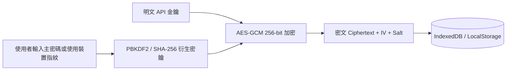

# 技術債 #0030: Web Crypto API 敏感金鑰加密與端到端保密持久化

- **狀態**：`OPEN`
- **優先級**：`P1`
- **發現來源**：資安架構深度審查
- **建立日期**：2026-09-02
- **標籤**：`Security` · `Cryptography` · `Storage` · `Privacy` · `WebCrypto`

---

## 1. 背景與現狀代碼 (Context & Current Code)

目前專案在設定頁面 (`src/components/SettingsWorkspace.tsx`) 允許使用者輸入外部金融 API 憑證（如 `FinMind Token`、`FMP API Key`、`AlphaVantage API Key`、`自訂 Proxy URL`）。

在底層儲存持久化層 (`src/utils/storage.ts` 與 `src/utils/db.ts`) 中，這些 API 金鑰物件 `ApiKeysConfig` 是以**純明文 (Plaintext)** 格式直接儲存於瀏覽器端的 `localStorage` (`STOCK_TRACKER_API_KEYS_V1`) 與 IndexedDB 的 `settings` 物件倉庫中：

```typescript
// src/utils/storage.ts
export function saveApiKeysConfigToStorage(config: ApiKeysConfig): void {
  try {
    localStorage.setItem(API_KEYS_STORAGE_KEY, JSON.stringify(config));
    dbPut('settings', { key: 'apiKeys', value: config });
  } catch (err) {
    logger.warn('Failed to save API keys to storage', err);
  }
}
```

---

## 2. 問題分析與潛在風險 (Problem & Risk Analysis)

1. **XSS 惡意提取風險**：由於單頁應用程式 (SPA) 在瀏覽器中運行，若任何引入的第三方依賴庫或注入腳本被執行，攻擊者可透過 `localStorage.getItem` 或 IndexedDB API 輕易讀取明文金鑰並外傳。
2. **本機共享環境威脅**：在公用電腦或多用戶環境下，任何人打開 DevTools Application 標籤頁即可直接查閱複製使用者的付費 API Key。
3. **記憶體生命週期暴露**：金鑰在 React state 中長期長駐，且在 JSON 序列化過程中無掩蔽 (Masking) 防護。

---

## 3. 建議重構方案 (Proposed Security Architecture)

採用瀏覽器原生 **Web Crypto API (`window.crypto.subtle`)** 進行端到端 AES-GCM 256-bit 加密持久化：



### 關鍵防禦機制：
1. **PBKDF2 密鑰衍生**：使用使用者自訂的主解鎖密碼 (Master Passphrase) 或 WebAuthn / 隨機產生的本機 Salt，透過 PBKDF2 (100,000 次疊代) 衍生出 AES-GCM 256-bit 加密金鑰。
2. **密文封裝格式**：
   ```typescript
   export interface EncryptedPayload {
     iv: string;         // Base64 編碼的 12-byte IV
     salt: string;       // Base64 編碼的 16-byte Salt
     ciphertext: string; // Base64 編碼的密文
     version: number;    // 密碼學架構版本 (v1)
   }
   ```
3. **UI 遮罩保護**：在設定介面與輸入框中，金鑰一律以 `sk-fmp****4a8f` 格式預設遮蔽顯示，點擊「顯示」按鈕或重新解鎖時才短暫呈現。
4. **平滑相容與自動升級**：讀取時若檢測到歷史舊版明文 JSON，自動進行原地加密遷移並覆蓋。

---

## 4. 驗收標準 (Acceptance Criteria)

- [ ] 本地 DevTools 檢查 `localStorage` 與 IndexedDB `settings` 倉庫，所有 API Key 均以 `EncryptedPayload` 密文儲存，無任何明文字串。
- [ ] 支援設定主解鎖密碼，密碼錯誤時正確阻斷解密並給予安全提示。
- [ ] 單元測試以 Vitest 覆蓋 Web Crypto 加密、解密、Salt 衍生與錯誤密碼異常處理流程。

---

## 5. 觸發處理時機 (Trigger Conditions)

- 接入更多需付費訂閱之外部金融數據源 (如 FMP 企業版、FinMind 付費版) 時。
- 啟動 E2EE 雲端多裝置同步 (Debt #0023) 前。
