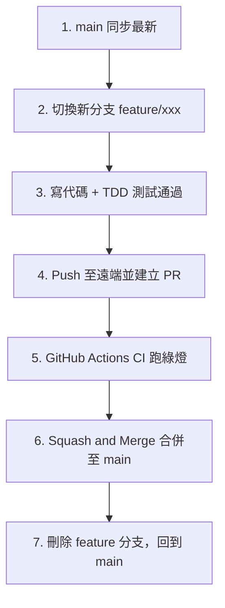

# GitHub 分支保護與 Feature PR 工作流操作手冊

本手冊專為初學者設計，詳細記錄 **GitHub 網頁端分支保護規則（Branch Protection Rules）設定** 與 **本地端 Feature 分支 ➔ PR 審查合併的完整 SOP**。

---

## 為什麼要設定分支保護？

1. **防止手滑破壞主幹**：避免開發者（或 AI Agent）不小心將未完成或有 Bug 的程式碼直接 `git push` 到 `main` 正式分支。
2. **強制自動化檢驗（CI Guard）**：確保所有代碼必須通過單元測試（Vitest）與靜態檢查（Lint），呈現綠燈才能合併。
3. **留存清晰的變更紀錄**：每一次功能開發都有獨立的 PR（Pull Request），方便日後追蹤、審查與回滾。

---

## 第一部分：GitHub 網頁端設定步驟（看圖一步一步做）

您目前在瀏覽器畫面上看到的頁面是：
**儲存庫 ➔ Settings ➔ Branches（Code, planning, and automation 分類下）**

### 步驟 1：點擊建立規則按鈕
在畫面中間的區塊，點擊右側的按鈕：
👉 **`Add classic branch protection rule`**（經典分支保護規則，最直覺、小白最易理解）。

---

### 步驟 2：指定受保護的分支名稱
- 找到 **`Branch name pattern`** 欄位。
- 輸入：`main`
- *(這代表底下設定的所有規則，都會嚴格套用在 `main` 主分支上)*。

---

### 步驟 3：設定「必須透過 PR 才能合併」
- 勾選 **`Require a pull request before merging`**。
- **針對個人獨立開發 / AI 協作的關鍵設定**：
  - 如果該儲存庫只有您一位擁有者，請**取消勾選** `Require approvals`（或者將審查人數設為 0），否則 GitHub 會因為「您無法審查自己發起的 PR」而卡住無法合併。
  - 若未來有多位真人成員協作，可勾選 `Require approvals` 並設定 `1` 人。

---

### 步驟 4：設定「必須通過 CI 自動化測試才能合併」
- 勾選 **`Require status checks to pass before merging`**。
- 勾選子項目 **`Require branches to be up to date before merging`**（確保分支是基於最新 main 測試的）。
- 在下方的搜尋框 **`Status checks found in the last week for this repository`** 中：
  - 輸入關鍵字搜尋：`自動化單元測試與語法驗證`（或直接輸入 `自動化`）。
  - 在下拉選單中**點擊勾選 `自動化單元測試與語法驗證`**。


---

### 步驟 5：防止意外強制推送或刪除
預設情況下，GitHub 就會禁止 `git push --force` 以及刪除 `main` 分支。
- *(可選)*：勾選 **`Do not allow bypassing the above settings`**（連 Repository Admin 管理員也必須遵守上述 PR 規則，杜絕例外）。

---

### 步驟 6：儲存規則
- 滑動到頁面最下方。
- 點擊綠色的 **`Create`**（或 **`Save changes`**）按鈕。
- 若系統跳出密碼或 2FA 確認，輸入確認即可完成。

---

## 第二部分：日常開發實戰工作流（4 步驟循環）

設定完成後，日後**任何**新功能開發或 Bug 修復，請完全遵循以下標準流程：



### 步驟 1：從最新的 main 建立新分支
在 VS Code / 終端機中執行：
```powershell
# 確保回到 main 分支並拉取最新代碼
git checkout main
git pull origin main

# 建立並切換至新功能分支（名稱命名格式：feature/功能描述）
git checkout -b feature/issue-12-add-analytics
```

---

### 步驟 2：編寫程式碼與單元測試（TDD）
在該分支下進行開發，並在本地確保所有測試與檢查均通過：
```powershell
# 執行單元測試
npm test

# 執行 TypeScript 檢查與建置驗證
npm run build
```

---

### 步驟 3：提交並推送到 GitHub
```powershell
# 加入暫存區並提交
git add .
git commit -m "feat: 新增股票損益儀表板分析功能"

# 推送到遠端倉庫（第一次推送該分支需加 -u origin）
git push -u origin feature/issue-12-add-analytics
```

---

### 步驟 4：建立 Pull Request (PR) 並合併
您有兩種方式發起 PR：

#### 方式 A：GitHub 網頁操作（推薦新手）
1. 開啟 GitHub 專案首頁，頂部會出現黃色提示：
   `feature/issue-12-add-analytics had recent pushes`
2. 點擊綠色按鈕 **`Compare & pull request`**。
3. 填寫 PR 標題與說明（例如 `關聯 Issue: Closes #12`）。
4. 點擊 **`Create pull request`**。
5. 等待 GitHub Actions CI 跑完並顯示 **`All checks have passed`（綠色勾勾）**。
6. 點擊 **`Squash and merge`** ➔ 確認合併 ➔ 點擊 **`Delete branch`** 刪除已合併的遠端分支。

#### 方式 B：GitHub CLI 指令操作（極速）
```powershell
# 一行指令建立 PR
gh pr create --title "feat: 新增股票損益儀表板分析功能" --body "完成功能開發與測試，Closes #12"

# 檢查 CI 狀態與合併
gh pr checks
gh pr merge --squash --delete-branch
```

---

## 第三部分：常見問題與防呆救援（FAQ）

### Q1：如果不小心在 `main` 分支寫了代碼且 `git push` 被拒絕，怎麼辦？
**現象**：終端機出現 `remote: error: GH006: Protected branch update failed for refs/heads/main. Changes must be made through a pull request.`

**解法**（無需慌張，代碼不會丟失）：
```powershell
# 1. 直接建立新分支保存當前進度
git checkout -b feature/save-my-work

# 2. 將新分支推送到遠端
git push -u origin feature/save-my-work

# 3. 回到 main 分支，將本地 main 重設回遠端的乾淨狀態
git checkout main
git reset --hard origin/main

# 4. 到 GitHub 網頁上為 feature/save-my-work 發起 PR 即可！
```

### Q2：PR 頁面顯示「Merging is blocked: Review required」，我點不了 Merge？
**原因**：在步驟 3 中勾選了 `Require approvals`，但該 Repo 只有您一人，自己不能審核自己的 PR。
**解法**：回到 GitHub 儲存庫 ➔ `Settings` ➔ `Branches` ➔ 編輯 `main` 規則 ➔ **取消勾選 `Require approvals`** ➔ 儲存即可。
