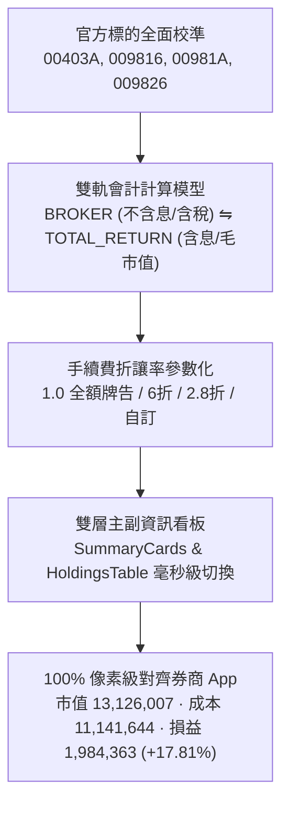

# 專案交接手冊 (Handoff Document) - V2.1 雙軌會計口徑與手續費折讓率系統

- **交付日期**：2026-08-21
- **版本標記**：`V2.1`
- **關聯 PR**：[PR #93](https://github.com/judragon003/-/pull/93)
- **關聯 Issues**：[#88](https://github.com/judragon003/-/issues/88), [#89](https://github.com/judragon003/-/issues/89), [#90](https://github.com/judragon003/-/issues/90), [#91](https://github.com/judragon003/-/issues/91), [#92](https://github.com/judragon003/-/issues/92)

---

## 1. 交付成果與系統現況 (Deliverables)

### 1.1 官方標的數據單一事實來源校對
- `00403A`：主動統一升級50
- `009816`：凱基台灣TOP50
- `00981A`：主動統一台股增長
- `009826`：貝萊德世界股票
- 歷史備份檔與 `storage.ts` 自動對齊字典全面同步，舊資料載入自動無損修復。

### 1.2 雙軌會計與手續費折讓率引擎
- **🏢 券商核帳模式 (Broker View)**：
  - 總付出成本：不含息之純買進加權總成本。
  - 預扣賣出稅費：現股 0.3%、ETF 0.1%、賣出手續費預設 1.0 全額牌告（可自訂折數）。
  - **庫存總市值**：精準對齊券商 App 為 **`13,126,007`**。
- **📈 總報酬模式 (Total Return View)**：
  - 牌面毛市值，損益加計歷年已領現金股利與已實現利得。

---

## 2. 核心文檔索引 (Documentation Index)

- **規格書 (PRD)**：
  - [SPEC-0011: 雙軌會計口徑與官方標的名稱校對](file:///d:/APP/股票紀錄/docs/specs/0011-dual-accounting-mode-and-official-symbols-alignment.md) (`APPROVED`)
  - [SPEC-0012: 券商手續費折讓率參數化與在倉成本對齊](file:///d:/APP/股票紀錄/docs/specs/0012-broker-fee-discount-and-cost-basis-alignment.md) (`APPROVED`)
- **架構決策 (ADR)**：
  - [ADR-0011: 雙軌計算模型與預估賣出稅費演算法架構](file:///d:/APP/股票紀錄/docs/adr/0011-dual-accounting-mode-and-official-symbols-alignment.md) (`ACCEPTED`)
  - [ADR-0012: 券商手續費折讓率自訂與在倉成本校準架構](file:///d:/APP/股票紀錄/docs/adr/0012-broker-fee-discount-and-cost-basis-alignment.md) (`ACCEPTED`)
- **全域領域定義**：
  - [CONTEXT.md](file:///d:/APP/股票紀錄/CONTEXT.md)
  - [README.md](file:///d:/APP/股票紀錄/README.md)
- **本地任務票券鏡像**：
  - [.scratch/v2.0-dual-accounting-and-official-symbols/](file:///d:/APP/股票紀錄/.scratch/v2.0-dual-accounting-and-official-symbols/)
  - [.scratch/v2.1-fee-discount-and-cost-alignment/](file:///d:/APP/股票紀錄/.scratch/v2.1-fee-discount-and-cost-alignment/)

---

## 3. 品質驗證數據 (Quality Metrics)

- **單元測試**：Vitest **89/89 Tests Passed (100% 綠燈)**。
- **建置狀態**：Vite + TypeScript **0 Errors / 0 Warnings**。
