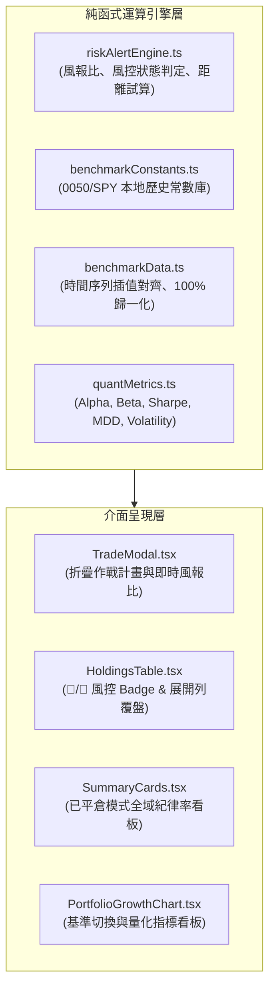

# 🤝 專案交接手冊：v5.7.0 主動交易作戰計畫、風控觸價警示與大盤量化基準對比體系

- **交付日期**：2026-08-28
- **版本號**：`v5.7.0`
- **關聯規格 (PRD)**：[PRD #0041: 交易計畫紀律檢討、風控觸價警示與大盤量化基準對比](../specs/0041-trade-discipline-risk-alerts-and-quant-benchmark.md)
- **架構決策記錄 (ADR)**：[ADR #0041: 交易計畫紀律檢討、盤中風控觸價警示與大盤量化基準對比架構](../adr/0041-trade-discipline-risk-alerts-and-quant-benchmark.md)
- **解決技術債**：
  - [技術債 #0002: 交易計畫與紀律檢討模組](../debts/0002-trade-plan-and-discipline-review.md) (`RESOLVED`)
  - [技術債 #0016: 移動停損停利風控線設定與觸價警示標籤](../debts/0016-stop-loss-take-profit-alerts-and-risk-badges.md) (`RESOLVED`)
  - [技術債 #0010: 大盤基準疊圖 (0050/SPY) 與量化績效指標](../debts/0010-benchmark-comparison-and-quant-metrics.md) (`RESOLVED`)
- **本地 Issue 鏡像目錄**：[`.scratch/v5.7.0-trade-discipline-risk-alerts-and-quant-benchmark/issues/`](../../.scratch/v5.7.0-trade-discipline-risk-alerts-and-quant-benchmark/issues/) (10 張票券全數 `RESOLVED`)

---

## 1. 迭代背景與交付目標 (Context & Objectives)

本迭代聚焦於主動交易員的四大核心交易管理需求：
1. **事前作戰計畫**：建倉時結構化記錄進場假說、停損停利點與預期風報比。
2. **盤中即時風控**：現價觸及停損/停利時醒目 Badge 提醒，逼近警戒線時提前示警。
3. **賽後紀律覆盤**：平倉後評定紀律星級、犯錯分類（追高、凹單等）與統計全域遵守率。
4. **客觀量化對標**：100% 離線本地大盤疊圖對照（0050/SPY/50-50）與 5 大量化指標看板（Alpha, Beta, Sharpe, MDD, Volatility）。

---

## 2. 架構異動與新增模組清單 (Architecture & Modules)

### 核心檔案清單
1. `src/types/stock.ts`：擴充 `TradePlan`, `TradeReview`, `RiskAlertStatus`, `HoldingRiskMetrics`, `BenchmarkType`, `QuantPerformanceMetrics`, `DisciplineSummary`。
2. `src/engine/riskAlertEngine.ts` & `test.ts`：風控觸價判定與百分比距離試算引擎。
3. `src/engine/benchmarkConstants.ts`：0050.TW 與 SPY 歷史收盤價常數庫。
4. `src/engine/benchmarkData.ts` & `test.ts`：時間序列向前填充插值與歸一化對齊引擎。
5. `src/engine/quantMetrics.ts` & `test.ts`：年化波動度、最大回撤、夏普值、Beta 與詹森阿爾法計算引擎。
6. `src/engine/calculator.ts`：持股風控指標組裝與已平倉紀律統計。
7. `src/components/TradeModal.tsx`：買進建倉折疊計畫面板與風報比即時試算。
8. `src/components/HoldingsTable.tsx`：個股代碼列風控 Badge 渲染與展開列賽後覆盤檢討卡片。
9. `src/components/SummaryCards.tsx`：已平倉戰績視圖新增全域紀律覆盤指標卡。
10. `src/components/PortfolioGrowthChart.tsx`：大盤基準切換選單與 5 大量化指標看板。

---

## 3. 測試與驗證報告 (Verification)

- **單元測試套件**：`npm test` ➔ **24 個測試檔案、288 項單元測試 100% 綠燈通過**。
- **TypeScript 靜態檢查與構建**：`npm run build` ➔ **0 Error / 0 Warning**。
