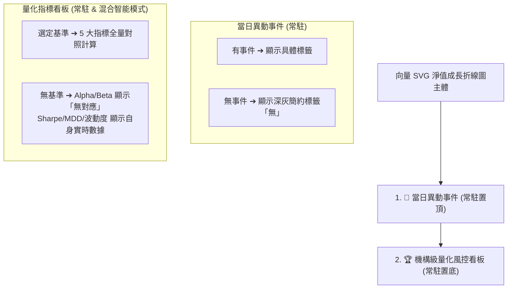

# 🤝 專案交接手冊：v5.7.1 成長圖表佈局重構——當日異動事件置頂常駐與量化指標混合智能常駐

- **交付日期**：2026-08-28
- **版本號**：`v5.7.1`
- **關聯規格 (PRD)**：[PRD #0042: 成長圖表佈局重構——當日異動事件置頂常駐與量化指標混合智能常駐](../specs/0042-quant-dashboard-and-events-permanent-layout.md)
- **架構決策記錄 (ADR)**：[ADR #0042: 成長圖表佈局重構——當日異動事件置頂常駐與量化指標混合智能常駐架構](../adr/0042-permanent-quant-dashboard-and-event-layout.md)
- **前置交接手冊**：[v5.7.0 主動交易作戰計畫、風控觸價警示與大盤量化基準對比體系](2026-08-28-v5.7.0-trade-discipline-risk-alerts-and-quant-benchmark.md)
- **本地 Issue 鏡像目錄**：[`.scratch/v5.7.1-quant-dashboard-permanent-layout/issues/`](../../.scratch/v5.7.1-quant-dashboard-permanent-layout/issues/) (3 張票券全數 `RESOLVED`)

---

## 1. 迭代背景與交付目標 (Context & Objectives)

在 v5.7.0 上線後，針對使用者操作體驗與視覺流動進行專屬優化重構：
1. **區塊排序互換**：將「📅 當日異動事件」置頂緊鄰折線圖下方，提供 Hover 即時探索反饋；「🏆 機構級量化風控看板」置於最底部作為宏觀結算數據。
2. **當日異動事件常駐化**：預設取最新一日、Hover 即時連動，無事件時顯示「無」標籤，徹底消除版面跳動 (Layout Shift)。
3. **量化指標混合智能模式 (Hybrid Intelligence Mode)**：
   - 無基準 (`NONE`) 時，看板常駐顯示；Alpha 與 Beta 顯示 **「無對應 (需對照基準)」**，夏普值、自身 MDD 與年化波動度依然即時計算自身真實投資表現。
   - 選定基準時，5 大指標完整聯動對照基準。

---

## 2. 架構異動與模組調整 (Architecture & Implementation)

### 修改核心檔案
1. `src/types/stock.ts`：更新 `QuantPerformanceMetrics`，增加 `hasBenchmark` 旗標，並將依賴基準之欄位 (`alpha`, `beta`, `correlation`, `benchmarkMaxDrawdown`) 設為 `number | null`。
2. `src/engine/quantMetrics.ts` & `test.ts`：更新 `calculateQuantMetrics`，當未提供基準時獨立計算自身夏普值、MDD 與年化波動度，大盤指標安全回傳 `null`。
3. `src/components/PortfolioGrowthChart.tsx`：
   - 區塊順序重組為事件置頂、量化置底。
   - 當日異動事件支援「無」標籤常駐渲染。
   - 量化看板支援無基準時「無對應」標註與自身指標實時展示。

---

## 3. 測試與驗證報告 (Verification)

- **單元測試套件**：`npm test` ➔ **24 個測試檔案、289 項單元測試 100% 綠燈通過**。
- **TypeScript 靜態檢查與構建**：`npm run build` ➔ **0 Error / 0 Warning**。
- **UI 互動與無跳動驗證**：切換時間範圍與大盤基準時，卡片高度穩定無 Layout Shift。
