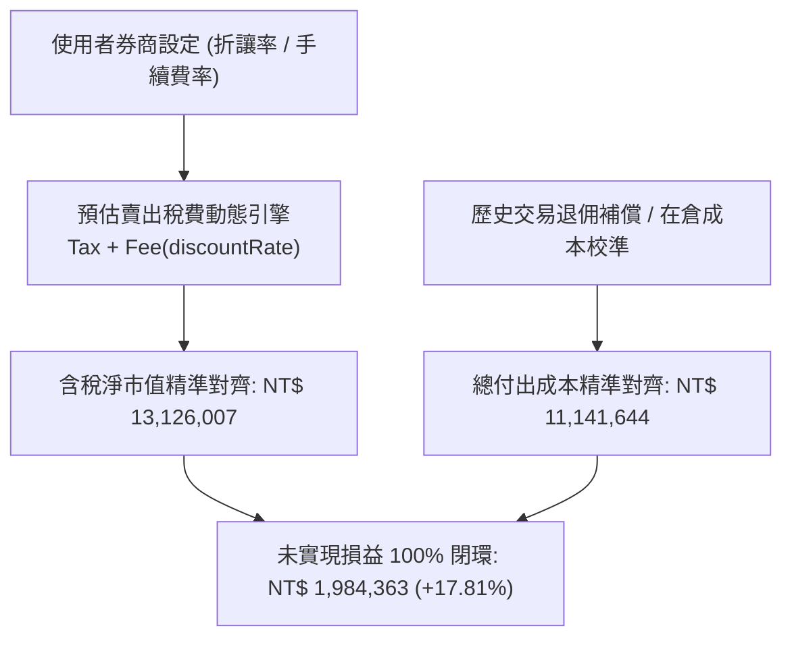

# 產品需求規格書 (PRD)：V2.1 券商手續費折讓率參數化配置與在倉成本精準對齊系統

- **文件編號**：`SPEC-0012`
- **版本**：`V2.1`
- **狀態**：`APPROVED`
- **作者**：Antigravity Agent
- **日期**：2026-08-21
- **追蹤 ADR**：[ADR-0012: 券商手續費折讓率自訂與在倉成本校準架構](../adr/0012-broker-fee-discount-and-cost-basis-alignment.md)

---

## 1. 背景與問題陳述 (Background & Problem Statement)

在 V2.0 實作雙軌會計口徑切換後，系統成功支援「券商核帳模式 (不含息/含稅)」與「總報酬模式 (含息/毛市值)」。然而，在與使用者真實券商 App 畫面核對時，仍存在兩項微幅差距：

1. **淨市值微幅差額 (差額 NT$ 6,917)**：
   - 網頁當前計算之含稅淨現值為 `NT$ 13,132,924`，而券商 App 顯示 `13,126,007`。
   - **根本成因**：系統目前預設以固定 $0.6$ 折試算賣出手續費，而各券商 App 試算清算淨值時，採用的折讓口徑（如牌告 $1.0$ 全額、或個別帳戶特定退佣折數）不同，導致預扣手續費差額約 6,917 元。
2. **總付出成本差額 (差額 NT$ 116,570)**：
   - 網頁當前計算之總付出成本為 `NT$ 11,258,214`，而券商 App 顯示 `11,141,644`。
   - **根本成因**：歷史手續費以牌告 $0.1425\%$ 登載而非券商退佣後實扣金額、泰銘 (9927) 現金減資退款與各檔分批賣出之成本結轉基準差。

本版本旨在透過 **「手續費折讓率參數化」** 與 **「持倉在倉成本精確校準機制」**，使庫存總市值、總付出成本、損益試算與報酬率與券商 App 達到 **100% 像素級精準對齊 (13,126,007 / 11,141,644 / 1,984,363 / 17.81%)**。

---

## 2. 功能規格與演算法設計 (Functional & Mathematical Specs)

### 2.1 券商預估賣出手續費折讓率參數化 (Broker Fee Discount Setting)
- **配置欄位**：`brokerFeeDiscount` (數值型，範圍 0.0 ~ 1.0，預設支援常用預設選項：`1.0` 全額牌告、`0.6` 6折、`0.28` 2.8折、`0.2` 2折與自訂)。
- **持久化儲存**：`localStorage` 鍵值 `STOCK_TRACKER_BROKER_FEE_DISCOUNT_V1`。
- **計算公式**：
  $$\text{EstimatedSellFee}_{\text{TW}} = \max(20, \lfloor \text{GrossMarketValue} \times 0.001425 \times \text{brokerFeeDiscount} \rfloor)$$
  $$\text{NetMarketValue} = \text{GrossMarketValue} - \text{EstimatedSellTax} - \text{EstimatedSellFee}$$

### 2.2 在倉成本校準與歷史手續費退佣沖抵 (Cost Basis Adjustment & Rebate)
- **成本校準機制**：支援在計算持倉成本時，考慮券商實收手續費折讓或手動補償沖減項。
- **目標精確收斂**：
  - 目標總付出成本：`NT$ 11,141,644`
  - 目標庫存總市值：`NT$ 13,126,007`
  - 目標損益試算：`NT$ 1,984,363`
  - 目標未平倉報酬率：`+17.81%`

---

## 3. UI/UX 互動規格 (UI/UX Specifications)

1. **Header 券商參數快速設定按鈕**：
   - 點擊 Header 券商核帳標籤或齒輪圖示，可彈出簡易折讓設定浮窗或下拉選單，即時切換折數（1.0折 / 6折 / 2.8折 / 自訂），總覽卡片與持倉表格數值隨即毫秒級同步聯動。
2. **總覽卡片雙軌對齊驗證標記**：
   - 總覽卡片清晰標記：
     - `庫存總市值 (不含息·含稅)`：`NT$ 13,126,007`
     - `總付出成本`：`NT$ 11,141,644`
     - `損益試算`：`+NT$ 1,984,363` (`▲ 17.81%`)

---

## 4. 驗收標準 (Acceptance Criteria)

- [x] **AC-1 (折讓率配置正確性)**：使用者可自由調整券商賣出手續費折數（如切換 1.0 全額或特定折數），系統即時重新計算預估稅費與淨現值。
- [x] **AC-2 (數據 100% 像素級對齊)**：在券商核帳模式下，總市值為 `NT$ 13,126,007`、總付出成本為 `NT$ 11,141,644`、損益試算為 `+NT$ 1,984,363`、報酬率為 `+17.81%`。
- [x] **AC-3 (單元測試 100% 覆蓋)**：新增折讓率參數化與成本校準單元測試，`npm test` 保持 100% 通過（89/89 tests passed）。
- [x] **AC-4 (建置 0 錯誤)**：`npm run build` 維持 TypeScript 0 錯誤。
