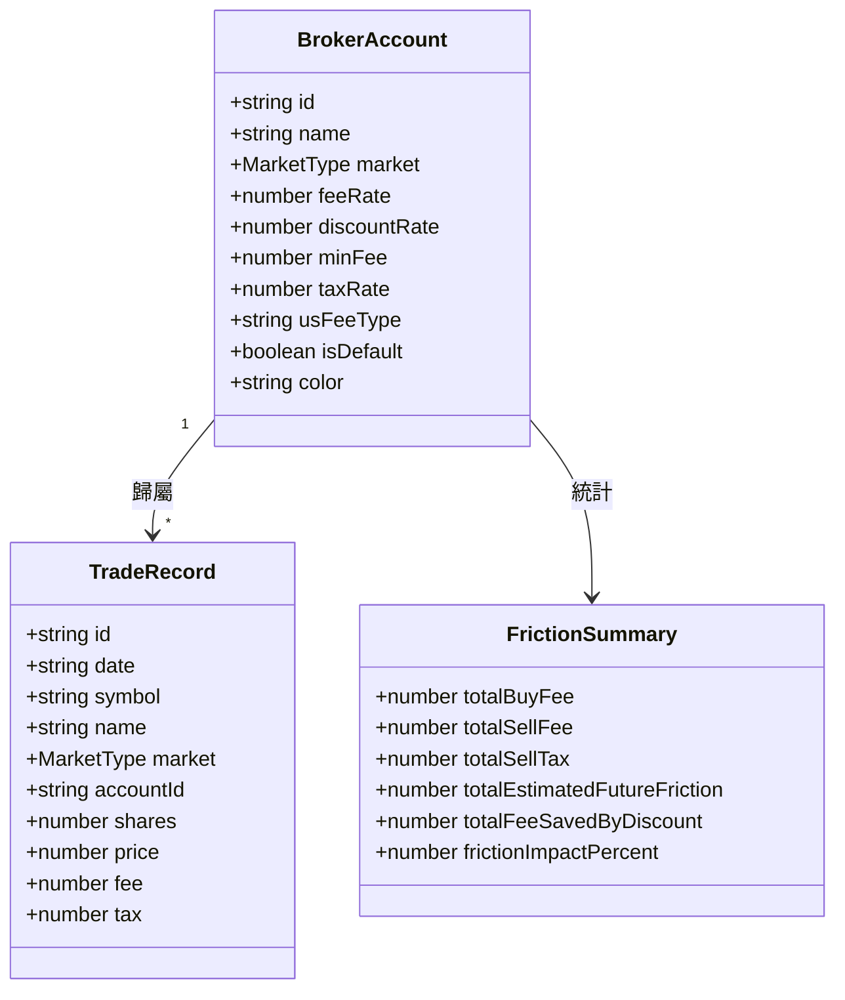

# 產品需求規格書 (PRD)：V3.0 多券商帳戶管理體系與交易摩擦成本深度分析中心

- **文件編號**：`SPEC-0013`
- **版本**：`V3.0`
- **狀態**：`APPROVED`
- **作者**：Antigravity Agent
- **日期**：2026-08-24
- **追蹤 ADR**：[ADR-0013: 多券商帳戶架構與交易摩擦成本分析引擎](../adr/0013-multi-broker-account-and-friction-cost-engine.md)

---

## 1. 背景與問題陳述 (Background & Problem Statement)

在真實投資實務中，投資人往往同時使用多家券商帳戶（例如：台股使用國泰證券 2.8 折低消 1 元、永豐大戶投 2 折低消 1 元或元大證券 6 折；美股使用嘉信理財/Firstrade 海外免手續費或複委託 0.1%）。

現有系統僅能透過單一全域賣出手續費折讓率進行試算，存在以下局限性：
1. **無法反映跨券商分帳戶持股與成本差額**：不同券商帳戶持有不同標的，其買進交割手續費與預估賣出成本無法依券商實況獨立計算。
2. **缺乏摩擦成本 (Friction Cost) 的結構性透視**：投資人無法一目了然得知歷年累積支付了多少買進手續費、賣出證交稅、節省了多少券商折讓退佣，以及摩擦成本對整體投資報酬率的衝擊程度。
3. **交易錄入無券商帳戶綁定**：手動記帳時無法自動依所屬帳戶費率公式試算手續費。

本版本旨在建構 **「多券商帳戶體系 (Multi-Broker Account Architecture)」** 與 **「交易摩擦成本深度分析中心 (Friction Center)」**，提供分帳戶獨立/合併對帳、主流券商費率模板庫、平滑自動遷移及摩擦成本深度視覺化分析。

---

## 2. 核心架構與實體資料模型 (Entity & Data Models)



### 2.1 券商帳戶實體 (`BrokerAccount`)
```typescript
export type USFeeType = 'ZERO_COMMISSION' | 'SUB_BROKERAGE';

export interface BrokerAccount {
  id: string;                      // 唯一識別碼 (如 'broker-tw-default', 'broker-cathay', 'broker-schwab')
  name: string;                    // 券商/帳戶名稱 (如 '國泰證券 (2.8折)', '永豐大戶投 (2折)', '嘉信理財 (免手續費)')
  market: MarketType;              // 'TW' | 'US'
  feeRate: number;                 // 標準手續費率 (台股 0.001425, 美股複委託 0.001)
  discountRate: number;            // 折讓率 (如 0.28, 0.2, 0.6, 1.0)
  minFee: number;                  // 最低手續費門檻 (如 1, 20, 0, 15 USD)
  taxRate: number;                 // 證交稅率 (現股 0.003, ETF 0.001)
  usFeeType?: USFeeType;           // 美股類型 ('ZERO_COMMISSION' | 'SUB_BROKERAGE')
  isDefault?: boolean;             // 是否為該市場之預設帳戶
  color?: string;                  // 帳戶標籤主題色
  createdAt?: number;
}
```

### 2.2 內建主流券商模板庫 (Default Broker Presets)
- **🇹🇼 台股模板**：
  1. `國泰證券`：手續費率 0.1425%、折讓 0.28 折、低消 NT$ 1。
  2. `永豐大戶投`：手續費率 0.1425%、折讓 0.2 折、低消 NT$ 1。
  3. `富邦證券`：手續費率 0.1425%、折讓 0.18 折、無低消。
  4. `元大證券`：手續費率 0.1425%、折讓 0.6 折、低消 NT$ 20。
  5. `標準牌告`：手續費率 0.1425%、折讓 1.0 全額、低消 NT$ 20。
- **🇺🇸 美股模板**：
  1. `海外券商 (嘉信/Firstrade/IB)`：免手續費 ($0)、賣出僅依 SEC/TAF 規範。
  2. `國內複委託優惠戶`：買賣手續費 0.1%、無低消 (或低消 $1)。
  3. `國內複委託標準戶`：買賣手續費 0.25%、低消 $15 USD。

---

## 3. 功能規格與演算法 (Functional Specifications)

### 3.1 平滑自動遷移策略 (Seamless Auto-Migration)
- 當使用者既有之 `TradeRecord[]` 無 `accountId` 欄位時，系統自動將 `market === 'TW'` 綁定至「預設台股帳戶」，將 `market === 'US'` 綁定至「預設美股帳戶」。
- 100% 向後相容，保證歷史資料 0 遺失。

### 3.2 多帳戶獨立與合併會計運算 (Multi-Account Accounting Engine)
- **全部帳戶檢視 (`accountId === 'ALL'`)**：合併加總全帳戶在倉市值與成本。
- **單一帳戶檢視 (`accountId === 'broker-xxx'`)**：
  - 僅聚合歸屬於該券商帳戶之交易與持股。
  - 預估賣出稅費直接採用該券商帳戶之 `discountRate`、`minFee` 與 `taxRate` 精準試算。

### 3.3 交易摩擦成本分析中心 (Friction Center Metrics)
- **歷史累計買進手續費 (Total Buy Commission)**：$\sum \text{Buy Trades Fee}$
- **歷史累計賣出稅費 (Total Sell Tax & Fee)**：$\sum \text{Sell Trades (Tax + Fee)}$
- **券商折讓累計節省金額 (Total Fee Saved by Discount)**：
  $$\text{FeeSaved} = \sum (\text{成交金額} \times \text{標準費率} - \text{實扣手續費})$$
- **預估在庫持股未來出清摩擦成本 (Estimated Future Liquidation Friction)**：
  $$\text{FutureFriction} = \sum_{\text{持股}} (\text{預估賣出證交稅} + \text{預估賣出手續費})$$
- **摩擦成本衝擊佔比 (Friction Impact Ratio %)**：
  $$\text{Impact\%} = \frac{\text{總摩擦成本}}{\text{總資產毛市值} + \text{歷史累計獲利}} \times 100\%$$

---

## 4. UI/UX 互動與介面規格 (UI/UX Specifications)

1. **頂部導覽列升級 (Header Upgrade)**：
   - 整合「帳戶篩選器」下拉/膠囊選單：`[🏛️ 全部帳戶 ▾]` ⇋ `[🇹🇼 國泰證券]` ⇋ `[🇹🇼 永豐大戶投]` ⇋ `[🇺🇸 嘉信理財]`。
   - 保留「🏢 券商核帳 / 📈 總報酬」切換。
   - 新增「📊 摩擦成本分析」與「⚙️ 券商帳戶管理」入口按鈕。
2. **券商帳戶管理彈窗 (Broker Accounts Modal)**：
   - 支援新增、編輯、刪除券商帳戶，並提供一鍵套用主流券商範本。
   - 支援批次將特定標的或交易指派至指定帳戶。
3. **交易摩擦成本分析儀彈窗 (Friction Center Modal)**：
   - 現代高質感發光玻璃卡片，展示 4 大摩擦指標（已付手續費、已付稅金、折讓省下金額、未來出清成本）。
   - 提供長條圖/圓餅圖可視化各券商帳戶之摩擦成本分佈。
4. **交易錄入彈窗智慧聯動 (TradeModal Smart Fill)**：
   - 選擇標的與券商帳戶時，手續費欄位依金額與帳戶費率自動試算並帶入建議值，亦允許手動微調。

---

## 5. 驗收標準 (Acceptance Criteria)

- [x] **AC-1 (多帳戶體系與平滑遷移)**：
  - 既有歷史交易能自動無損歸屬預設台/美帳戶。
  - 使用者能自由新增、編輯、刪除多個券商帳戶並自訂折讓率與低消。
- [x] **AC-2 (分帳戶持倉與對帳計算精確性)**：
  - 切換單一帳戶時，卡片與表格僅呈現該帳戶之持股，且預估賣出稅費嚴格遵循該帳戶設定。
- [x] **AC-3 (摩擦成本分析中心準確性)**：
  - 摩擦成本分析儀精確加總歷史買賣手續費、稅金、折讓省下金額與未來出清預估成本。
- [x] **AC-4 (品質與建置門禁)**：
  - 單元測試套件保持 100% 覆蓋通過（96/96 tests passed）。
  - `npm run build` 維持 TypeScript 0 錯誤。
