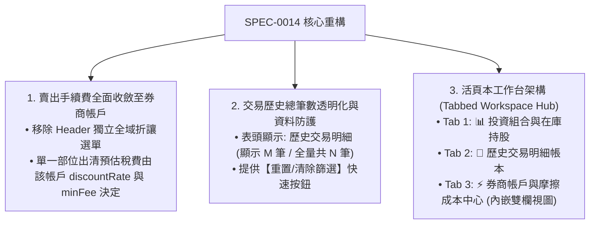

# SPEC-0014: 活頁本工作台 (Tabbed Workspace) 與券商手續費整併規格書

- **文件編號**：`SPEC-0014`
- **版本**：`V3.1`
- **狀態**：`APPROVED`
- **作者**：Antigravity Agent
- **日期**：2026-08-24
- **追蹤 ADR**：[ADR-0014: 活頁本工作台架構與券商手續費整併收斂](../adr/0014-tabbed-workspace-and-broker-fee-consolidation.md)

---

## 1. 痛點與需求背景 (Problem Statement)

在 V3.0 上線多券商帳戶與摩擦成本分析儀後，使用者在實際操作中提出 3 大關鍵改進需求：
1. **手續費功能重複**：Header 頂部仍殘留獨立的全域「賣出手續費折讓率 (2.8折/2折/全額)」選單，與「券商帳戶體系」功能重疊且造成認知混亂。
2. **交易筆數透明度**：當前若套用特定市場或帳戶過濾時，交易列表直接縮減，缺乏「顯示筆數 vs 全量總筆數」的清晰提示，易讓使用者誤以為歷史資料遺失。
3. **介面垂直堆疊與彈窗割裂**：將持倉、交易紀錄、摩擦分析與券商管理全部垂直堆在同一頁面，導致頁面過長，且彈窗頻繁開關阻斷流暢體驗。

---

## 2. 核心解決方案與架構設計 (Solution Design)

---

## 3. 功能規格與詳細設計 (Functional Specifications)

### 3.1 賣出手續費全面整併至券商帳戶 (Broker Fee Consolidation)
- **Header 簡化**：移除 Header 上的 `brokerFeeDiscount` 下拉選單與相關全域狀態。
- **單一真理來源 (SSOT)**：
  - 每個 `BrokerAccount` 內部定義的 `discountRate`、`minFee`、`taxRate` 為計算賣出手續費之唯一依據。
  - 當切換到特定帳戶時，在庫持股之預估賣出手續費與稅金一律採用該帳戶設定。
  - 在「全部帳戶合併」檢視下，各持股按其綁定之 `accountId` 分別計算預估賣出成本後加總。

### 3.2 交易歷史總筆數透明化 (Trade Count Transparency)
- **表頭筆數指示器**：
  - 當無過濾時顯示：`歷史交易明細 (共 N 筆)`。
  - 當有市場或帳戶過濾時顯示：`歷史交易明細 (已篩選 M 筆 / 全量共 N 筆)`，並呈現醒目的提示 Badge。
  - 提供快速按鈕 `[顯示全部 N 筆交易]`，點擊後重置市場為 `ALL` 且帳戶為 `ALL`。

### 3.3 活頁本工作台 (Tabbed Workspace Hub)
在 Header 下方提供現代高質感的活頁標籤欄：
- **標籤 1: 📊 投資組合總覽 (Portfolio Overview)**
  - 渲染：`SummaryCards` + `AllocationChart` + `HoldingsTable`。
- **標籤 2: 📜 歷史交易帳本 (Trade History Ledger)**
  - 渲染：`TradeHistoryTable`，提供完整的篩選、分頁與批次指派能力。
- **標籤 3: ⚡ 券商與摩擦成本中心 (Broker & Friction Hub)**
  - 獨立內嵌視圖（免開彈窗）：
    - **頂部**：4 大摩擦指標發光卡片（累計手續費、累計稅金、折讓已省金額、未來出清成本）。
    - **左側/區塊 A**：各券商帳戶清單、折讓率/低消設定、新增與範本套用。
    - **右側/區塊 B**：摩擦成本衝擊佔比進度條、帳戶摩擦成本分佈與優化建議。
- **狀態持久化**：使用 LocalStorage 記住使用者最後停留在哪一個 Tab，下次開啟自動回到該活頁。

---

## 4. 驗收標準 (Acceptance Criteria)

- [x] **AC-1 (手續費功能收斂)**：
  - Header 頂部不再出現獨立的「賣出手續費」下拉選單。
  - 所有在庫部位與總覽的預估賣出手續費正確依循個別券商帳戶設定試算。
- [x] **AC-2 (交易筆數透明展示)**：
  - 歷史表記錄表頭正確顯示 `(顯示 M 筆 / 全量共 N 筆)`，並提供一鍵還原全部篩選按鈕。
- [x] **AC-3 (活頁本工作台流暢切換)**：
  - 頁面支援 3 大活頁標籤 (`Portfolio`, `Ledger`, `Broker & Friction Hub`) 切換。
  - 摩擦成本與券商管理在獨立活頁中直接操作，不需依賴彈窗。
  - 活頁狀態自動記憶於 LocalStorage。
- [x] **AC-4 (品質與測試門禁)**：
  - 單元測試套件全數通過 (96/96 tests 100% 綠燈)。
  - `npm run build` 維持 TypeScript 0 錯誤。
