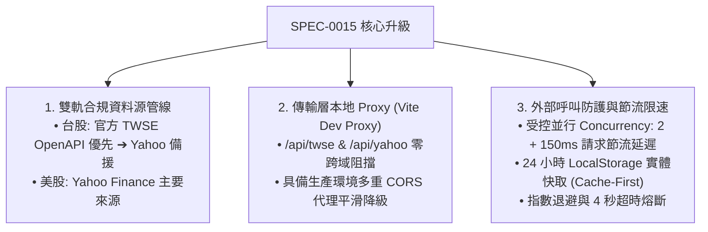

# SPEC-0015: 公司行動雙軌資料管線、受控限速與本地代理防護規格書

- **文件編號**：`SPEC-0015`
- **版本**：`V3.2`
- **狀態**：`APPROVED`
- **作者**：Antigravity Agent
- **日期**：2026-08-24
- **追蹤 ADR**：[ADR-0015: 公司行動雙軌資料源、受控限速與本地代理防禦架構](../adr/0015-corporate-action-dual-pipeline-and-rate-limiting.md)

---

## 1. 痛點與需求背景 (Problem Statement)

使用者在匯入 386 筆大量交易紀錄並執行「智慧掃描公司行動」時發現：
1. **跨域阻擋導致漏失**：瀏覽器直接連線外部端點時遭遇 CORS 跨域政策攔截，依賴的第三方免費代理池因高頻並發連線超時或被阻擋，導致 99% 的台股標的除權息事件無法抓取。
2. **外部 API 呼叫限制風險**：大批量股票同時發送查詢可能觸發遠端 API 的頻率限制 (HTTP 429 Too Many Requests) 或 IP 封鎖。
3. **資料源優先級需符合規約**：依據系統架構設計，台股除權息應優先以台灣證券交易所 (TWSE) 官方公告為主，Yahoo Finance 為備援；美股則以 Yahoo Finance 為主。

---

## 2. 核心解決方案與架構設計 (Solution Architecture)

---

## 3. 功能規格與詳細設計 (Functional Specifications)

### 3.1 傳輸層 Vite 本地代理配置 (`vite.config.ts`)
- 配置 `/api/twse` 代理轉發至 `https://openapi.twse.com.tw`。
- 配置 `/api/yahoo` 代理轉發至 `https://query1.finance.yahoo.com`。
- 在前端發送請求時，優先使用本地代理路由；若處於純靜態託管環境 (回傳 404)，自動平滑降級至外部 CORS 代理池。

### 3.2 雙軌資料源管線與優先級 (`corporateActionScanner.ts`)
- **🇹🇼 台股市場**：
  1. 優先查詢 TWSE 官方除權除息預告表 (`TWT48U_ALL`)。
  2. 若官方查無除權息資料或需比對歷史分割/減資事件，自動查詢 Yahoo Finance 備援資料。
- **🇺🇸 美股市場**：
  1. 主要查詢 Yahoo Finance 事件端點 (`div|split`)。

### 3.3 外部呼叫防護與節流限速機制
- **受控並行隊列**：限制同時進行的並發請求數不超過 2 個 (`concurrency: 2`)。
- **請求節流 (Throttling)**：每個標的查詢完成後，加入 150ms~200ms 的保護延遲，徹底避免高頻並發觸發 429 限制。
- **24 小時 LocalStorage 實體快取 (`STOCK_TRACKER_CA_CACHE_V1`)**：
  - 查詢成功之標的事件快取 24 小時。
  - 再次開啟掃描彈窗時優先讀取快取，**0 發送外部請求**，秒級載入。
  - 提供「強制全量重掃 (forceRefresh)」按鈕供手動清除快取並重新線上抓取。

---

## 4. 驗收標準 (Acceptance Criteria)

- [x] **AC-1 (本地代理與跨域解套)**：
  - 在瀏覽器中執行「智慧掃描公司行動」時，能秒級連線抓取 `00878`、`2886`、`2330`、`0050` 等全部持股之除權息事件。
- [x] **AC-2 (雙軌資料源優先級)**：
  - 台股除權息優先解析 TWSE 官方公告，官方無資料時由 Yahoo Finance 備援。
- [x] **AC-3 (節流限速與 24H 實體快取)**：
  - 掃描執行時並行數嚴格受控 (<= 2) 且帶有 150ms 節流延遲。
  - 第二次開啟掃描時直接命中 LocalStorage 快取，無重複網路請求。
- [x] **AC-4 (品質與建置門禁)**：
  - 單元測試套件全數通過 (96/96 tests 100% 綠燈)。
  - `npm run build` 維持 TypeScript 0 錯誤。
