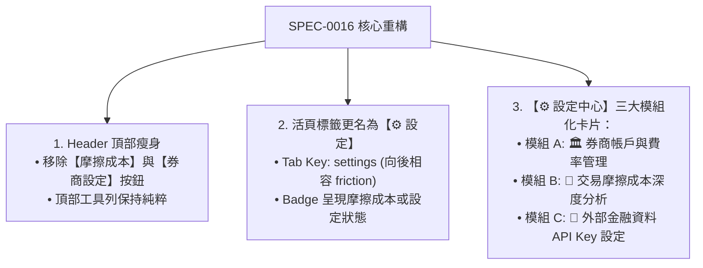

# SPEC-0016: 整合式設定中心、Header 按鈕精簡與外部 API Key 配置規格書

- **文件編號**：`SPEC-0016`
- **版本**：`V3.3`
- **狀態**：`APPROVED`
- **作者**：Antigravity Agent
- **日期**：2026-08-24
- **追蹤 ADR**：[ADR-0016: 整合式設定工作台與外部 API Key 管理架構](../adr/0016-settings-workspace-and-api-key-configuration.md)

---

## 1. 痛點與需求背景 (Problem Statement)

1. **Header 工具列重複割裂**：在引入活頁本工作台後，頂部 Header 仍殘留 `[ 💸 摩擦成本 ]` 與 `[ ⚙️ 券商設定 ]` 兩個獨立按鈕，與下方活頁籤功能重疊，造成視覺混亂。
2. **工作台命名與權責收斂**：原本的「券商與摩擦中心」應進一步演進為全域的「⚙️ 設定 (Settings)」，統一收納所有系統配置、券商帳戶、摩擦分析與資料源設定。
3. **外部金融資料 API Key 擴充需求**：為了日後支援更多官方或高階金融資料源（如 FinMind、FMP、Alpha Vantage 等），需在設定中提供專業、安全的 API 金鑰配置介面與隔離持久化機制。

---

## 2. 核心解決方案與架構設計 (Solution Design)

---

## 3. 功能規格與詳細設計 (Functional Specifications)

### 3.1 Header 頂部精簡 (`src/components/Header.tsx`)
- 移除頂部 Header 上的 `[ 💸 摩擦成本 ]` 與 `[ ⚙️ 券商設定 ]` 按鈕。
- 移除 `HeaderProps` 中未使用的相關回呼函數。

### 3.2 活頁標籤更新 (`src/components/WorkspaceTabs.tsx`)
- Tab 鍵值擴充支援 `'settings'`（向後相容舊有 LocalStorage 之 `'friction'`）。
- 標籤顯示圖示與文字改為：`⚙️ 設定`。

### 3.3 設定中心工作台 (`src/components/SettingsWorkspace.tsx`)
- 將原 `BrokerAndFrictionHub.tsx` 重構/升級為 `SettingsWorkspace.tsx`。
- **三大區塊配置**：
  1. **區塊 1: 🏛️ 券商帳戶管理**：帳戶 CRUD、折讓率（2.8折等）、最低手續費、美股模式設定、範本套用。
  2. **區塊 2: 💸 交易摩擦成本深度分析**：4 大發光看板、衝擊佔比進度條、摩擦分佈與節省金額。
  3. **區塊 3: 🔑 外部資料 API 金鑰管理**：
     - **FinMind API Token** (台股高階即時/除權息)
     - **FMP (Financial Modeling Prep) API Key** (美股行情與公司行動)
     - **Alpha Vantage API Key** (外匯與大盤數據)
     - **自訂 Proxy 伺服器端點 (Custom Proxy URL)**
     - 支援 `👁️` 遮罩切換（密碼/明文顯示）。
     - 具備「儲存設定」提示與獨立 LocalStorage 隔離儲存 (`STOCK_TRACKER_API_KEYS_V1`)。

---

## 4. 驗收標準 (Acceptance Criteria)

- [x] **AC-1 (Header 精簡)**：
  - 頂部 Header 不再出現「摩擦成本」與「券商設定」按鈕，畫面乾淨清爽。
- [x] **AC-2 (活頁標籤更名為設定)**：
  - 活頁標籤欄第三項正確認為 `⚙️ 設定`，點擊後流暢切換至設定頁面。
- [x] **AC-3 (API Key 設定與隔離持久化)**：
  - 設定頁面提供 FinMind / FMP / Alpha Vantage / 自訂 Proxy 欄位。
  - 支援密碼遮罩切換，金鑰安全儲存於 `STOCK_TRACKER_API_KEYS_V1`，重新整理後不遺失。
- [x] **AC-4 (品質與測試門禁)**：
  - 單元測試套件全數通過 (98/98 tests 100% 綠燈)。
  - `npm run build` 維持 TypeScript 0 錯誤。
