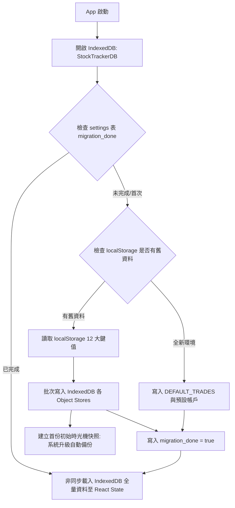

# 需求規格說明書：底層儲存遷移至 IndexedDB、ACID 事務與時光機快照體系 (IndexedDB Storage & Time-Machine Snapshots System)

## Problem Statement

目前股票紀錄與分析儀系統的所有核心資產數據（交易流水 `trades`、券商帳戶 `broker_accounts`、現金流水 `cash_transactions`、質押借款 `loan_records`、歷史資產淨值日 K `historical_prices`、匯率地圖 `historical_fx` 與公司行動快取等）皆存放於瀏覽器原生的 `localStorage` 中。

隨著系統功能演進與資料積累，面臨以下三大架構瓶頸與安全隱患：
1. **5MB 容量硬上限 (Quota Exceeded Risk)**：`localStorage` 限制總容量僅約 5MB。當使用者累積多年交易紀錄、大量歷史日 K 增量快取或進行批量 CSV 匯入時，極易觸發 `QuotaExceededError` 導致資料無法寫入或狀態損毀。
2. **主執行緒同步阻塞 (Main Thread Blocking)**：`localStorage.getItem()` 與 `JSON.parse()` 為同步阻塞操作。隨資料量增長，每次頁面初次載入或狀態更新均會佔用主執行緒，導致畫面掉幀（UI Lag）。
3. **缺乏原子性事務與防呆快照 (Lack of ACID Safety & Snapshot Rollback)**：在執行「批量 CSV 匯入」、「全站資料重置」、「大量刪除」或「公司行動補登」等複合操作時，若中途發生異常或誤操作，容易造成資料半寫入的不一致狀態，且使用者無法一鍵回溯至先前的時間點。

---

## Solution

依據 KISS 原則與第一性原理，建置**「原生 Promise 輕量 IndexedDB 儲存引擎與時光機快照防呆體系」**：
1. **0 依賴原生 IndexedDB 儲存驅動 (`src/utils/db.ts`)**：
   - 建立高可用結構化資料庫 `StockTrackerDB`（版本 `v1`），規劃 9 大 Object Stores（`trades`, `brokerAccounts`, `cashTransactions`, `loanRecords`, `historicalPrices`, `historicalFx`, `priceMetadata`, `snapshots`, `settings`）。
   - 提供標準非同步 CRUD、集合批次讀寫 (`batchPut`, `getAll`) 與原子性事務 (`transaction`) 操作介面。
2. **無損平滑雙重保險遷移 (Non-destructive Migration Engine)**：
   - 系統啟動時自動偵測 IndexedDB 初始化狀態；若首次升級，自動自 `localStorage` 讀取既有資料無損寫入 IndexedDB。
   - 遷移完成後保留 `localStorage` 原資料作為冷備份，並標記遷移成功狀態，徹底達成 100% 零資料遺失。
3. **完整時光機快照防呆體系 (Time-Machine Snapshots & Restore)**：
   - **自動快照觸發**：在進行「批量 CSV 匯入」、「資料重置/清空」、「重大歷史修復」前自動擷取當前全量狀態快照。
   - **智慧保留機制**：自動保留最新 10 份歷史快照（支援手動命名與加鎖防止被輪替淘汰）。
   - **一鍵時光機還原**：於設定工作台提供快照清單看板，展示建立時間、快照名稱、資產淨值與交易筆數，支援一鍵即時還原與 JSON 匯出。
4. **極速非同步生命週期與記憶體零延遲同步 (Async Lifecycle & Zero-Lag Sync)**：
   - 在 `App.tsx` 啟動階段進行非同步初始化（通常 < 50ms），以簡潔骨架載入後一次性灌入記憶體 State。
   - 使用者後續所有操作保持 React 記憶體即時運算（零延遲），並由儲存介面在背景非同步持久化至 IndexedDB。

---

## User Stories

1. As a long-term investor with thousands of trade records and historical daily prices, I want the system to store my data in IndexedDB, so that I never encounter browser 5MB storage quota errors.
2. As a smooth user experience seeker, I want the application to read and write large data asynchronously without blocking the UI thread, so that clicking tabs and filtering holdings feels instantaneous.
3. As an existing user updating to this new version, I want all my historical trades, cash accounts, and settings in localStorage to automatically migrate to IndexedDB without any manual action or risk of data loss.
4. As a cautious user about to import a batch of CSV trades, I want the system to automatically generate a snapshot before import, so that I can roll back if the CSV contains incorrect data.
5. As a user who accidentally deleted or reset transactions, I want a "Time-Machine Restore" panel in Settings where I can pick any previous snapshot and restore my portfolio with one click.
6. As an organized investor, I want to manually create and name a backup snapshot (e.g., "Year-End 2025 Audit Baseline") and lock it, so that it will never be overwritten by automatic retention rotation.
7. As a data-conscious user, I want to view my IndexedDB storage health status (e.g., database version, record count per table, snapshot count) in the Settings workspace.
8. As an offline user or in private browsing mode, I want the storage layer to gracefully handle fallback or report friendly diagnostics without crashing the entire app.

---

## Implementation Decisions

### 1. 資料庫結構定義 (Database Schema: `StockTrackerDB`)
- **Database Name**: `StockTrackerDB`
- **Version**: `1`
- **Object Stores**:
  - `trades` (KeyPath: `id`): 存放股票交易紀錄。
  - `brokerAccounts` (KeyPath: `id`): 存放券商帳戶與費率設定。
  - `cashTransactions` (KeyPath: `id`): 存放現金收支與交割流水。
  - `loanRecords` (KeyPath: `id`): 存放股票質押與借貸紀錄。
  - `historicalPrices` (KeyPath: `symbol`): 存放標的歷史日 K 線價格映射。
  - `historicalFx` (KeyPath: `pair`): 存放歷史匯率序列。
  - `priceMetadata` (KeyPath: `symbol`): 存放標的報價元數據（漲跌幅、自訂鎖定標記）。
  - `snapshots` (KeyPath: `id`, Index: `createdAt`): 存放時光機全量快照實體。
  - `settings` (KeyPath: `key`): 存放通用設定（`apiKeys`, `accountingView`, `activeTab`, `colorTheme`, `migrationStatus` 等）。

### 2. 快照資料模型 (Snapshot Data Model)
```typescript
export interface SystemSnapshot {
  id: string;                    // UUID 或 timestamp 標識
  name: string;                  // 快照名稱 (如 "自動備份 (CSV 匯入前)", "使用者自訂備份")
  reason: 'AUTO_BEFORE_IMPORT' | 'AUTO_BEFORE_RESET' | 'AUTO_BEFORE_CORP_ACTION' | 'MANUAL';
  createdAt: string;             // ISO 8601 時間字串
  isLocked?: boolean;            // 是否鎖定（鎖定之快照不參與自動輪替清除）
  metricsSummary: {
    totalTrades: number;
    totalCashTransactions: number;
    totalAccounts: number;
    totalNavTwd: number;
  };
  payload: {
    trades: TradeRecord[];
    brokerAccounts: BrokerAccount[];
    cashTransactions: CashTransaction[];
    loanRecords: LoanRecord[];
    historicalPrices: HistoricalDailyPriceMap;
    historicalFx: HistoricalFxRateMap;
    priceMetadata: PriceMetadataStore;
    apiKeys: ApiKeysConfig;
    accountingView: AccountingView;
  };
}
```

### 3. 無損自動遷移演算法 (Non-Destructive Migration Flow)


### 4. 時光機自動輪替機制 (Snapshot Retention Policy)
- 當觸發自動快照時，若快照總數超過 **10 份**：
- 依 `createdAt` 升冪排序，篩選出 `isLocked !== true` 且 `reason !== 'MANUAL'` 的最舊快照進行刪除，確保始終維持在 10 份以內。

---

## Acceptance Criteria

### 儲存引擎與 CRUD
- [ ] `src/utils/db.ts` 能在原生瀏覽器環境正常開啟 `StockTrackerDB` 並建立 9 大 Object Stores。
- [ ] 提供單筆 `get/put/delete` 與批量 `getAll/batchPut`，且支援事務回滾。
- [ ] 支援在無痕/異常模式下平滑降級或拋出可讀錯誤，不致使白屏。

### 資料遷移與相容性
- [ ] 當 `localStorage` 存在既有交易與現金資料時，系統啟動時能 100% 正確遷移至 IndexedDB。
- [ ] 遷移後 `localStorage` 舊資料維持原樣（作為冷備份），且後續刷新不再重複執行遷移。
- [ ] 全新訪客開啟時，自動以 `DEFAULT_TRADES` 與預設券商建立資料庫。

### 時光機快照與回滾
- [ ] 在執行 CSV 匯入前，系統自動建立名為 `自動備份 (CSV 匯入前)` 的快照。
- [ ] 在執行清空資料前，系統自動建立名為 `自動備份 (資料清空前)` 的快照。
- [ ] 設定頁面「時光機快照管理」面板能清晰列出所有快照，展示交易筆數、淨值與觸發原因。
- [ ] 點擊快照「還原」按鈕時，跳出確認對話框，確認後全站資料立即精確回滾至該快照時點。
- [ ] 使用者可手動建立快照並自訂名稱，並可對特定快照進行「鎖定 (Lock)」與「刪除」。
- [ ] 自動快照保留上限為 10 份，超出時自動淘汰最舊之未鎖定快照。

### 測試覆蓋率
- [ ] 新增 `src/utils/db.test.ts` 覆蓋 100% 核心資料庫與快照管理邏輯。
- [ ] 所有既有單元測試 (`npm test`) 100% 通過，`npm run build` 0 錯誤。
