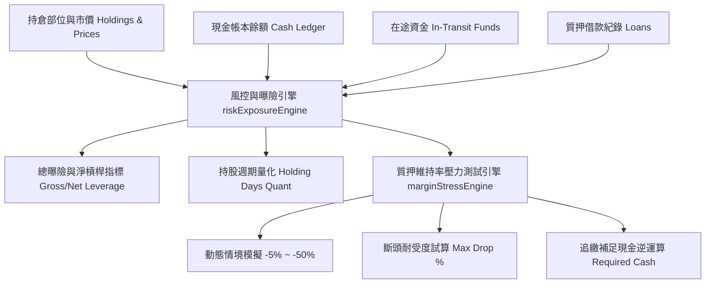

# 需求規格說明書 #0037：整戶總曝險、淨槓桿率與質押維持率極端壓力測試系統 (Portfolio Leverage Exposure & Margin Stress Testing System)

- **版本**：v5.4
- **狀態**：`READY_FOR_DEV`
- **建立日期**：2026-08-28
- **關聯技術債**：
  - [docs/debts/0017-portfolio-leverage-ratio-and-holding-period-quant.md](../debts/0017-portfolio-leverage-ratio-and-holding-period-quant.md)
  - [docs/debts/0009-margin-pledge-stress-testing-and-margin-call-simulator.md](../debts/0009-margin-pledge-stress-testing-and-margin-call-simulator.md)

---

## 1. 執行摘要 (Executive Summary)

本模組旨在為投資人打造頂級專業量化機構級別的**整戶總曝險與淨槓桿率監控體系 (Gross/Net Leverage & Exposure System)** 以及 **質押維持率極端壓力測試與追繳逆運算模擬器 (Margin Pledge Stress Testing & Margin Call Simulator)**。

在經歷了多帳戶現金帳本、XIRR 績效引擎與批次沖銷 (Lot-based Accounting) 的完善後，系統具備了完整的底層資產與負債數據。本模組將各模組之股票現值、質押擔保品、借款負債、在途交割款與現金餘額進行統一整合，解決以下核心痛點：
1. **真實槓桿盲區**：在融資與質押並存時，直觀揭露整戶財務槓桿倍數（$\text{Net Leverage}$），杜絕不知不覺擴張曝險的爆倉風險。
2. **大盤暴跌斷頭恐慌**：提供動態壓力情境模擬滑桿（$-5\% \sim -50\%$），即時推演各情境下的維持率變化、斷頭安全邊際與精確的補繳保證金差額。
3. **週期與週轉量化**：依據加權買進時間量化個股與投資組合之持股天數（Holding Days），精確劃分短線波段、中期波段與長線存股。

在使用者體驗 (UI/UX) 上，**所有專業量化與風控術語均附帶繁體中文名稱，並全面配置「懸停即時說明浮窗 (Hover Tooltips)」**，確保零金融門檻的直觀操作體驗。

---

## 2. 專業名詞雙語與懸停說明對照表 (Terminology & Tooltips Dictionary)

本系統所有介面元素與報表必須嚴格遵循以下中英雙語及懸停說明文案規範：

| 英文術語 | 繁體中文名稱 | 介面顯示格式 | 懸停即時說明浮窗內容 (Tooltip Text) |
| :--- | :--- | :--- | :--- |
| **Gross Exposure** | 總資產曝險額 | `總曝險額 (Gross Exposure)` | 當前所有持有股票與證券資產的市場總現值，代表您暴露在市場波動下的總資金規模。 |
| **Net Asset Value (NAV)** | 帳戶淨資產 | `淨資產 (NAV)` | 總資產（股票現值 + 現金餘額 + 應收在途款）扣除總負債（質押借款 + 融資負債 + 應付在途款）後之真實淨身家。 |
| **Net Leverage Ratio** | 淨槓桿率 | `淨槓桿率 (Net Leverage)` | 計算公式為 `(總股票市值 - 可用現金) / 淨資產 NAV`。衡量扣除防守現金後，帳戶真實承擔的股票市場槓桿倍數。`1.0x` 為無槓桿，`>1.0x` 代表融資或質押借款買股。 |
| **Gross Leverage Ratio** | 總槓桿率 | `總槓桿率 (Gross Leverage)` | 計算公式為 `總股票市值 / 淨資產 NAV`。不考慮手頭現金，衡量每 1 元本金所撬動的總股票部位規模。 |
| **Collateral Maintenance Ratio** | 質押維持率 | `質押維持率 (Maintenance Ratio)` | 計算公式為 `(擔保品股票總市值 / 質押借款總額) * 100%`。台灣法規規定跌破 130% 將觸發券商追繳通知。 |
| **Margin Call Line** | 斷頭追繳警戒線 | `追繳警戒線 (130%)` | 證券金融法定維持率門檻 (130%)。低於此水位將收到追繳令 (Margin Call)，若限期未補足差額將遭券商強制斷頭處分股票。 |
| **Safe Margin Line** | 安全緩衝水位 | `安全水位 (160% / 200%)` | 建議維持的健康水位。在面對大盤修正時能提供充足緩衝空間，避免頻繁補錢或恐慌斷頭。 |
| **Stress Drop %** | 壓力測試情境跌幅 | `情境跌幅 (Stress Drop %)` | 模擬大盤或質押標的在極端行情下瞬間下跌特定幅度時，對維持率與淨資產產生的衝擊測試。 |
| **Max Drop Tolerance** | 最大耐受跌幅 (斷頭距離) | `最大耐受跌幅 (To Margin Call)` | 質押標的從當前價格計算，距離觸發 130% 斷頭追繳線所能承受的最大下跌百分比。 |
| **Required Margin Call Cash** | 追繳補足金額逆運算 | `需補繳現金 (Required Cash)` | 在特定壓力情境下，若維持率低於安全或追繳目標時，系統精確反推需立即匯入的現金保證金金額。 |
| **Weighted Holding Days** | 加權持股天數 | `持股天數 (Days)` | 依據每次買進批次之股數加權計算自取得日起至今日的持有天數，用以評估資金週轉效率與長短線策略歸因。 |

---

## 3. 功能架構與演算法規格 (Functional & Algorithm Specs)

### 3.1 整戶總曝險與淨槓桿率計算引擎 (`src/engine/riskExposureEngine.ts`)

#### 1. 核心輸入參數
- `holdings: HoldingPosition[]`（含最新市價、股數、原始計價與折合 TWD 現值）
- `cashBalances: { TWD: number, USD: number }`（各幣別已結算可用現金）
- `inTransitFunds: { totalReceivableTWD: number, totalPayableTWD: number }`（在途交割款）
- `loans: LoanRecord[]`（股票質押與各類借款合約，包含本金與已提列利息）
- `usdToTwdRate: number`（當前即時/參考匯率）

#### 2. 計算公式與步驟
1. **計算總股票市值 (Total Stock Market Value, $V_{\text{stock}}$)**：
   $$V_{\text{stock}} = \sum (\text{holding.shares} \times \text{holding.currentPrice} \times \text{fxRate})$$
2. **計算可用總現金 (Total Cash, $C$)**：
   $$C = \text{cash}_{\text{TWD}} + (\text{cash}_{\text{USD}} \times \text{usdToTwdRate}) + \text{inTransit}_{\text{receivable}} - \text{inTransit}_{\text{payable}}$$
3. **計算總借款負債 (Total Debt, $D$)**：
   $$D = \sum \text{loan.principalRemaining} + \sum \text{loan.accruedInterest}$$
4. **計算淨資產 (Net Asset Value, $\text{NAV}$)**：
   $$\text{NAV} = V_{\text{stock}} + C - D$$
5. **計算總曝險額 (Gross Exposure)**：
   $$\text{Gross Exposure} = V_{\text{stock}}$$
6. **計算總槓桿率 (Gross Leverage)**：
   $$\text{Gross Leverage} = \frac{V_{\text{stock}}}{\text{NAV}} \quad (\text{若 } \text{NAV} \le 0 \text{ 則標示為警示狀態})$$
7. **計算淨槓桿率 (Net Leverage)**：
   $$\text{Net Leverage} = \frac{V_{\text{stock}} - \max(0, C)}{\text{NAV}}$$

#### 3. 槓桿風險等級判定 (Risk Tier Classification)
| 淨槓桿區間 | 風險等級代碼 | 燈號標籤 | 建議與描述 |
| :--- | :--- | :--- | :--- |
| $\text{Net Leverage} \le 1.0\times$ | `CONSERVATIVE` | 🟢 穩健無槓桿 | 帳戶手頭現金充裕或未啟動借貸槓桿，無強制平倉風險。 |
| $1.0\times < \text{Net Leverage} \le 1.3\times$ | `MODERATE` | 🔵 溫和槓桿 | 適度運用低成本質押或融資放大收益，風險在可控範圍。 |
| $1.3\times < \text{Net Leverage} \le 1.6\times$ | `ELEVATED` | 🟡 積極擴張 | 槓桿偏高，若遭遇大盤 15%~20% 修正需密切留意維持率。 |
| $\text{Net Leverage} > 1.6\times$ | `HIGH_RISK` | 🔴 極度危險 | 財務槓桿過度集中，重大黑天鵝行情可能引發流動性危機。 |

---

### 3.2 質押維持率極端壓力測試引擎 (`src/engine/marginStressEngine.ts`)

#### 1. 擔保品現值與靜態維持率
- **總質押擔保品市值 ($V_{\text{pledge}}$)**：
  $$V_{\text{pledge}} = \sum_{p \in \text{PledgedHoldings}} (p.\text{shares} \times p.\text{currentPrice} \times p.\text{fxRate})$$
- **當前靜態維持率 ($M_0$)**：
  $$M_0 = \frac{V_{\text{pledge}}}{D_{\text{loan}}} \times 100\%$$

#### 2. 動態壓力情境推演 (Stress Testing Formula)
當使用者設定全市場或質押股票預期下跌百分比 $d$ (例如 $d = 0.20$ 代表下跌 20%)：
- **壓力下擔保品市值 ($V_{\text{pledge}}^{\text{stressed}}$)**：
  $$V_{\text{pledge}}^{\text{stressed}} = V_{\text{pledge}} \times (1 - d)$$
- **情境維持率 ($M_{\text{stressed}}$)**：
  $$M_{\text{stressed}} = \frac{V_{\text{pledge}}^{\text{stressed}}}{D_{\text{loan}}} \times 100\%$$

#### 3. 最大耐受跌幅逆運算 (Max Drop Tolerance to 130%)
計算質押股票由現價下跌至觸發券商追繳線（130%）的極限跌幅百分比：
$$\text{Max Drop Tolerance} = 1 - \frac{1.30 \times D_{\text{loan}}}{V_{\text{pledge}}}$$
*(若 $M_0 < 130\%$，則耐受跌幅為 $0\%$，並立即標註已處於追繳違約狀態)*

#### 4. 追繳差額現金補足款逆運算 (Required Margin Call Cash)
在情境維持率 $M_{\text{stressed}}$ 下，若維持率低於目標安全水位 $M_{\text{target}}$（例如法定 $130\%$ 或自訂安全水位 $160\%$）：
$$\text{Target Collateral Value} = D_{\text{loan}} \times \frac{M_{\text{target}}}{100}$$
$$\text{Required Cash} = \max\left(0, \text{Target Collateral Value} - V_{\text{pledge}}^{\text{stressed}}\right)$$

同時提供「加補等值擔保品股票市值」換算：
$$\text{Required Stock Value} = \text{Required Cash}$$

---

### 3.3 持股週期與資金週轉量化引擎 (`src/engine/holdingPeriodEngine.ts`)

結合各標的之 `TaxLot[]` 批次取得日期與買進金額：
1. **加權平均持有天數 (Weighted Holding Days)**：
   $$\text{Weighted Days} = \frac{\sum_{i} (\text{Lot}_i.\text{shares} \times \text{Lot}_i.\text{unitCost} \times \text{Lot}_i.\text{holdingDays})}{\sum_{i} (\text{Lot}_i.\text{shares} \times \text{Lot}_i.\text{unitCost})}$$
2. **持股策略週期標籤分類**：
   - `ULTRA_SHORT`（超短線）：$< 7$ 天 (`⚡ 超短線`)
   - `SHORT_TERM`（短線波段）：$7 \sim 30$ 天 (`🚀 短線波段`)
   - `MEDIUM_TERM`（中期波段）：$31 \sim 180$ 天 (`📈 中期波段`)
   - `LONG_TERM`（長線存股）：$181 \sim 364$ 天 (`💎 長線存股`)
   - `TAX_EXEMPT_LONG`（長期稅務門檻）：$\ge 365$ 天 (`🛡️ 稅務長期 (≥1年)`)

---

## 4. 使用者介面與互動設計 (UI/UX Design)

### 4.1 頂部總覽區：淨槓桿率與總曝險卡片 (`src/components/SummaryCards.tsx`)

1. **淨槓桿率 (Net Leverage) 指標卡**：
   - 數值格式：`1.24x` 或 `0.85x`（附帶動態風險色徽章：綠/藍/黃/紅）。
   - 懸停浮窗：顯示詳細計算式 `(股票現值 $3,450,000 - 現金 $500,000) / 淨資產 $2,380,000`。
   - 點擊卡片：直接喚起「量化風控與槓桿分析」抽屜/模態框。

2. **總曝險與擔保額度徽章**：
   - 在總資產下方以微縮標籤展示 `總曝險: NT$ 3,450,000 (145% NAV)`。

---

### 4.2 質押維持率與極端壓力測試模擬器模態框 (`src/components/MarginStressModal.tsx`)

提供身臨其境的動態風控互動介面：
1. **動態壓力測試滑桿 (Interactive Stress Slider)**：
   - 範圍：`0%` 至 `-50%`，步進 `1%`。
   - 預設快捷按鈕：`[平盤 0%]`、`[回檔 -10%]`、`[修正 -20%]`、`[黑天鵝 -30%]`、`[崩盤 -40%]`。
2. **維持率儀表盤 (Maintenance Ratio Visual Gauge)**：
   - 即時連動滑桿數值，指針動態變化。
   - 刻度區間：
     - `< 130%`：紅色警告區 (追繳斷頭 Margin Call)
     - `130% ~ 160%`：黃色預警區 (注意水位)
     - `160% ~ 200%`：藍色健康區 (標準水位)
     - `> 200%`：綠色安全區 (極度安全)
3. **斷頭耐受度與追繳試算看板**：
   - **最大耐受跌幅**：以顯眼大字展示，例如 `還可承受下跌 -34.8%`。
   - **補足差額計算機**：當情境維持率跌破指定水位時，即時顯示 `需匯入現金 NT$ 185,420` 或 `需加補市值 NT$ 185,420 股票`。
4. **個股獨立壓力自訂 (Custom Individual Stress Testing)**：
   - 支援針對單一主力持股（如台積電 2330、0050）單獨自訂跌幅，精準評估個股黑天鵝對整體質押帳戶的衝擊。

---

### 4.3 持倉明細表格：持有天數與週期標籤

在持倉明細表格（`HoldingsTable`）中：
- 新增 `持股天數 (Holding Days)` 欄位。
- 顯示加權天數（如 `142 天`）與色彩週期膠囊標籤（如 `📈 中期波段`）。
- 滑鼠懸停顯示各別買進批次之原始日期分布。

---

## 5. 檔案變更與架構影響 (Architecture & File Touchpoints)

| 檔案路徑 | 性質 | 職責與變更內容 |
| :--- | :---: | :--- |
| `src/engine/riskExposureEngine.ts` | **新建** | 實作整戶總曝險、淨槓桿率、總槓桿率與風險等級評定演算法。 |
| `src/engine/marginStressEngine.ts` | **新建** | 實作質押維持率動態壓力測試、最大耐受跌幅、追繳保證金差額逆運算。 |
| `src/engine/holdingPeriodEngine.ts` | **新建** | 實作加權平均持有天數、週轉週期與策略標籤分類演算法。 |
| `src/components/MarginStressModal.tsx` | **新建** | 質押維持率極端壓力測試模擬器彈窗、動態滑桿、儀表盤與補繳試算介面。 |
| `src/components/SummaryCards.tsx` | **修改** | 新增淨槓桿率卡片、總曝險提示與風險色階徽章。 |
| `src/components/LoanModal.tsx` | **修改** | 整合「壓力測試模擬」快捷按鈕與耐受跌幅提示。 |
| `src/components/HoldingsTable.tsx` | **修改** | 新增持有天數欄位、策略週期標籤與批次取得日期懸停 Tooltip。 |
| `src/types/index.ts` | **修改** | 新增曝險、槓桿與壓力測試相關 TypeScript 型別定義。 |
| `tests/engine/riskExposureEngine.test.ts` | **新建** | 100% 覆蓋淨槓桿率、負債與風險評級單元測試。 |
| `tests/engine/marginStressEngine.test.ts` | **新建** | 100% 覆蓋極端跌幅、追繳補款逆運算與斷頭安全邊際單元測試。 |
| `tests/engine/holdingPeriodEngine.test.ts` | **新建** | 100% 覆蓋加權持有天數與長短線策略分類單元測試。 |

---

## 6. 測試驅動驗收清單 (Acceptance Criteria & TDD Checklist)

### 6.1 風控與槓桿引擎 (`riskExposureEngine`)
- [ ] 總股票市值 100 萬、現金 20 萬、無借款時：$\text{Net Leverage} = (100 - 20) / 120 = 0.67\times$（評定為 `CONSERVATIVE` 綠燈）。
- [ ] 總股票市值 200 萬、現金 10 萬、質押借款 80 萬（$\text{NAV} = 130$ 萬）時：$\text{Net Leverage} = (200 - 10) / 130 = 1.46\times$（評定為 `ELEVATED` 黃燈）。
- [ ] 當淨資產 $\text{NAV} \le 0$（資不抵債）時，優雅防禦不發生除以零例外，標記為超高風險狀態。

### 6.2 質押維持率與壓力測試引擎 (`marginStressEngine`)
- [ ] 擔保品市值 200 萬、借款 100 萬時，靜態維持率為 $200\%$。
- [ ] 最大耐受跌幅計算驗證：$1 - (1.30 \times 100 / 200) = 35\%$（可耐受下跌 35% 觸發 130% 斷頭）。
- [ ] 設定下跌 $40\%$ 情境：擔保品現值降為 120 萬，維持率降至 $120\%$（低於 130% 斷頭線）。
- [ ] 補繳現金逆運算驗證：
  - 恢復至 130% 需補繳現金：$100 \times 1.30 - 120 = 10$ 萬。
  - 恢復至 160% 安全水位需補繳現金：$100 \times 1.60 - 120 = 40$ 萬。

### 6.3 持有天數與週期引擎 (`holdingPeriodEngine`)
- [ ] 批次 A（買入 100 天前、1000 股 @ 100 元）、批次 B（買入 10 天前、1000 股 @ 200 元）：
  - 總成本 = 10 萬 + 20 萬 = 30 萬。
  - 加權天數 = $(10\text{萬} \times 100 + 20\text{萬} \times 10) / 30\text{萬} = 40$ 天（評定為 `MEDIUM_TERM` 中期波段）。
