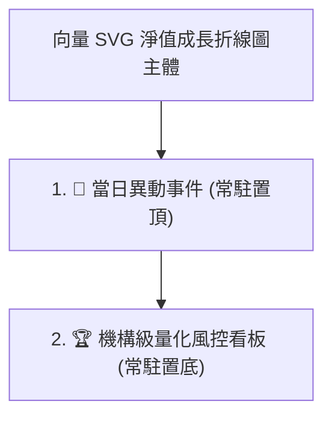

# PRD #0042: 成長圖表佈局重構——當日異動事件置頂常駐與量化指標混合智能常駐 (Permanent Layout for Daily Events & Quant Dashboard)

- **版本**：v5.7.1
- **狀態**：`PROPOSED`
- **日期**：2026-08-28
- **關聯 PRD**：[PRD #0041: 交易計畫紀律檢討、風控觸價警示與大盤量化基準對比](0041-trade-discipline-risk-alerts-and-quant-benchmark.md)
- **目標檔案**：
  - `src/components/PortfolioGrowthChart.tsx`
  - `src/engine/quantMetrics.ts`
  - `src/engine/quantMetrics.test.ts`

---

## 1. 概述與問題陳述 (Executive Summary & Problem Statement)

在 v5.7.0 中，系統成功引入了大盤基準疊圖與 5 大機構級量化風控指標看板（Alpha, Beta, Sharpe, MDD, Volatility）。然而在實際使用者互動體驗上存在以下優化空間：
1. **區塊排序未達最優視覺流動**：「📅 當日異動事件」與「🏆 機構級量化風控看板」排列順序需互換，因當日事件為高頻 Hover 即時探索資訊，應置頂緊鄰折線圖主體下方；而量化綜合看板為宏觀結算指標，應常駐於最底部。
2. **動態條件隱藏造成介面跳動 (Layout Shift)**：目前當日異動事件僅在選中日有事件時出現，量化看板僅在選中基準時出現，導致使用者在切換基準或移動滑鼠時，整個卡片高度劇烈跳動。
3. **無基準時缺少自身組合洞察**：在未選取大盤基準 (`benchmarkType === 'NONE'`) 時，原本看板完全隱藏，但投資組合自身的年化波動度、夏普值（以無風險利率計算）與自身最大回撤 (MDD) 其實無需基準即可即時呈現。

---

## 2. 核心功能與需求規格 (Functional Requirements)

### 2.1 區塊層級與排序重構

- **位置一（頂層）**：`📅 當日異動事件`。
- **位置二（底層）**：`🏆 機構級量化風控看板`。

---

### 2.2 當日異動事件常駐規格 (Permanent Daily Events View)
1. **即時連動機制**：
   - 預設顯示當前時間範圍內**最新一日**（`activeSnapshot`）的事件。
   - 滑鼠在折線圖上移動 Hover 時，即時切換至游標所在日期的異動事件。
2. **三種資料狀態呈現**：
   - **狀態 A（有事件）**：標題顯示 `📅 {date} 當日異動事件 ({count})：`，右側以標籤渲染每項事件內容（例如：`配息入帳 9927: 64,145 TWD`、`買進 2330: 1,000股`）。
   - **狀態 B（無事件）**：標題顯示 `📅 {date} 當日異動事件 (0)：`，內容以深灰半透明簡約標籤顯示 `無`。
   - **狀態 C（無任何歷史快照）**：顯示 `無歷史事件紀錄`。

---

### 2.3 量化指標看板常駐與混合智能計算規格 (Hybrid Permanent Quant Dashboard)
1. **全局常駐**：不論是否選取大盤基準，量化看板始終固定於折線圖最底部，消除任何頁面重排跳動。
2. **混合智能模式 (Hybrid Intelligence Mode)**：
   - **無基準模式 (`benchmarkType === 'NONE'`)**：
     - **標題**：`🏆 機構級量化風控看板 (目前未設定基準對照)`，右上提示「切換上方 🇹🇼 0050 / 🇺🇸 SPY 可解鎖 Alpha & Beta 超額指標」。
     - **詹森阿爾法 (Alpha)**：數值顯示 **「無對應」**（副標：需設定大盤基準）。
     - **貝塔係數 (Beta)**：數值顯示 **「無對應」**（副標：相關度 r = 無對應）。
     - **夏普值 (Sharpe)**：即時計算自身夏普比率 $\frac{R_p - R_f}{\sigma_p}$（若天數不足 5 天或標準差為 0 顯示 **「無」**）。
     - **最大回撤 (MDD)**：即時計算自身投資組合之 MDD（例如 `-18.40%`），基準回撤處顯示「基準回撤: 無對應」。
     - **年化波動度 (Volatility)**：即時計算自身投資組合 252 交易日標準差年化波動度（例如 `8.70%`）。
   - **選定基準模式 (`benchmarkType !== 'NONE'`)**：
     - **標題**：`🏆 機構級量化風控與超額報酬看板 (對照 {benchmarkLabel})`，右上顯示紫虛線走勢對照說明。
     - 5 大指標全數對齊大盤基準進行計算與呈現。

---

## 3. 驗收條件 (Acceptance Criteria)

- [ ] **AC-1 佈局順序**：折線圖下方第一欄為「當日異動事件」，第二欄為「機構級量化風控看板」，兩者順序正確。
- [ ] **AC-2 異動事件常駐**：未 Hover 時預設顯示最新一日，無事件時顯示灰色標籤「無」，不再因無事件而消失。
- [ ] **AC-3 異動事件 Hover 連動**：滑鼠在折線圖上滑動時，上方事件欄位隨日期即時更新事件或顯示「無」。
- [ ] **AC-4 量化看板常駐**：在「無基準 (NONE)」時，量化看板維持常駐不消失；Alpha/Beta 顯示「無對應」，Sharpe/MDD/波動度顯示自身實時數據。
- [ ] **AC-5 基準切換連動**：切換至「🇹🇼 0050」或「🇺🇸 SPY」時，Alpha/Beta 即時解鎖並精確計算，紫虛線同步繪製於折線圖中。
- [ ] **AC-6 測試與構建**：`npm test` 100% 綠燈通過，`npm run build` TypeScript 0 錯誤。
