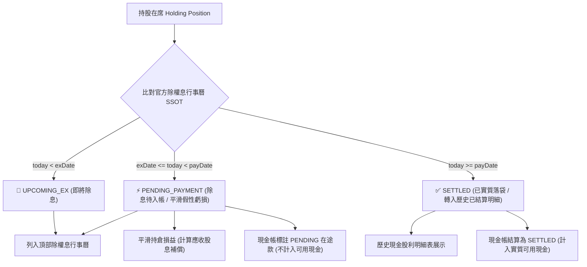

# 需求規格說明書 (PRD #0050)：除息日與入帳發放日時序徹底分離、官方 SSOT 股息行事曆、除權配股在籍股數回溯計算與固定雙欄排版系統

## 1. 執行摘要 (Executive Summary)

本規格書針對除權息生命週期、現金帳流水結算與除權息行事曆視覺呈現進行系統級架構定義與規格化收斂：
1. **除息日 ($Ex\text{-}Date$) 與發放入帳日 ($Pay\text{-}Date$) 徹底時序分離**：確立除息日為假性虧損平滑與債權成立日，發放日為資金實質入帳與可用現金結算日。
2. **官方除權息行事曆單一真實來源 (Single Source of Truth, SSOT)**：以官方公司行動日曆為基準，消除歷史帳本舊紀錄對待入帳行事曆的交錯干擾與誤殺。
3. **除息日在籍股數回溯計算**：以除息日前一日收盤在籍股數為基準，完整回溯並累加所有歷史買賣、除權配股 (`STOCK_DIVIDEND`)、分割、減資與增資補正。
4. **現金帳本 (CashLedger) 發放日精準交割**：現金股利交割日嚴格綁定發放日 (`payDate`)，未到期款項標記為在途 (`PENDING`)，不虛增可用現金。
5. **除權息卡片固定雙欄 (2 欄/行) 與內部 2x2 舒展排版**：每行固定 2 欄卡片，內部參數採 2 列 2 欄寬裕網格，杜絕折行切碎。

---

## 2. 背景與痛點剖析 (Problem Statements)

### 2.1 痛點一：除息日與入帳發放日概念混淆導致現金帳失真
* **現象**：許多投資人或舊系統將除息日登記為股利交易日，導致現金帳在除息當日立即計入可用現金餘額。
* **衝擊**：台股自除息日至發放日通常相隔 28 天，美股相隔約 21 天。提前計入可用現金會造成資金調度與融資維持率高估的風控缺陷。

### 2.2 痛點二：多來源交錯干擾與防重複過濾誤殺
* **現象**：帳本中過去存有手動登記之除息紀錄（但填寫除息日而非發放日），舊系統在掃描官方公告時，因檢查到帳本中有舊紀錄而誤判為「已落袋入帳」，強行將官方除息公告（如 2886 兆豐金、00878、00923）剔除。
* **衝擊**：導致使用者在「除權息待入帳行事曆」中看不到已除息但尚未入帳的重點持股。

### 2.3 痛點三：除息庫存股數未完整計入除權配股等公司行動
* **現象**：除息庫存股數若直接抓當前最新持股或單純累加買賣，會忽略先前除權配發之股票股利 (`STOCK_DIVIDEND`) 或除息日後的持股變動。
* **衝擊**：導致卡片上顯示的「除息庫存股數」與實際除息在籍股數產生落差，計算出的預估股利金額失真。

### 2.4 痛點四：卡片橫向擠壓折行
* **現象**：3 欄排版導致標的名稱截斷成省略號，內部 4 欄小方塊寬度過窄，導致「每股配息金額」等文字折行切碎。

---

## 3. 架構設計與核心生命週期 (Architecture & Lifecycle)

### 3.1 純線性生命週期時序圖 (Linear Lifecycle)

### 3.2 官方單一真實來源 (SSOT) 與事件模型

1. **官方常態日曆庫 (`OFFICIAL_DIVIDEND_CALENDAR`)**：
   - 內建 2330 台積電、2886 兆豐金、00878、00923、9927 等標的之標準除息日 (`exDate`) 與官方發放日 (`payDate`)。
2. **在籍股數計算規範**：
   - 依證券法規，以除息日前一日收盤（$date < exDate$）在籍持股為基準：
     $$\text{sharesHeld} = \text{getHoldingsAsOfDate}(trades, \text{prevDay}, symbol)$$
   - 累加所有歷史交易，完整計入 $BUY$、$SELL$、$STOCK\_DIVIDEND$（配股）、$STOCK\_SPLIT$（分割）、$CAPITAL\_REDUCTION$（減資換發）。

---

## 4. 驗收標準 (Acceptance Criteria)

### 4.1 時序分離與狀態正確性
- [x] **AC-1 (即將除息)**：當 $today < exDate$ 時，標記為 `UPCOMING_EX`，卡片顯示「📢 即將除息」，金額不計入現金帳可用餘額。
- [x] **AC-2 (除息待入帳)**：當 $exDate \le today < payDate$ 時，標記為 `PENDING_PAYMENT`，卡片顯示「⚡ 除息待入帳」，自動補償持倉未實現假性虧損，現金帳標記為 `PENDING` 在途。
- [x] **AC-3 (實質入帳落袋)**：當 $today \ge payDate$ 時，款項轉入「歷史現金股利入帳明細表」，現金帳結算為 `SETTLED` 並計入可用現金。

### 4.2 官方 SSOT 與 5 檔標的對齊
- [x] **AC-4 (無漏項呈報)**：2330 台積電、2886 兆豐金、00878 國泰永續高股息、00923 群益台ESG低碳50、9927 泰銘共 5 檔在席持股 100% 完整呈現在除權息待入帳行事曆中。
- [x] **AC-5 (除權在籍股數精準度)**：股數精準回溯至除息日前一日收盤，完整包含除權配股補正，預估毛額與扣除 2.11% 二代健保後淨額計算正確。

### 4.3 視覺排版與使用者體驗
- [x] **AC-6 (每行固定雙欄)**：外層容器採用每行固定 2 欄卡片佈局，消除非對稱留白。
- [x] **AC-7 (2x2 舒展參數格)**：內部參數採用 2 列 2 欄網格（除息基準日、預估發放日、除息庫存股數、每股配息金額），文字 0 折行，數字清晰舒展。

---

## 5. 技術實現與關鍵模組清單

1. [`src/engine/receivableDividendEngine.ts`](file:///d:/APP/股票紀錄/src/engine/receivableDividendEngine.ts)：官方 SSOT 注入、線性生命週期判定、除息日前在籍股數回溯計算。
2. [`src/engine/corporateActionScanner.ts`](file:///d:/APP/股票紀錄/src/engine/corporateActionScanner.ts)：官方除息事件備援庫與雙層 Session 快取。
3. [`src/engine/cashLedgerEngine.ts`](file:///d:/APP/股票紀錄/src/engine/cashLedgerEngine.ts)：現金股利依 `payDate` 交割，在途款項隔離。
4. [`src/components/DividendLogView.tsx`](file:///d:/APP/股票紀錄/src/components/DividendLogView.tsx)：每行固定 2 欄網格、卡片內部 2x2 舒展排版。
5. [`src/engine/calculator.ts`](file:///d:/APP/股票紀錄/src/engine/calculator.ts)：`getHoldingsAsOfDate` 與 `applyTradeToShares` 完整支援除權配股與公司行動。
