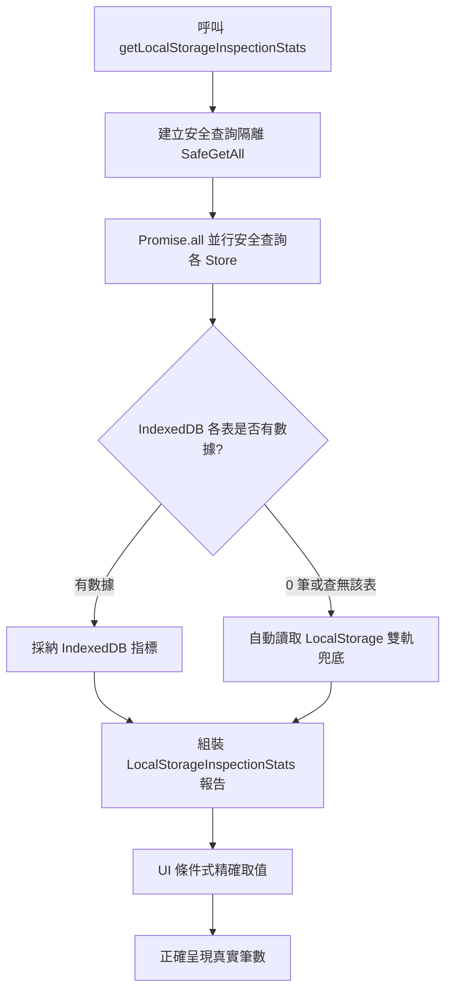

# 規格說明書 0059：本地儲存檢測中心雙軌容錯韌性升級與 0 筆計數盲區修復規格書

## 1. 需求背景與問題陳述 (Problem Statement & Background)

在系統演進至 v6.6+ 時，設定中心導入了「本地數據與儲存空間總覽 (Local Storage Inspector)」模組。然而在實際運作中，發生了**「明明上方導覽列有 602 筆交易、611 筆現金流水，下方時光機也列出 2 份快照，但上方檢測卡片卻全部顯示 0 筆 / 0 份」**之嚴重數據矛盾。

經深度調研與第一性原理剖析，確定兩大連鎖根因：
1. **單點崩潰 (Single Point of Failure via `Promise.all`)**：`getLocalStorageInspectionStats()` 採用 `Promise.all` 批次查詢 10 個 ObjectStore。若舊版資料庫缺少任何新加入的 Store，將觸發 `NotFoundError` 導致整個查詢直接跳入 `catch`，使 10 個表變數全部坍縮為空陣列 `[]`。
2. **UI 空值合併運算子 (Nullish Coalescing) 語法盲區**：在 `SettingsWorkspace.tsx` 中使用 `{stats?.coreAssets.totalTrades.toLocaleString() ?? trades.length}`。當數值為 `0` 時，`0.toLocaleString()` 轉為字串 `"0"`，因其為非 Nullish 的有效字串，導致 Props 中傳入的真實交易筆數永遠無法兜底生效。

本規格書定義「雙軌儲存容錯回退架構 (Dual-Track Fallback Reconciliation)」與「防禦性 UI 取值防線」之正式標準。

---

## 2. 核心架構與設計理念 (Architecture & First Principles)

### 2.1 雙軌容錯查詢模型

### 2.2 核心改動要素

1. **版本平滑升級 (`DB_VERSION = 2`)**：
   - 提升 IndexedDB 版本號，確保舊客戶端在開啟時自動觸發 `onupgradeneeded`，補齊 `corporateActions`、`snapshots` 等新版 Stores。
2. **事務級隔離與存在性檢查**：
   - 在所有底層操作（`dbGet`, `dbGetAll`, `dbPut`, `dbBatchPut`, `dbDelete`, `dbClear`）中，先透過 `db.objectStoreNames.contains(storeName)` 驗證，未存在時安全回傳或跳過，絕不拋出未捕獲例外。
3. **雙軌自動回退機制 (Dual-Track Fallback)**：
   - 當 IndexedDB 表中筆數為 0 時，主動無損回退讀取 LocalStorage 對應金鑰（`STOCK_TRACKER_TRADES_V1` 等）之真實數據長度。
4. **UI 取值防禦防線**：
   - UI 端採用顯式數值判斷 `(stats?.coreAssets ? (stats.coreAssets.totalTrades || trades.length) : trades.length)`，杜絕字串 `"0"` 阻斷兜底。

---

## 3. 驗收標準 (Acceptance Criteria / BDD Scenarios)

### AC 1: 缺少特定 ObjectStore 時的容錯隔離
- **Given**：使用者瀏覽器的 IndexedDB 缺少 `corporateActions` Store。
- **When**：系統調用 `getLocalStorageInspectionStats()`。
- **Then**：其他 9 個 Store（如 `trades`, `brokerAccounts`, `snapshots`）必須正常回傳其統計筆數，不得全盤歸零；`isIndexedDbHealthy` 仍應回報正常。

### AC 2: IndexedDB 為空時自動回退 LocalStorage
- **Given**：IndexedDB 尚未同步（或剛建立空庫），但 LocalStorage 內存有 602 筆交易與 2 個帳戶。
- **When**：進入「設定中心」檢視核心資產數據卡片。
- **Then**：卡片必須準確顯示 `602 筆` 交易與 `2 個` 帳戶，且買進/賣出/配息分類與起訖日期正常解析。

### AC 3: 時光機快照卡片與列表一致性
- **Given**：系統內存有 2 份時光機快照。
- **When**：進入「設定中心」檢視第 3 張卡片「時光機快照」與下方「時光機歷史還原點管理」。
- **Then**：卡片上必須準確顯示 `2 份 (已鎖定 X 份)`，與下方列表清單之總筆數 100% 保持一致。

---

## 4. 測試縫隙 (Test Seams & TDD Verification Plan)

### 公開測試縫隙 (Seams)
- **單元測試層 (`src/utils/db.test.ts`)**：
  - 測試 `getLocalStorageInspectionStats` 在空 IndexedDB 下回退讀取 LocalStorage 之精確度。
  - 測試單獨抹除快取（股價、匯率、行情）時對核心個人資產之絕對隔離性。
- **組件測試層 (`src/components/SettingsWorkspace.test.ts`)**：
  - 測試 `SettingsWorkspace` 在載入中或 stats 延遲時，各數據卡片正確回退至 Props 數據。

---

## 5. 非功能性需求 (Non-Functional Requirements)

1. **效能要求**：`getLocalStorageInspectionStats()` 執行時間不得超過 50ms。
2. **相容性**：支援現代主流瀏覽器（Chrome, Edge, Safari, Firefox）之 IndexedDB 與 LocalStorage。
3. **無損與零污染**：檢測採集僅為唯讀（Read-Only）探針，絕不在採集過程中對使用者資料進行非預期之寫入或刪除。
