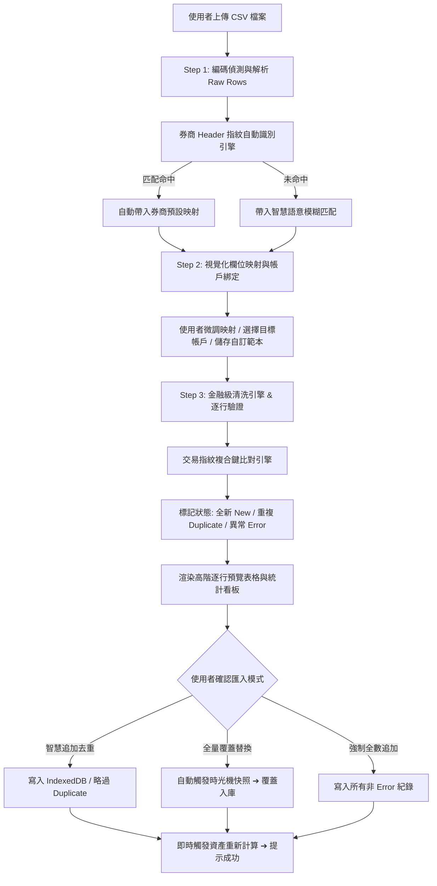

# 技術債 #0005 深度調研與架構規劃規格書 (PRD / Tech Spec)

## 📌 執行摘要 (Executive Summary)

本模組旨在將系統現有「陽春型固定表頭 CSV 匯入」全面升級為**「增強型 CSV 欄位對齊映射與逐行預覽匯入器 (Enhanced CSV Importer)」**。
透過 **3 步驟視覺化匯入精靈**、**主流台美券商範本與 Header 指紋自動偵測**、**金融級髒資料清洗引擎 (Big5/民國年/貨幣千分位/語意動作對齊/字典補全)** 以及 **交易指紋智慧去重機制**，徹底消除使用者從外部券商匯出交易資料時的匯入門檻與資料污染風險。

---

## 🔍 一、現狀分析與調研成果 (Deep Research & Gap Analysis)

### 1.1 現有代碼與限制分析 (Current Code Limitations)
- **現行實作**：`src/utils/storage.ts` (`parseCSVToTrades`) 與 `src/components/ImportModal.tsx`。
- **痛點與缺點**：
  1. **固定表頭比對**：僅能辨識少數預設欄位名稱（如 `日期`、`代碼`、`股數`），券商常見的「成交日期」、「委託書號」、「證券代號」、「成交股數」若有微小差異即無法匹配。
  2. **缺乏欄位對齊介面**：無法讓使用者手動將 CSV 欄位與系統欄位（如 Date, Symbol, Type, Shares, Price, Fee, Tax, Account）進行拖拉或下拉對齊。
  3. **缺乏券商範本庫**：使用者每次匯入都需要手動修改 CSV 內容或重新適配。
  4. **編碼與特殊格式容錯低**：台灣部分券商匯出之 Big-5 (CP950) 編碼、民國年 (`113/05/20`)、美式日期 (`05/20/2024`)、千分位符號 (`1,000`) 或負號括號 `(100)` 會造成解析為 `NaN` 或被直接略過。
  5. **缺乏逐行預覽與去重保護**：匯入前無法預覽即將寫入的資料狀態（有效/異常/重複），容易發生重複灌水或覆蓋後才發現資料錯誤。

### 1.2 主流台美券商 CSV 表頭特徵與指紋調研庫 (Broker Fingerprint Registry)

| 券商名稱 | 市場 | 常見表頭特徵 (Fingerprint Columns) | 日期特徵 | 交易類別特徵 | 預設幣別 |
| :--- | :---: | :--- | :--- | :--- | :---: |
| **國泰證券 (Cathay)** | `TW` | `成交日期`, `委託書號`, `股票代號`, `股票名稱`, `買賣別`, `成交股數`, `成交單價`, `手續費`, `交易稅` | 民國年 (`1130520` 或 `113/05/20`) | `買進` / `賣出` | `TWD` |
| **富邦證券 (Fubon)** | `TW` | `成交日期`, `市場`, `股票代碼`, `股票名稱`, `買賣`, `成交數量`, `成交價格`, `手續費`, `證交稅` | 民國年 / 西元年 | `買進` / `賣出` / `融資買進` | `TWD` |
| **永豐大戶投 (SinoPac)** | `TW` | `委託日期`, `商品代碼`, `商品名稱`, `買賣別`, `成交股數`, `成交價`, `手續費`, `交易稅` | 西元年 (`YYYY/MM/DD`) | `現股買` / `現股賣` | `TWD` |
| **元大證券 (Yuanta)** | `TW` | `日期`, `帳號`, `股號`, `股名`, `交易別`, `股數`, `單價`, `價金`, `手續費`, `稅金` | 民國年 / 西元年 | `買進` / `賣出` / `配息` | `TWD` |
| **Firstrade (第一證券)** | `US` | `TradeDate`, `Symbol`, `Action`, `Quantity`, `Price`, `Fee`, `Amount` | 美式 (`MM/DD/YYYY`) | `BUY` / `SELL` / `DIVIDEND` | `USD` |
| **Charles Schwab (嘉信)** | `US` | `Date`, `Action`, `Symbol`, `Description`, `Quantity`, `Price`, `Fees & Comm`, `Amount` | 美式 (`MM/DD/YYYY`) | `Buy` / `Sell` / `Dividend` / `Reinvest Shares` | `USD` |
| **Interactive Brokers (IB)** | `US` | `Date/Time`, `Symbol`, `Quantity`, `T. Price`, `Comm/Fee`, `Basis`, `Code` | ISO / 美式 | `BOT` / `SLD` | `USD` |
| **通用標準 (Standard)** | `TW/US` | `日期`, `市場`, `代碼`, `名稱`, `類別`, `股數`, `單價`, `手續費`, `稅費`, `幣別` | `YYYY-MM-DD` | `BUY` / `SELL` 等 | `TWD/USD` |

---

## 🏗️ 二、系統架構與資料流設計 (System Architecture & Data Flow)

---

## 🧩 三、核心演算法與模組設計 (Core Modules & Algorithms)

### 3.1 金融級資料清洗引擎 (`src/engine/csvSanitizer.ts`)
1. **日期標準化演算法 (`normalizeDateString`)**：
   - 偵測民國年：正則匹配 `^(\d{2,3})[/-](\d{1,2})[/-](\d{1,2})$` 或 `^(\d{3})(\d{2})(\d{2})$`，民國年 + 1911 轉換為標準西元 `YYYY-MM-DD`。
   - 偵測美式日期：匹配 `^(\d{1,2})/(\d{1,2})/(\d{4})$` 轉換為 `YYYY-MM-DD`。
   - 偵測純數字日期：`20240520` 轉換為 `2024-05-20`。
2. **數值與符號清洗演算法 (`sanitizeNumeric`)**：
   - 剔除貨幣符號 (`$`, `NT$`, `US$`, `¥`)、千分位逗點 (`,`)、百分比 (`%`)。
   - 處理會計括號負數：`"(1,234.50)"` 轉換為 `-1234.5`。
3. **交易動作語意推斷 (`inferTradeType`)**：
   - `買 / Buy / 買進 / 現股買進 / BOT / 認購` ➔ `BUY`
   - `賣 / Sell / 賣出 / 現股賣出 / SLD / 贖回` ➔ `SELL`
   - `息 / Div / 配息 / 現金股利 / Dividend / 股利` ➔ `DIVIDEND`
   - `權 / 配股 / 股票股利 / Stock Div` ➔ `STOCK_DIVIDEND`
   - `減資 / Capital Reduction` ➔ `CAPITAL_REDUCTION`
   - `拆股 / 分割 / Split` ➔ `STOCK_SPLIT`
4. **標的名稱自動補齊 (`resolveSymbolAndName`)**：
   - 結合 `resolveOfficialSecurityName` 與內建股票字典，若代碼為 `2330` 且名稱為空，自動補齊 `台積電`。

### 3.2 交易指紋去重比對模型 (`src/engine/tradeDeduplicator.ts`)
- **交易唯一指紋特徵公式**：
  $$\text{Fingerprint} = \text{hash}(\text{date} + \text{"_"} + \text{market} + \text{"_"} + \text{symbol} + \text{"_"} + \text{type} + \text{"_"} + \text{shares} + \text{"_"} + \text{price})$$
- 比對既有交易庫中所有記錄之指紋，若指紋完全一致，標記為 `IS_DUPLICATE = true`。

### 3.3 三步驟精靈 UI 元件 (`src/components/EnhancedImportModal/`)
- `EnhancedImportModal.tsx`（主彈窗容器，支援 Step 1~3 切換）
- `Step1Upload.tsx`（檔案上傳拖曳區、編碼切換按鈕、偵測券商展示）
- `Step2Mapping.tsx`（左右對齊選擇器、預設值指定、帳戶下拉選單、自訂範本儲存與讀取）
- `Step3Preview.tsx`（逐行預覽資料表、彩色狀態 Badge、去重統計、入庫模式確認切換）

---

## 🧪 四、測試驅動開發 (TDD) 驗證矩陣

| 測試模組 | 測試縫隙 (Test Seam) | 測試情境 (Test Cases) |
| :--- | :--- | :--- |
| **`csvSanitizer.test.ts`** | `normalizeDateString` | 1. 民國年 `113/05/20` 正確轉為 `2024-05-20` 2. 美式日期 `12/31/2023` 正確轉為 `2023-12-31` 3. 純數字 `20240101` 與 `1130101` 正確解析 |
| **`csvSanitizer.test.ts`** | `sanitizeNumeric` | 1. 帶千分位 `12,345.67` 正確轉換為 `12345.67` 2. 帶幣別與括號 `(NT$ 5,000)` 轉為 `-5000` 3. 非法字串安全回傳 0 或 NaN |
| **`csvSanitizer.test.ts`** | `inferTradeType` | 1. 測試台股各種買賣語意 (`現股買`, `買進`, `賣出`, `除權息`) 2. 測試美股語意 (`BOT`, `SLD`, `Buy`, `Sell`, `Div`)|
| **`brokerTemplates.test.ts`** | `detectBrokerTemplate` | 1. 給予國泰證券表頭，精準判定為 `CATHAY` 2. 給予 Firstrade 表頭，精準判定為 `FIRSTRADE` 3. 未知表頭安全回退為 `STANDARD` 或 `CUSTOM` |
| **`tradeDeduplicator.test.ts`**| `deduplicateTrades` | 1. 既有交易與新增交易比對，精準過濾重複指紋記錄 2. 日期或價格微異時正確判定為全新交易 3. 支援 `APPEND_NEW_ONLY`、`OVERWRITE`、`APPEND_ALL` 三種模式 |

---

## 📋 五、分階段實作任務拆解 (Actionable Task Breakdown)

1. **Task 1 (引擎層 - TDD)**：實作 `src/engine/csvSanitizer.ts` 與完整單元測試（涵蓋日期、數值、語意、名稱解析）。
2. **Task 2 (範本與指紋庫 - TDD)**：實作 `src/engine/brokerTemplates.ts` 與 `src/engine/tradeDeduplicator.ts`，支援台美各大券商範本與指紋比對。
3. **Task 3 (UI 元件層)**：建置 `src/components/EnhancedImportModal/` 三步驟視覺化精靈與 CSS 動畫/暗黑毛玻璃風格。
4. **Task 4 (系統整合)**：將 `App.tsx` 匯入入口升級對接 `EnhancedImportModal`，打通快照備份、IndexedDB 寫入與自動重新計算。
5. **Task 5 (技術債結案與文檔更新)**：更新 `docs/debts/README.md` (0005 標記為 RESOLVED)、建立 ADR 文件、完成 `npm test` 與 `npm run build` 全綠燈驗證。
