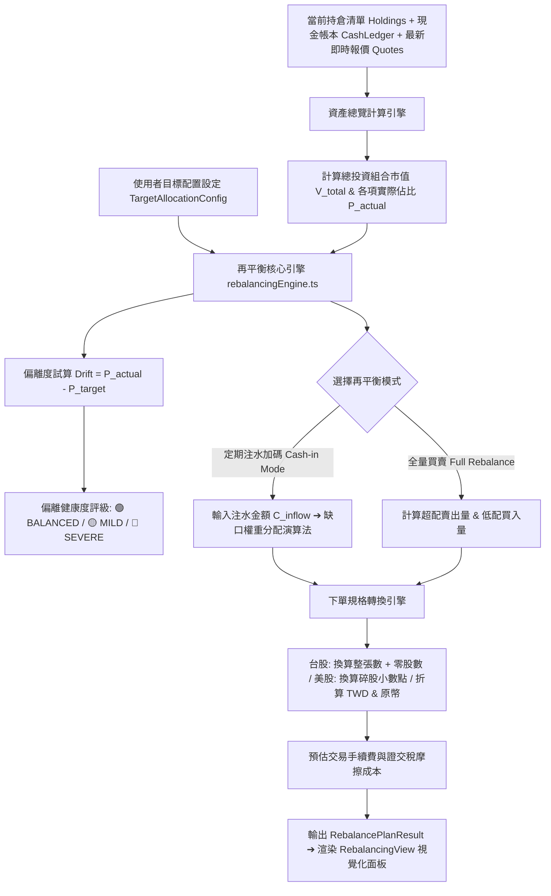

# 技術債 #0012 深度調研與架構規劃規格書 (PRD / Tech Spec)

## 📌 執行摘要 (Executive Summary)

本模組旨在將系統現有「被動式資產分佈呈現」全面升級為**「資產配置目標偏離 (Drift) 試算與再平衡推薦器 (Target Allocation Drift & Rebalancing Optimizer)」**。
透過 **雙軌目標模型 (市場大類/個股標的)**、**偏離度量化與容忍區間 (Tolerance Bands) 診斷機制**、**雙模式再平衡演算法 (定期注水加碼 / 全量買賣再平衡)** 以及 **跨市場交易顆粒度 (台股整張+零股 / 美股碎股 / 雙幣別即時換算)**，提供投資人最頂級的資產配置紀律與主動決策輔助。

- **關聯技術債**：[docs/debts/0012-target-allocation-drift-and-rebalancing-optimizer.md](../debts/0012-target-allocation-drift-and-rebalancing-optimizer.md)
- **規格書編號**：#0065
- **影響範圍**：`src/types/allocation.ts`、`src/engine/rebalancingEngine.ts`、`src/engine/rebalancingEngine.test.ts`、`src/components/RebalancingView.tsx`、`src/components/AllocationChart.tsx`、`docs/debts/README.md`

---

## 🔍 一、現狀分析與調研成果 (Deep Research & Gap Analysis)

### 1.1 現有代碼與限制分析 (Current Code Limitations)
- **現行實作**：`src/components/AllocationChart.tsx`（樹狀圖與長條權重清單）與 `src/components/TreemapChart.tsx`。
- **痛點與缺點**：
  1. **被動式檢視，缺乏目標錨定**：系統僅能呈現當下市值權重（如台股 65%、美股 35%），投資人無法設定理想的「目標權重 (Target Allocation)」（如：美股 50%、台股 30%、現金 20%）。
  2. **缺乏偏離度 (Drift) 診斷**：無法即時量化資產因行情漲跌造成的結構失衡程度，缺乏直觀警示燈號。
  3. **缺乏再平衡決策引擎**：
     - 當投資人領到薪水或股息想進行「定期定額注水加碼」時，必須手動計算應補足多少金額才能修復偏離；
     - 當投資人進行「年度再平衡」時，缺乏自動計算各標的超配賣出與低配買進金額的精確試算。
  4. **未適配台美股交易顆粒度與摩擦成本**：台股下單需區分「整張 (1,000股)」與「盤中零股」，美股支援小數碎股；再平衡時若未考慮交易手續費與證交稅，容易產生預算落差。

### 1.2 金融會計與資產配置演算法調研 (Modern Portfolio Management)

| 運算模型 | 核心原則 | 適用場景 | 摩擦成本與稅負衝擊 | 演算法邏輯 |
| :--- | :--- | :--- | :--- | :--- |
| **定期注水加碼再平衡<br>(Cash-in / Contribution)** | **只買不賣**<br>利用新增現金加碼落後部位 | 定期定額投入、股息再投入、領薪注水 | **極低**<br>不產生證交稅、無資本利得稅、無賣出手續費 | 1. 找出所有實際佔比低於目標的標的<br>2. 計算各低配標的市值缺口<br>3. 將注水現金依缺口權重分配加碼 |
| **全量買賣再平衡<br>(Full Rebalancing)** | **嚴格重置**<br>賣出超配、買進低配 | 年度/季度資產重置、極端市場行情修正 | **中等**<br>產生賣出稅費與潛在損益實現 | 1. 計算理論目標總市值之個別應有金額<br>2. 超配標的產生賣出建議 ($\Delta V < 0$)<br>3. 低配標的產生買進建議 ($\Delta V > 0$) |
| **偏離容忍帶<br>(Tolerance Bands)** | **防禦性過濾**<br>偏離未達門檻不建議頻繁交易 | 全模式通用過濾層 (預設 $\pm 5\%$) | **最佳化**<br>避免因日常微小波動頻繁換手產生摩擦 | 1. $|Drift| \le 5\%$ ➔ 🟢 正常平衡<br>2. $5\% < |Drift| \le 10\%$ ➔ 🟡 輕度偏離<br>3. $|Drift| > 10\%$ ➔ 🔴 顯著失衡 |

---

## 🏗️ 二、系統架構與資料流設計 (System Architecture & Data Flow)



---

## 🧩 三、核心演算法與資料結構設計 (Core Models & Algorithms)

### 3.1 目標配置與再平衡資料型別 (`src/types/allocation.ts`)

```typescript
export type TargetAllocationType = 'MARKET' | 'SYMBOL';

export interface TargetAllocationItem {
  key: string;               // 市場 ('TW' | 'US' | 'CASH') 或 股票代碼 ('2330' | '0050' | 'AAPL')
  name?: string;            // 標的名稱 (如 '台積電', '美股部位', '現金儲備')
  targetPercent: number;    // 目標百分比 (例如 40 代表 40%)
}

export interface TargetAllocationConfig {
  id: string;
  type: TargetAllocationType;    // 'MARKET' (市場層級) 或 'SYMBOL' (個股層級)
  name: string;                  // 策略名稱 (例如: '核心股債 6:4', '科技股成長配置')
  items: TargetAllocationItem[]; // 各項目比例清單 (各項之和應為 100%)
  toleranceBandPercent: number;  // 偏離容忍門檻 % (預設 5.0 代表 ±5%)
  updatedAt: number;
}

export type RebalanceMode = 'CASH_IN' | 'FULL_REBALANCE';
export type RebalanceItemStatus = 'BALANCED' | 'MILD_DRIFT' | 'SEVERE_DRIFT';
export type RebalanceAction = 'BUY' | 'SELL' | 'HOLD';

export interface RebalanceItemRecommendation {
  key: string;
  name: string;
  market?: 'TW' | 'US';
  currency: 'TWD' | 'USD';
  currentPrice: number;
  currentValueTwd: number;
  currentPercent: number;
  targetPercent: number;
  driftPercent: number;
  status: RebalanceItemStatus;
  action: RebalanceAction;
  recommendedAmountTwd: number;
  recommendedAmountOriginal: number;
  recommendedShares: number;
  recommendedLotsSummary?: string; // 例如: '2 張 + 350 股' (台股)
}

export interface RebalancePlanResult {
  mode: RebalanceMode;
  totalPortfolioValueTwd: number;
  newTotalValueTwd: number;
  cashInflowTwd: number;
  isFullyBalanced: boolean;
  toleranceBandPercent: number;
  recommendations: RebalanceItemRecommendation[];
  summary: {
    totalBuyAmountTwd: number;
    totalSellAmountTwd: number;
    estimatedFrictionTwd: number;
  };
}
```

### 3.2 核心數學公式與演算法 (`src/engine/rebalancingEngine.ts`)

#### 1. 偏離度分析 (Drift & Health Rating)
$$P_i = \frac{V_i}{V_{\text{total}}} \times 100\%$$
$$\text{Drift}_i = P_i - \text{Target}_i$$
$$\text{Status}_i = \begin{cases} \text{BALANCED} & \text{if } |\text{Drift}_i| \le T_{\text{band}} \\ \text{MILD\_DRIFT} & \text{if } T_{\text{band}} < |\text{Drift}_i| \le 2 \times T_{\text{band}} \\ \text{SEVERE\_DRIFT} & \text{if } |\text{Drift}_i| > 2 \times T_{\text{band}} \end{cases}$$

#### 2. 定期注水加碼再平衡 (Cash-in Only Algorithm)
1. 設注水現金 $C_{\text{inflow}} \ge 0$，$V_{\text{new}} = V_{\text{total}} + C_{\text{inflow}}$。
2. 對於各標的 $i$，其理論目標資產值為 $V_{\text{target}, i} = V_{\text{new}} \times \frac{\text{Target}_i}{100}$。
3. 計算資金缺口 $\text{Gap}_i = \max(0, V_{\text{target}, i} - V_i)$。
4. **情況 A**：若 $\sum \text{Gap}_i \le C_{\text{inflow}}$，則各低配標的獲得全額 $\text{Gap}_i$，剩餘注水資金 $R = C_{\text{inflow}} - \sum \text{Gap}_i$ 按 $\text{Target}_i$ 等比分配。
5. **情況 B**：若 $\sum \text{Gap}_i > C_{\text{inflow}}$，則依各標的缺口比例分配注水資金：
   $$\text{Allocated}_i = C_{\text{inflow}} \times \frac{\text{Gap}_i}{\sum \text{Gap}_k}$$

#### 3. 全量買賣再平衡 (Full Rebalancing Algorithm)
1. 理論目標資產值 $V_{\text{target}, i} = V_{\text{total}} \times \frac{\text{Target}_i}{100}$。
2. 計算調整差額 $\Delta V_i = V_{\text{target}, i} - V_i$。
3. 若 $\Delta V_i > 0$，建議 `BUY` 加碼 $\Delta V_i$。
4. 若 $\Delta V_i < 0$，建議 `SELL` 減碼 $|\Delta V_i|$。

#### 4. 台美股下單顆粒度轉換
- **台股 (TW)**：
  $$\text{Shares} = \lfloor \frac{\text{Amount}_{\text{TWD}}}{\text{Price}} \rfloor$$
  $$\text{Lots} = \lfloor \frac{\text{Shares}}{1000} \rfloor, \quad \text{OddShares} = \text{Shares} \bmod 1000$$
- **美股 (US)**：
  $$\text{Shares}_{\text{US}} = \text{round}\left(\frac{\text{Amount}_{\text{USD}}}{\text{Price}}, 3\right)$$

---

## 🧪 四、測試驅動開發 (TDD) 驗證矩陣

| 測試檔案 | 測試縫隙 (Test Seam) | 測試情境 (Test Cases) | 預期結果 |
| :--- | :--- | :--- | :--- |
| **`rebalancingEngine.test.ts`** | `calculateAllocationDrift` | 1. 目標總和非 100% 驗證<br>2. 正常平衡 ($Drift \le 5\%$) 判定<br>3. 輕度與顯著偏離判定 | 1. 拋出校驗錯誤或標記無效<br>2. 回傳 `BALANCED`<br>3. 回傳 `MILD_DRIFT` 與 `SEVERE_DRIFT` |
| **`rebalancingEngine.test.ts`** | `generateCashInRebalancePlan` | 1. 注水資金充裕情境<br>2. 注水資金有限情境<br>3. 組合已經完美平衡情境 | 1. 各標的缺口完全補足<br>2. 資金優先按缺口比例填補<br>3. 資金依目標比例等比注入 |
| **`rebalancingEngine.test.ts`** | `generateFullRebalancePlan` | 1. 超配賣出與低配買進平衡性<br>2. 跨市場 TWD/USD 與匯率折算<br>3. 包含現金項目平衡試算 | 1. 總賣出金額與總買進金額平衡<br>2. USD 標的正確換算原幣<br>3. 現金與證券總和吻合 |
| **`rebalancingEngine.test.ts`** | `convertAmountToOrderUnits` | 1. 台股整張 (1,000股) 與零股拆解<br>2. 美股碎股小數點第 3 位精準度<br>3. 股價為 0 或負數防呆處理 | 1. 輸出正確張數與零股描述<br>2. 輸出 0.123 股精度<br>3. 安全防呆不拋錯 |

---

## 📋 五、交付物與影響清單 (Deliverables & Impact Checklist)

- [ ] **型別定義**：`src/types/allocation.ts`
- [ ] **純運算引擎**：`src/engine/rebalancingEngine.ts`
- [ ] **完整單元測試**：`src/engine/rebalancingEngine.test.ts`
- [ ] **UI 視圖元件**：`src/components/RebalancingView.tsx`
- [ ] **主圖表整合**：`src/components/AllocationChart.tsx`
- [ ] **技術債看板更新**：`docs/debts/README.md` (標記 #0012 為 `RESOLVED`)
- [ ] **專案上下文同步**：`CONTEXT.md` 與交接手冊

---

## 🚀 六、分階段執行步驟 (Roadmap)

1. **Phase 1: TDD 核心引擎開發**
   - 建立型別與測試用例，編寫純粹無副作用的再平衡計算引擎。
   - 確保 `npm test` 綠燈 100% 通過。
2. **Phase 2: UI 視圖構建與視覺化**
   - 構建 `RebalancingView.tsx`，具備策略編輯器、偏離度雙色對比長條、注水加碼輸入框與下單明細清單。
   - 整合進 `AllocationChart.tsx`。
3. **Phase 3: 驗證與技術債閉環**
   - 執行 `npm test` 與 `npm run build` 進行全量零錯誤校驗。
   - 更新技術債看板並完成交接文件更新。
