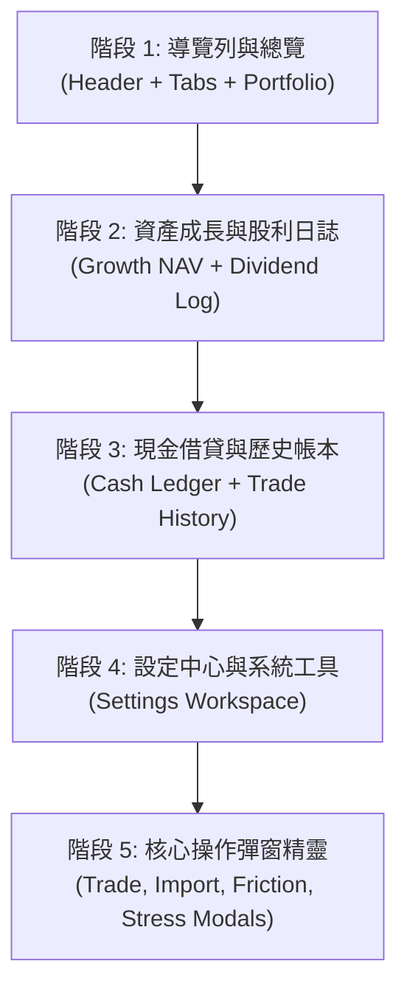

# 0069 - 全站 UI/UX 現代金融終端深色玻璃擬態升級規格 (Full Project UI/UX Modern Glassmorphism & Financial Terminal Upgrade Spec)

## 1. 概述與背景 (Overview & Background)

本專案經過多次迭代，已具備極高精度的台美股雙市場會計核算、多券商分流、公司行動掃描、XIRR 現金流折現、質押維持率壓力測試與智慧技術指標分析等專業功能。然而，既有使用者介面存在以下問題：
- **視覺雜訊過多**：多種功能按鈕與控制器分散，缺乏一致的視覺層級與資訊分群（Information Grouping）。
- **數值掃描易讀性不足**：大額數字排版缺乏等寬微調（Tabular Numbers）與層次光澤。
- **微互動與狀態指示欠缺**：開休市、即時報價、應收股利與風控警告缺乏精緻動態指示。

本規格定義本專案全站所有頁面與模態框的 **「現代深色玻璃擬態 (Modern Glassmorphism) + 極致金融終端風 (Financial Terminal HUD)」** 升級標準與循序漸進的實施路徑。

---

## 2. 核心設計系統規範 (Core Design System & Tokens)

### 2.1 色彩與層次變數 (Color Tokens)
- **背景底色**：`--bg-primary: #080c14`（深邃黑夜），輔以柔和放射狀三色微漸變光暈。
- **卡片基底**：`--bg-card: rgba(15, 23, 42, 0.72)`，搭配 `backdrop-filter: blur(16px)` 與柔和內外陰影。
- **控制元件底色**：`--bg-input: #131d31`，邊框 `--border-color: rgba(51, 65, 85, 0.45)`。
- **雙市場漲跌色彩模式**：
  - 台灣市場模式（`data-color-theme="taiwan"`）：紅漲（`#ef4444`）綠跌（`#10b981`）。
  - 國際市場模式（`data-color-theme="international"`）：綠漲（`#10b981`）紅跌（`#ef4444`）。
- **輔助主題色**：天藍（`#38bdf8` 帳戶/資訊）、翡翠綠（`#10b981` 獲利/主要按鈕）、紫羅蘭（`#a78bfa` 美股/公司行動）、琥珀金（`#fbbf24` 股息/利息）、珊瑚紅（`#f87171` 質押壓力/虧損）。

### 2.2 數值與排版 (Typography & Micro-interactions)
- **等寬金融字型**：`.mono` 類別採用 `'JetBrains Mono', monospace`，開啟 `font-variant-numeric: tabular-nums`，保證金額與股數垂直對齊不抖動。
- **狀態心跳光點**：`.pulse-dot-green` 用於盤中即時狀態、最新連線與健康指示。
- **膠囊切換器 (Segmented Pill Switchers)**：所有模式、市場、會計視角與時間範圍按鈕全面升級為流暢膠囊群組。

---

## 3. 模組分階段實施規格 (Page-by-Page Upgrade Breakdown)

### 3.1 階段 1：導覽列與投資組合總覽 (已就緒)
- **[Header.tsx](file:///d:/APP/股票紀錄/src/components/Header.tsx)**：
  - 品牌區：微光 Logo + 脈衝點 + PRO 徽章。
  - 控制區：市場、帳戶、會計口徑切換為 Pill 膠囊；匯率與盤中狀態升級為金融 HUD 晶片。
  - 操作區：突顯 ✨ 智慧掃描 與 ➕ 新增交易，收斂 JSON/CSV 匯出入按鈕。
- **[WorkspaceTabs.tsx](file:///d:/APP/股票紀錄/src/components/WorkspaceTabs.tsx)**：
  - 6 大活頁標籤升級為深藍發光膠囊底座，Badge 徽章色彩對比增強。
- **[SummaryCards.tsx](file:///d:/APP/股票紀錄/src/components/SummaryCards.tsx)**：
  - 大字排版 + 柔和邊框 + 淨槓桿率/XIRR/利息膠囊整合。
- **[AllocationChart.tsx](file:///d:/APP/股票紀錄/src/components/AllocationChart.tsx)**：
  - 比例 HUD 晶片、三段式微漸變進度條、視圖切換微按鈕。
- **[HoldingsTable.tsx](file:///d:/APP/股票紀錄/src/components/HoldingsTable.tsx)**：
  - 三態篩選膠囊（持倉中/已平倉/全部）、高光行懸停、精緻快速操作膠囊。

### 3.2 階段 2：資產成長與股利日誌 (NAV & Dividend)
- **[PortfolioGrowthChart.tsx](file:///d:/APP/股票紀錄/src/components/PortfolioGrowthChart.tsx)**：
  - 時間範圍切換器（1M / 3M / 6M / YTD / 1Y / ALL）膠囊化。
  - Recharts 漸變折線與雙軸（NAV 淨值 vs 總回報率%）發光曲線。
  - 浮動 Tooltip HUD 顯示當日淨值、累計入金、未實現價差與 XIRR。
  - 歷史市價背景同步進度條視覺微動效。
- **[DividendLogView.tsx](file:///d:/APP/股票紀錄/src/components/DividendLogView.tsx)**：
  - 待發放應收股利高光卡片與發放倒數指示。
  - 年度與月度股利分佈長條圖/視覺層次強化。
  - 二代健保與美股 30% 預扣稅扣繳紀錄膠囊對齊。

### 3.3 階段 3：現金與借貸質押管理 & 交易歷史帳本 (Cash & Ledger)
- **[CashLedgerWorkspace.tsx](file:///d:/APP/股票紀錄/src/components/CashLedgerWorkspace.tsx)**：
  - 多券商現金水位卡片與即時購買力 (Buying Power) HUD。
  - 借貸質押維持率動態警戒條（安全綠 > 預警黃 > 追繳紅）。
  - 現金流水流水帳過濾器與分類膠囊。
- **[TradeHistoryTable.tsx](file:///d:/APP/股票紀錄/src/components/TradeHistoryTable.tsx)**：
  - 搜尋與過濾控制列（日期區間、買賣型態、券商帳戶）膠囊化。
  - 交易明細表格斑馬紋、行懸停高亮、編輯與刪除操作按鈕微縮化。

### 3.4 階段 4：設定中心 (Settings Workspace)
- **[SettingsWorkspace.tsx](file:///d:/APP/股票紀錄/src/components/SettingsWorkspace.tsx)**：
  - 券商手續費折讓與融資/質押利率管理卡片。
  - 外部 API Key（Yahoo / TWSE / FinMind / FMP）連線狀態指示燈與安全遮蔽切換。
  - 時光機快照與資料庫冷備份還原面板，提升操作安全感。

### 3.5 階段 5：核心操作彈窗精靈 (Modals & Tools)
- **[TradeModal.tsx](file:///d:/APP/股票紀錄/src/components/TradeModal.tsx)**：
  - 買進/賣出/除權息型態切換膠囊，即時預估成交總額與手續費折讓 HUD。
- **[EnhancedImportModal.tsx](file:///d:/APP/股票紀錄/src/components/EnhancedImportModal.tsx)**：
  - 拖曳上傳區高光回饋、CSV 欄位對應預覽與重複交易智慧排除清單。
- **[MarginStressModal.tsx](file:///d:/APP/股票紀錄/src/components/MarginStressModal.tsx)**：
  - 壓力測試模擬滑桿、極端崩跌情境維持率動態儀表。
- **[XirrDetailModal.tsx](file:///d:/APP/股票紀錄/src/components/XirrDetailModal.tsx)**：
  - 現金流時間權重折現分佈可視化。

---

## 4. 品質保證與防禦原則 (Quality Assurance & Defensive Principles)

1. **功能零破壞 (Zero Breaking Changes)**：所有數學公式（加權均價、淨變現值、XIRR、維持率、稅費折讓）100% 保持既有單元測試驗證標準。
2. **測試驅動保護 (TDD Seams)**：每次變更必須通過既有 42 個測試檔案（465 項測試）與 TypeScript 0 錯誤型別檢查。
3. **極簡收斂 (KISS)**：優先採用純 CSS 變數與原生效能，避免導入沉重額外套件。

---

## 5. 驗收標準 (Acceptance Criteria)

- [x] 完成第一階段（Header、WorkspaceTabs、Portfolio 頁面）現代深色玻璃擬態重構。
- [x] 全量 465 項單元測試 100% 通過，TypeScript 0 錯誤。
- [ ] 完成第二階段（NAV 資產成長折線圖、Dividend 股利日誌）UI/UX 升級。
- [ ] 完成第三階段（Cash Ledger 現金借貸、Trade History 歷史帳本）UI/UX 升級。
- [ ] 完成第四階段（Settings Workspace 設定中心）UI/UX 升級。
- [ ] 完成第五階段（全彈窗與精靈 Modals）UI/UX 升級。
- [ ] 跨裝置 (Desktop / Laptop / Tablet) 響應式佈局無破版。
