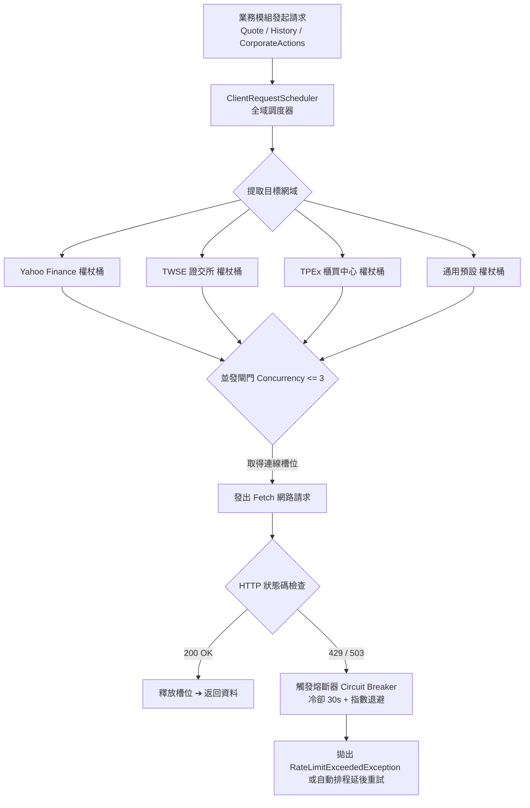

# PRD #0090: 客戶端 API 速率限制 (Rate Limiting) 與防封禁配額保護規格說明書

- **版本**：v8.9.0
- **狀態**：`APPROVED`
- **關聯技術債**：[技術債 #0035 (P2)](../debts/0035-client-side-rate-limiting-and-api-quota-guard.md)
- **架構連動**：為後續 [技術債 #0019 (全量指標回補)](../debts/0019-local-historical-indicators-and-external-backfill-engine.md) 與 [技術債 #0020 (宏觀戰情室)](../debts/0020-market-war-room-macro-liquidity-and-ai-advisor.md) 建立不可或缺的防封禁底層基建。

---

## 1. 執行摘要與核心目標 (Executive Summary & Goals)

### 1.1 背景盲區
目前系統在初始化與使用者手動觸發時，會向外部發送多個高並發請求：
- `priceFetcher.ts`：以 `Promise.all` 併發拉取全投資組合最新行情報價。
- `historicalPriceFetcher.ts`：連續抓取多檔標的歷史價格。
- `corporateActionScanner.ts`：針對各標的抓取歷年除權息公告。

無控管的突發高頻請求極易觸發交易所（TWSE/TPEx）與 Yahoo Finance 的 IP 防護機制，回傳 `HTTP 429 Too Many Requests`，造成本地 IP 被暫時封鎖數小時至一天，系統報價全面癱瘓。

### 1.2 核心目標
1. **網域獨立權杖桶 (Domain-specific Token Bucket Rate Limiting)**：
   - 針對 Yahoo Finance、TWSE、TPEx 分別建立獨立速率限制器（如每秒最大請求數、突發桶容量）。
2. **連線並發池控制 (Concurrency Pool)**：
   - 限制同時在線的 HTTP 請求上限（預設最大 3 個連線），防止瀏覽器連線池佔滿與主執行緒卡頓。
3. **自動指數退避與熔斷器 (Exponential Backoff & Circuit Breaker)**：
   - 當特定網域回傳 HTTP 429 或 503 時，自動觸發熔斷並進入冷卻期（預設 30 秒），且後續重試加入隨機抖動 (Jitter)，杜絕連環轟炸。
4. **透明中介層無痛整合 (Zero-Disruption Adapter)**：
   - 將速率限制調度器深度整合進 `fetchWithCORSProxy`，既有業務代碼無需大幅修改，即享全域速率保護。

---

## 2. 系統架構與資料流 (System Architecture & Dataflow)



---

## 3. 詳細介面與資料模型 (Interface & Schema Specification)

### 3.1 速率限制配置與狀態
```typescript
// src/engine/rateLimiter.ts
export interface DomainRateConfig {
  domain: string;
  maxTokens: number;         // 權杖桶容量 (最大突發請求量)
  refillRatePerSec: number;  // 權杖每秒填充速率
  maxConcurrency: number;    // 最大並發請求數
}

export interface CircuitBreakerState {
  isOpen: boolean;           // 熔斷器是否開啟（冷卻阻斷中）
  cooldownUntil: number;     // 冷卻截止時間戳 (毫秒)
  consecutiveFailures: number;// 連續失敗次數
}

export interface RateLimiterMetrics {
  totalScheduled: number;
  totalExecuted: number;
  totalThrottled: number;
  circuitBreakerTrips: number;
  activeRequests: number;
}
```

### 3.2 核心類別設計
```typescript
export class ClientRequestScheduler {
  private configs: Map<string, DomainRateConfig>;
  private tokens: Map<string, number>;
  private lastRefill: Map<string, number>;
  private activeCount: Map<string, number>;
  private circuitBreakers: Map<string, CircuitBreakerState>;

  constructor(customConfigs?: DomainRateConfig[]);
  
  // 提取 URL 之主機名稱或歸類網域
  public resolveDomain(url: string): string;

  // 排程並執行請求
  public async schedule<T>(
    url: string,
    requestFn: () => Promise<T>,
    options?: { priority?: 'HIGH' | 'NORMAL' | 'LOW'; timeoutMs?: number }
  ): Promise<T>;

  // 手動重置或查詢指標
  public getMetrics(): RateLimiterMetrics;
  public resetCircuitBreaker(domain: string): void;
}
```

---

## 4. 驗收標準 (Acceptance Criteria)

1. **權杖桶節流驗收**：
   - 模擬連續並發 20 個請求，請求必須依據設定的速率間隔平滑流出，無突發打滿現象。
2. **並發連線槽位驗收**：
   - 任何瞬間進行中的請求總數不超過 `maxConcurrency`（預設 3）。
3. **熔斷器保護驗收**：
   - 當 mock 請求拋出 HTTP 429 時，熔斷器立即轉為開啟狀態，在冷卻時間（30 秒）內後續同網域請求立即拒絕或排隊延遲，避免連續撞牆。
4. **既有行情相容性驗收**：
   - `fetchWithCORSProxy` 接入速率限制器後，所有既有單元測試（如 `priceFetcher.test.ts`、`historicalPriceFetcher.test.ts`）維持 100% 通過。
