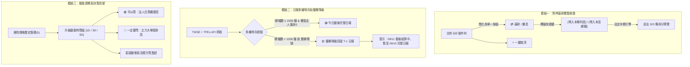

# Spec 0119: 質押借貸還款繳息按鈕整併、籌碼日報優雅降級與聰明錢動能優化規格書

## Problem Statement

在經歷 V8.36.0 (法定沖償順序) 與 V8.37.0 (自訂還款日期與歷史補登) 的重大架構升級後，實務金融操作與視覺化決策中浮現以下三大核心痛點：

### 1. 質押借貸「繳息」與「還本」按鈕二元分立，認知摩擦過高 (Pledge Action Fragmentation)
- **現況問題**：在 [`CashLedgerWorkspace.tsx`](file:///d:/APP/股票紀錄/src/components/CashLedgerWorkspace.tsx) 的股票質押借貸卡片底部，配置了 `[💰 繳息]`、`[💳 還本]`、`[⚡ 一鍵結清]` 三個按鈕。
- **底層機轉與實務矛盾**：
  - 系統底層已完整落實《民法》第 323 條法定沖償順序（規費 ➔ 利息 ➔ 本金）。
  - 在真實銀行與券商借貸實務中，投資人轉帳還款時**只有單一還款入口**，系統自動依序扣抵費用、利息與本金。
  - 將「繳息」與「還本」分成兩個按鈕，反而強迫使用者在操作前先分類，且使用者若只想繳息時誤點還本、或想繳息多還一點本金時困惑於該按哪顆按鈕，完全違背 KISS 原則。

### 2. 籌碼日報假同步 Bug：資料未齊全卻誤判已完成，出現「全 0 張假象」(Incomplete Chips False-Positive Sync)
- **現況問題**：如實機截圖所示，強茂 (2481) 顯示 `外資: +0 張 | 投信: +0 張 | 自營商: +0 張`，氣泡平躺在中軸，但頂部狀態燈號卻誤標為 `🟢 已同步：09/11 盤後 (共 894 檔)`。
- **根因剖析 (Root Cause)**：
  - 在 [`smartMoneyFetcher.ts`](file:///d:/APP/股票紀錄/src/engine/smartMoneyFetcher.ts#L232-L236) 中，健康度哨兵 `isMarketCoverageValid` 僅檢驗 `data['2330']` 是否存在。
  - 臺灣證券交易所與櫃買中心在交易日 15:30 盤後釋出的 API 常有「分批上傳」或「半成品空回應」現象。此時全市場僅有 894 檔（正常應有 1,800+ 檔），且強茂 (2481) 等大量標的買賣超全為 0。
  - 系統只要偵測到 `2330` 在名單中，便誤判定為「今日盤後已更新完畢」，將半殘資料寫入快取並宣稱 `isLiveToday = true`。
  - **應有行為**：任何日報資料未齊全（檔數過低或關鍵法人數據全 0）時，系統必須**優雅降級 (Graceful Fallback) 回退到前一交易日 (T-1) 之完整已結算日報**，並清楚提示使用者。

### 3. 「歷史籌碼 (5)」膠囊認知混亂，缺乏波段決策信號 (Lack of Actionable Momentum Horizons)
- **現況問題**：在 [`ChipsWorkspace.tsx`](file:///d:/APP/股票紀錄/src/components/ChipsWorkspace.tsx#L602-L623) 頂部顯示之 `💾 歷史籌碼 (5)` 膠囊，僅為顯示 IndexedDB 快取天數的靜態工程徽章，不可點擊，佔據版面且易被誤認為篩選器。
- **決策痛點**：散戶與法人實務操作極度重視「波段連續性」：
  - 單日籌碼常受外資隔日沖（如摩根大通、美林）干擾，單日大買翌日大倒。
  - 使用者無法一眼識別：**哪幾檔是法人連續認養可以買？哪幾檔主力正在大舉提款一定要閃？**

---

## Solution & Architectural Design



### 1. 質押卡片按鈕單一化：`[💳 還款 / 繳息]` + 快捷帶入
1. **介面精簡**：
   - 移除卡片底部 `[💰 繳息]` 與 `[💳 還本]`，整併為單一主要按鈕：**`[💳 還款 / 繳息]`**。
   - 保留次要按鈕：**`[⚡ 一鍵結清]`**。
2. **彈窗體驗 (Pay Loan Modal)**：
   - 彈窗標題調整為「貸款還款 / 繳息沖償」。
   - 輸入框上方提供兩組快捷點擊按鈕：
     - `[帶入本期利息 NT$ xxx]`（點擊即自動填入精確應計利息）
     - `[帶入本息總額 NT$ yyy]`（點擊即自動填入本利和）
   - 即時響應動態拆分明細卡片：
     - 「本次折抵規費：$0」
     - 「本次繳清利息：$A (計息 N 天)」
     - 「本次沖還本金：$B」
     - 「還款後剩餘本金：$C」
   - 遵循既有自訂還款日期機制 (`payDateInput`)。

### 2. 籌碼日報多維哨兵校驗與優雅降級 (Graceful Fallback)
1. **重構哨兵演算法 (`isInstitutionalReportComplete`)**：
   - 捨棄單純檢驗 `data['2330']` 的脆弱哨兵。
   - **全市場檔數門檻**：上市 (TWSE) + 上櫃 (TPEx) 總檔數必須 $\ge 1,500$ 檔（若 $< 1,200$ 檔直接判定為未發布完畢之半殘資料）。
   - **活躍法人交易量門檻**：全體標的之 `foreignNetShares` 與 `trustNetShares` 絕對值總和大於 10,000 張，確保非全 0 空資料。
2. **降級回退機制 (Fallback to Last Known Good)**：
   - 若當日資料未通過哨兵驗證，系統**不寫入當日快取**，自動向歷史遞推呼叫前一交易日 (T-1) 之日報。
   - `InstitutionalReportResult` 擴充標記：
     ```typescript
     export interface InstitutionalReportResult {
       reportDate: string;        // 實際呈現之日報日期 (如 20260910)
       isLiveToday: boolean;       // 是否為當日完整出爐
       fallbackReason?: 'INCOMPLETE_DATA' | 'MARKET_NOT_READY';
       data: Record<string, TwseInstitutionalRow>;
       totalSymbols: number;
     }
     ```
3. **UI 狀態誠實揭露**：
   - 若降級回 T-1，頂部狀態燈號以黃燈顯示：
     - `🟡 09/11 盤後結算中 (暫呈 09/10 完整日報，共 1,894 檔)`。
   - 強茂 (2481) 等氣泡將顯示 09/10 真實結算數據，不再平躺中軸或顯示全 0。

### 3. 歷史籌碼膠囊轉型：動能時間窗切換 (1D / 3D / 5D)
1. **移除靜態徽章**：移除頂部純展示的 `💾 歷史籌碼 (5)` 膠囊。快取狀況移至同步狀態 Tooltip 內部。
2. **導入動能週期切換鈕 (Horizon Tabs)**：
   - 提供 `[1日 (當日)]`、`[3日 (短波段)]`、`[5日 (週籌碼)]` 切換按鈕。
   - 當使用者選取 3 日或 5 日時：
     - 引擎自動調用本地 IndexedDB 快取之歷史日報，將外資、投信、自營商買賣超進行累計加總 (`sumNetShares`)。
     - 星圖 Y 軸自動對齊「N 日累計買賣超」，有效過濾單日隔日沖噪音！

### 4. 籌碼動能雷達：決策快報「可以買」與「一定要閃」
在星圖上方或側邊導入決策信號清單（支援折疊）：
1. **🟢【法人聯手搶買榜（可以買）】**：
   - 條件：外資買超 > 0 且 投信買超 > 0（雙法人共買），且買超張數佔成交量比重高者。
   - 標籤：`🔥 雙法人認養`。
2. **🔴【主力大舉提款榜（一定要閃）】**：
   - 條件：外資賣超 < 0 且 投信賣超 < 0，或法人連續大賣且股價回檔。
   - 標籤：`⚠️ 雙法人出逃`。
3. **持股 24 檔籌碼診斷徽章**：
   - 在持倉清單中為每檔標的貼上動態狀態標籤（如強茂 2481 ➔ `❄️ 法人觀望` 或 `🔥 外資回補`）。

---

## Technical Specifications & Interfaces

### 1. `smartMoneyFetcher.ts` 哨兵升級
```typescript
export function isInstitutionalReportComplete(
  data: Record<string, TwseInstitutionalRow> | null | undefined
): boolean {
  if (!data || typeof data !== 'object') return false;
  const symbols = Object.keys(data);
  // 1. 全市場檔數閥值 (上市+上櫃合計應 >= 1500)
  if (symbols.length < 1500) return false;

  // 2. 活躍交易量哨兵：前 30 大股票買賣超絕對值總和不得為 0
  let totalVolumeShares = 0;
  for (let i = 0; i < Math.min(symbols.length, 30); i++) {
    const row = data[symbols[i]];
    if (row) {
      totalVolumeShares += Math.abs(row.foreignNetShares) + Math.abs(row.trustNetShares);
    }
  }
  return totalVolumeShares > 0;
}
```

### 2. `CashLedgerWorkspace.tsx` 還款按鈕整合
```typescript
// 統一還款入口
<button
  onClick={() => handleOpenPayLoan(loan, 'UNIFIED_REPAY')}
  className="px-3 py-1.5 rounded-lg bg-blue-600/20 text-blue-300 hover:bg-blue-600/30 border border-blue-500/30 text-xs font-semibold"
>
  💳 還款 / 繳息
</button>
<button
  onClick={() => handleOpenPayLoan(loan, 'FULL_PAYOFF')}
  className="px-3 py-1.5 rounded-lg bg-emerald-600/20 text-emerald-300 hover:bg-emerald-600/30 border border-emerald-500/30 text-xs font-semibold"
>
  ⚡ 一鍵結清
</button>
```

### 3. 多日累計籌碼計算器 (`chipsAggregator.ts`)
```typescript
export function aggregateMultiDayChips(
  dailyReports: Record<string, TwseInstitutionalRow>[],
  horizonDays: 1 | 3 | 5
): Record<string, TwseInstitutionalRow> {
  if (horizonDays === 1 || dailyReports.length <= 1) {
    return dailyReports[0] || {};
  }
  const effectiveReports = dailyReports.slice(0, horizonDays);
  const aggregated: Record<string, TwseInstitutionalRow> = {};

  for (const report of effectiveReports) {
    for (const [symbol, row] of Object.entries(report)) {
      if (!aggregated[symbol]) {
        aggregated[symbol] = { ...row };
      } else {
        aggregated[symbol].foreignNetShares += row.foreignNetShares;
        aggregated[symbol].trustNetShares += row.trustNetShares;
        aggregated[symbol].dealerNetShares += row.dealerNetShares;
        aggregated[symbol].totalNetShares += row.totalNetShares;
      }
    }
  }
  return aggregated;
}
```

---

## Verification Plan

### Automated Unit & Regression Tests
1. **日報哨兵與降級測試 (`smartMoneyFetcher.test.ts`)**：
   - 驗證日報檔數僅 894 檔時，`isInstitutionalReportComplete` 回傳 `false`。
   - 驗證當日資料不合格時，`fetchTwseInstitutionalReportDetailed` 自動退回 T-1 完整日報，並標註 `isLiveToday = false`。
2. **多日籌碼加總計算測試 (`chipsAggregator.test.ts`)**：
   - 驗證 3 日與 5 日累計買賣超之純粹累加性與數學正確性。
3. **質押還款整合測試 (`CashLedgerWorkspace.test.tsx`)**：
   - 驗證卡片底部渲染 `💳 還款 / 繳息` 與 `⚡ 一鍵結清` 兩個按鈕。
   - 點擊「帶入本期利息」即時填入利息數值，點擊「帶入本息總額」即時填入本利和。
   - 依民法 323 條成功沖償並推進付息日。
4. **全庫回歸與編譯驗證**：
   - 執行 `npm test` 確保既有 747 個單元測試 100% 通過。
   - 執行 `npm run build` 確保 TypeScript 0 錯誤。
