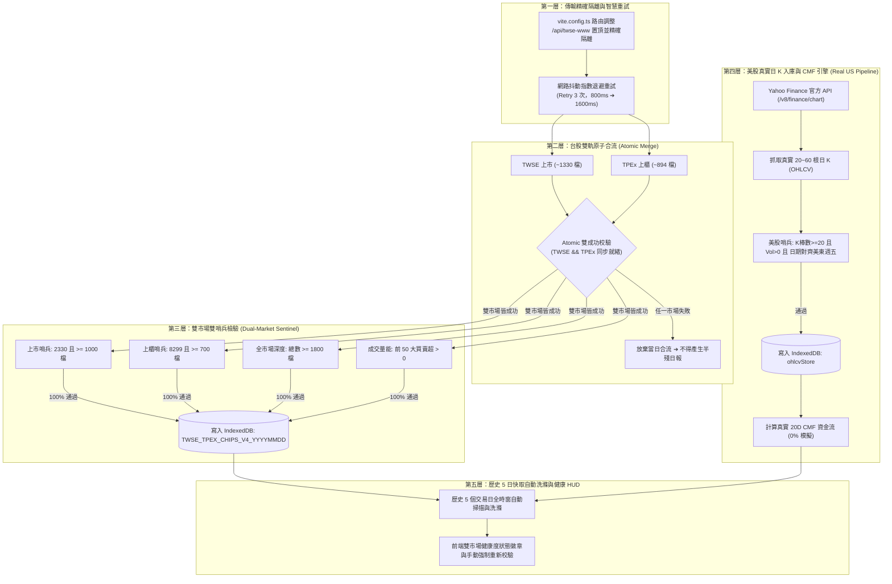

# Spec 0120: 台美雙市場全量籌碼與聰明錢動能零遺漏、原子性合流與真實入庫規格書
(Dual-Market Smart Money Zero-Loss, Atomic Ingestion & Real Data Pipeline Spec)

## 一、問題背景與現況痛點 (Problem Statement)

籌碼與聰明錢動能是投資人進行「買進訊號判定」與「風險避坑防禦」的核心決策基礎，**容不得任何模糊、不確定、資料丟失或虛擬模擬**。在實測與深度研討中，現行系統浮現三大核心缺陷與重大金融決策隱患：

### 1. Vite 代理前綴遮蔽 (Prefix Shadowing) 導致上市數據 100% 報 404，資料停滯於 9/9
- **現況問題**：2026-09-12（週六）啟動系統時，目標交易日應為 09-11（週五），但畫面上籌碼動能資料停在 9 月 9 號，9 月 10 號與 9 月 11 號資料完全空白。
- **根因剖析**：
  - 在 [`vite.config.ts`](file:///d:/APP/股票紀錄/vite.config.ts#L24-L53) 中，`/api/twse` 代理規則放置於 `/api/twse-www` 之前。
  - 當前端抓取臺灣證交所（TWSE 上市股票）日報 `/api/twse-www/rwd/zh/fund/T86...` 時，被較短前綴 `/api/twse` 優先攔截，路徑被錯誤 rewrite 為 `-www/rwd/zh/fund/T86...` 並發往 `openapi.twse.com.tw`，導致**上市股票請求 100% 回傳 `404 Not Found (nginx)`**。
  - 由於 TWSE 完全拿不到數據，系統僅抓取到櫃買中心（TPEx 上櫃股票約 894 檔）。系統多維哨兵偵測到僅 894 檔（介於 10 ~ 1199 檔之殘缺日報門檻），正確拒絕將殘缺資料寫入快取，但因連續失敗而觸發優雅降級回溯，最終退回本地已沉澱的 09/09 舊快取，導致使用者誤以為「9/10 資料丟失、9/11 未搜尋」。

### 2. 台股單邊成功即合併之非原子性合流 (Non-Atomic Merging) 隱患
- **現況問題**：目前 [`smartMoneyFetcher.ts`](file:///d:/APP/股票紀錄/src/engine/smartMoneyFetcher.ts#L286-L295) 採用 `Promise.allSettled` 同步拉取 TWSE 與 TPEx。
- **隱患剖析**：
  - 若 TWSE 上市（約 1,330 檔）成功但 TPEx 上櫃（約 894 檔）失敗，合併結果將有 1,330 檔（超過舊有 1,200 檔哨兵門檻），系統會誤判日報已完整並入庫！
  - 這將導致全市場所有上櫃股票（如 8299 群聯、6488 環球晶等）買賣超全被刷為 0 張，讓投資人面臨嚴重的籌碼誤判風險。
  - **台股日報必須遵循「全有或全無 (All-or-Nothing)」的原子性合流標準**。

### 3. 美股聰明錢 CMF 採合成虛擬 K 線，缺乏真實入庫沉澱 (Synthetic US Data Flaw)
- **現況問題**：在 [`ChipsWorkspace.tsx`](file:///d:/APP/股票紀錄/src/components/ChipsWorkspace.tsx#L190-L204) 與在庫持倉美股中，為計算 Chaikin Money Flow (CMF 資金流)，竟使用 `Array.from({ length: 20 })` 依漲跌幅正負數學平滑合成虛擬的 20 根日 K 棒！
- **金融實務矛盾**：
  - 華爾街主流機構以 20 日 CMF 作為大資金累積/派發（Accumulation/Distribution）的黃金指標，依賴每根日 K 的真實最高價、最低價、收盤價與成交量（Volume）。
  - 合成虛擬 K 線根本無法反映真實大戶是在拉高出貨（開高走低爆量）或是壓盤吸籌（開低走高爆量），嚴重背離真實市場量價結構。
  - 系統必須全面對接 Yahoo Finance 官方 Chart API，將美股持倉與核心權值 Top 25 檔的真實 20~60 根日 K 捕捉並存入 IndexedDB。

---

## 二、架構設計與解決方案 (Solution Architecture)

---

## 三、模組規格詳述 (Detailed Specifications)

### 模組 1：傳輸層精確隔離與自動重試
1. **路由排序與正則保護**：
   - 於 `vite.config.ts` 中將 `'/api/twse-www'` 排在 `'/api/twse'` 之前。
   - 確保 `/api/twse-www` 絕對不會被較短的 `/api/twse` 匹配。
2. **自動重試抓取函數 (`fetchWithRetry`)**：
   - 當發起 TWSE 或 TPEx 抓取時，若遇到非 404 之網路超時或 5xx 錯誤，自動重試最多 3 次，重試間隔為 $800\text{ms} \times 2^{(attempt-1)}$。

### 模組 2：台股雙市場雙哨兵與原子性合流
1. **原子性原則 (Atomic All-or-Nothing)**：
   - `fetchCombinedTwseAndTpex` 內部檢驗：若 `twseData` 檔數為 0 或 `tpexData` 檔數為 0，視為合流失敗，回傳 `{}`。
2. **金融級雙哨兵 (`isInstitutionalReportComplete`)**：
   - **上市哨兵**：必須包含 `2330` 台積電，且上市標的數 $\ge 1,000$ 檔。
   - **上櫃哨兵**：必須包含 `8299` 群聯，且上櫃標的數 $\ge 700$ 檔。
   - **全市場深度門檻**：總標的數 $\ge 1,800$ 檔。
   - **主力活躍度門檻**：全市場前 50 大主力股票三大法人淨買賣超張數絕對值總和 $> 0$。
   - 只有四項條件同時滿足，才允許寫入 IndexedDB 快取。

### 模組 3：美股真實 20D OHLCV 入庫與標準 CMF 引擎
1. **徹底根除合成模擬 (Zero Synthetic Candles)**：
   - 廢除 `ChipsWorkspace.tsx` 中的 `Array.from` 虛擬日 K 產生邏輯。
   - 在庫持倉美股與全市場美股焦點 Top 25 標的，一律經由 `backfillSymbolOhlcvAndIndicators` 調用 Yahoo Finance Chart API。
2. **永續入庫快取**：
   - 真實日 K 儲存於 IndexedDB `ohlcvStore`。
   - 依據真實收盤價與成交量計算標準 20 日 CMF：
     $$MFV = \frac{(Close - Low) - (High - Close)}{High - Low} \times Volume$$
     $$CMF_{20} = \frac{\sum_{i=1}^{20} MFV_i}{\sum_{i=1}^{20} Volume_i}$$
3. **美股歷史時序對齊**：
   - 歷史回放時，直接使用當時對應交易日的真實日 K 計算該日 CMF，重現真實資金流向軌跡。

### 模組 4：歷史 5 日快取自動洗滌 (Cache Wash & Auto-Backfill)
1. **增量補齊強化 (`fetchRecentTwseReports`)**：
   - 啟動時掃描最近 5 個交易日。
   - 若本地快取中存在舊版未通過雙哨兵之殘缺日報（如無台積電或總數 $< 1,800$ 檔），自動將該快取失效（Invalidate），重新發起遠端拉取並覆蓋寫入。
2. **保證 1D / 3D / 5D 動能視窗 100% 完整**：
   - 確保加總歷史計算時，每一天都是 2,200+ 檔真實全市場數據。

### 模組 5：UI 透明度與健康度狀態看板 (Data Health HUD)
1. **雙市場健康度徽章**：
   - 台股徽章：`🟢 台股已同步：09/11 盤後 (上市 1,330 檔 + 上櫃 894 檔，共 2,224 檔)`。
   - 美股徽章：`🟢 美股已同步：09/11 美東收盤 (持倉 + 焦點 25 檔，真實 20D CMF 已入庫)`。
2. **降級清楚提示**：
   - 若處於盤中或結算中，清楚標記降級原因與顯示基準日。
3. **強制全量重新校驗按鈕**：
   - 點擊「🔄 雙市場全量重新同步」按鈕，強制略過快取，重新拉取並校驗最近 5 日台美雙市場所有籌碼與日 K。

---

## 四、使用者情境與故事 (User Stories)

1. **情境一：週末打開聰明錢星圖**
   - 作為台股與美股投資人，週六早晨打開系統時，系統應自動呈現週五（09/11）已結算之完整籌碼。台股包含 1,330 檔上市與 894 檔上櫃（共 2,224 檔），美股呈現週五美東收盤之真實 20D CMF，不再平躺中軸或停在 09/09。
2. **情境二：波段動能決策 (3D / 5D)**
   - 當我切換為「3 日短波段」或「5 日週籌碼」時，系統能保證過去 3 天與 5 天的每一筆日報都是完整 2,200+ 檔數據，精準加總出「外資投信合買股」與「主力大提款股」，不會因某日殘缺導致波段計算失真。
3. **情境三：美股持倉即時分析**
   - 當我切換至在庫持倉的美股（如 NVDA, AAPL），我看到的是基於 Yahoo Finance 真實 20 日日 K 所算出的真實 CMF，而不是數學公式模擬出的假資金流，讓我能安心判斷機構籌碼動態。

---

## 五、驗收標準 (Acceptance Criteria)

- [ ] **AC 1 (傳輸無遮蔽)**：本地發送 `/api/twse-www/rwd/zh/fund/T86?...` 成功取得 200 與 1,330+ 檔上市數據，無 404 錯誤。
- [ ] **AC 2 (原子性合流)**：若 TWSE 或 TPEx 任一市場為空，合流日報必須為空，嚴禁產出只有單邊市場的日報。
- [ ] **AC 3 (雙哨兵把關)**：`isInstitutionalReportComplete` 正確驗證上市（含 2330 且 $\ge 1000$ 檔）與上櫃（含 8299 且 $\ge 700$ 檔），未達標者絕不寫入快取。
- [ ] **AC 4 (美股真實日 K)**：在庫美股與焦點 Top 25 標的之 CMF 100% 由真實 20D 日 K（OHLCV）計算，移除所有虛擬模擬產生代碼。
- [ ] **AC 5 (歷史快取洗滌)**：啟動時自動洗滌並補齊最近 5 個交易日之台美雙市場日報，IndexedDB 內歷史交易日皆達 2,200+ 檔。
- [ ] **AC 6 (測試 100% 綠燈)**：既有測試與新測試全數通過，`npm test` 零錯誤，`npm run build` 零報錯。

---

## 六、實作任務票券拆解 (Task Tickets)

- **Ticket 01**：修正 `vite.config.ts` 代理規則順序與路徑隔離，加入 `fetchWithRetry` 機制。
- **Ticket 02**：升級 `smartMoneyFetcher.ts` 雙市場原子性合流與雙哨兵檢驗（2330 + 8299，總數 $\ge 1800$）。
- **Ticket 03**：改造美股日 K 抓取管線，拔除虛擬合成日 K，全面對接 Yahoo Finance 真實 20D OHLCV 與 CMF。
- **Ticket 04**：強化歷史 5 日日報補齊與殘缺快取自動洗滌管線。
- **Ticket 05**：UI 雙市場健康度徽章 (HUD) 與「強制雙市場全量重新同步」功能。
- **Ticket 06**：編寫全量單元測試（TDD 驗證），保證台美雙市場 100% 覆蓋。
