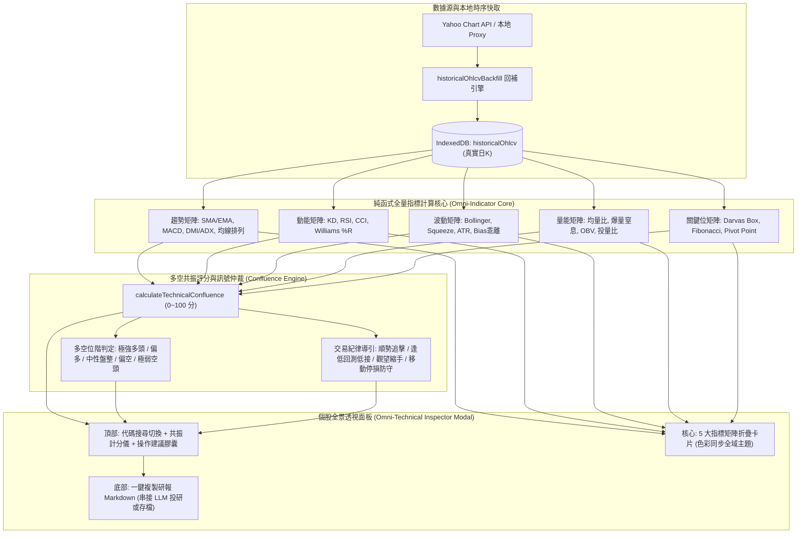

# Spec 0121: 全市場個股全技術指標透視分析系統規格書
(Omni-Technical Indicator Analysis & Confluence Radar Spec)

- **狀態**：`PROPOSED`
- **日期**：2026-09-12
- **負責人**：AI Pair Programmer & User
- **關聯技術債**：[技術債 #0037](../debts/0037-equity-deep-dive-seven-step-framework.md)
- **前置架構依賴**：[ADR 0091 (本地全量歷史技術指標庫與外部回補架構)](../adr/0091-local-historical-indicators-and-external-backfill-engine.md) · [ADR 0104 (肌肉書僮真實日 K 體系)](../adr/0104-muscle-booker-ssot-real-candles-and-synthetic-removal.md)

---

## 一、 問題背景與現況痛點 (Problem Statement)

在個人股票交易實務中，投資人面臨以下四大技術分析痛點：

### 1. 指標碎片化與深度斷層
現行系統雖然在 [ADR 0091](../adr/0091-local-historical-indicators-and-external-backfill-engine.md) 導入了歷史日 K 線回補與肌肉書僮箱子戰術，並在持倉列表呈現少量訊號膠囊（如「KD高檔鈍化」、「突破箱頂」），但缺少成熟交易體系必備之完整維度：
- **動能擺盪缺漏**：缺少 RSI (相對強弱指標)、CCI (順勢指標)、Williams %R (威廉指標)。
- **趨勢強弱缺漏**：缺少 DMI / ADX (趨向指標與趨勢強度)、均線多空排列矩陣。
- **量能資金流缺漏**：缺少 OBV (能量潮累積) 與價量背離判定。
- **關鍵支撐壓力缺漏**：缺少 Fibonacci 黃金分割位 (0.382 / 0.5 / 0.618) 與經典樞紐點 (Pivot Points)。

### 2. 多指標矛盾與「分析癱瘓」 (Analysis Paralysis)
當 KD 超買但 RSI 剛轉強、或 MACD 綠柱收斂但均線呈空頭排列時，投資人往往無所適從。現行系統缺乏**「多空共振量化整合計分機制 (Technical Confluence Score)」**，無法將十餘種指標收斂為單一客觀的多空能量評級與紀律導引。

### 3. 缺乏全市場自由代碼隨選透視 (Ad-hoc On-Demand Analysis)
目前技術指標散見於在庫持股或特定動能觀察池，使用者若想針對任意市場代碼（如台股 `2330`、`3037`，美股 `NVDA`、`AAPL`）快速執行完整技術體檢，缺乏一站式的「個股全指標透視彈窗 (Technical Inspector Modal)」。

---

## 二、 架構設計與解決方案 (Solution Architecture)



---

## 三、 詳細技術規格 (Technical Specifications)

### 1. 核心資料模型 (`src/types/omniIndicator.ts`)

```ts
import { BoxStatus, TrendSlope } from './indicators';

// 1. 趨勢指標群
export interface TrendMetrics {
  ma5?: number;
  ma20?: number;
  ma60?: number;
  ma120?: number;
  ma240?: number;
  maAlignment: 'BULLISH' | 'BEARISH' | 'ENTANGLED'; // 多頭排列 / 空頭排列 / 糾結
  macd: {
    dif: number;
    signal: number;
    hist: number;
    isGoldenCross: boolean;
    isDeathCross: boolean;
  };
  dmiAdx?: {
    pdi: number; // +DI
    mdi: number; // -DI
    adx: number; // 趨勢強度 (>=25 代表強趨勢)
    trendDirection: 'BULLISH' | 'BEARISH' | 'RANGE';
  };
}

// 2. 動能擺盪指標群
export interface MomentumMetrics {
  rsi6?: number;
  rsi14?: number;
  rsi24?: number;
  rsiStatus: 'OVERBOUGHT' | 'BULLISH' | 'NEUTRAL' | 'BEARISH' | 'OVERSOLD';
  kd9: {
    k: number;
    d: number;
    status: 'GOLDEN_CROSS' | 'DEATH_CROSS' | 'HIGH_DULL' | 'LOW_DULL' | 'NEUTRAL';
  };
  cci20?: number; // 順勢指標 (>100 超買, <-100 超賣)
  williamsR14?: number; // 威廉指標 (0~-20 超買, -80~-100 超賣)
}

// 3. 波動通道指標群
export interface VolatilityMetrics {
  bollinger: {
    upper: number;
    mid: number;
    lower: number;
    bandwidthPercent: number;
    percentB: number; // (Price - Lower) / (Upper - Lower)
    isSqueeze: boolean; // 帶寬 <= 8%
  };
  atr14: number;
  trailingDefensePrice: number; // 滾動波段最高價 - 2.5 * ATR
  bias20Percent: number; // (Close - MA20) / MA20 * 100%
  bias60Percent: number;
}

// 4. 量能與資金流指標群
export interface VolumeFlowMetrics {
  yesterdayVolume: number;
  avgVolume5: number;
  avgVolume20: number;
  volumeRatio5: number; // 昨日量 / 5日均量
  isSurge: boolean;     // 量能放大 >= 1.8x
  isDryUp: boolean;     // 量能窒息 <= 0.35x
  obv: {
    current: number;
    trend: 'RISING' | 'FALLING' | 'FLAT';
  };
  trustNetBuyRatio?: number; // 投量比 % (台股)
}

// 5. 關鍵支撐壓力與價格位階群
export interface SupportResistanceLevels {
  darvasBox: {
    upper: number;
    lower: number;
    status: BoxStatus;
  };
  fibonacci: {
    high: number;
    low: number;
    fib236: number; // 0.236
    fib382: number; // 0.382
    fib500: number; // 0.500
    fib618: number; // 0.618
    fib786: number; // 0.786
  };
  pivotPoints: {
    pivot: number; // (H + L + C) / 3
    r1: number;    // 2P - L
    r2: number;    // P + (H - L)
    s1: number;    // 2P - H
    s2: number;    // P - (H - L)
  };
}

// 6. 多空共振量化評估結果
export interface TechnicalConfluence {
  score: number; // 0 ~ 100 分
  rating: 'STRONG_BULL' | 'MODERATE_BULL' | 'NEUTRAL' | 'MODERATE_BEAR' | 'STRONG_BEAR';
  primarySignals: string[]; // 核心多空特徵條列 (如: "均線多頭排列", "MACD紅柱擴張")
  actionAdvice: string;     // 具體紀律指引 (如: "多頭動能強勁，跌破移動防守線前續抱")
  riskAlert?: string;       // 潛在風險預警 (如: "KD已進入極端超買區，慎防正乖離過大短拉回")
}

// 7. 個股全指標整合資料包
export interface OmniIndicatorReport {
  symbol: string;
  name: string;
  market: 'TW' | 'US';
  asOfDate: string;
  currentPrice: number;
  candleCount: number;
  trend: TrendMetrics;
  momentum: MomentumMetrics;
  volatility: VolatilityMetrics;
  volumeFlow: VolumeFlowMetrics;
  levels: SupportResistanceLevels;
  confluence: TechnicalConfluence;
}
```

---

### 2. 演算法精確數學定義 (`src/engine/omniIndicatorEngine.ts`)

#### (1) RSI (Wilder's Smoothing, 週期 N=14)
$$\text{Up}_t = \max(C_t - C_{t-1}, 0), \quad \text{Down}_t = \max(C_{t-1} - C_t, 0)$$
$$\overline{\text{Up}}_t = \frac{\overline{\text{Up}}_{t-1} \times (N - 1) + \text{Up}_t}{N}, \quad \overline{\text{Down}}_t = \frac{\overline{\text{Down}}_{t-1} \times (N - 1) + \text{Down}_t}{N}$$
$$\text{RS} = \frac{\overline{\text{Up}}_t}{\overline{\text{Down}}_t}, \quad \text{RSI} = 100 - \frac{100}{1 + \text{RS}}$$
*防禦邊界*：當 $\overline{\text{Down}}_t = 0$ 時，$\text{RSI} = 100$；當 $\overline{\text{Up}}_t = 0$ 時，$\text{RSI} = 0$。

#### (2) DMI / ADX (週期 N=14)
$$\text{TR} = \max(H - L, |H - C_{\text{prev}}|, |L - C_{\text{prev}}|)$$
$$+DM = \begin{cases} H - H_{\text{prev}} & \text{if } H - H_{\text{prev}} > L_{\text{prev}} - L \text{ and } > 0 \\ 0 & \text{otherwise} \end{cases}$$
$$-DM = \begin{cases} L_{\text{prev}} - L & \text{if } L_{\text{prev}} - L > H - H_{\text{prev}} \text{ and } > 0 \\ 0 & \text{otherwise} \end{cases}$$
$$\text{PDI} = \frac{\text{Smooth}(+DM, 14)}{\text{Smooth}(TR, 14)} \times 100, \quad \text{MDI} = \frac{\text{Smooth}(-DM, 14)}{\text{Smooth}(TR, 14)} \times 100$$
$$\text{DX} = \frac{|\text{PDI} - \text{MDI}|}{\text{PDI} + \text{MDI}} \times 100, \quad \text{ADX} = \text{Smooth}(\text{DX}, 14)$$

#### (3) CCI (順勢指標, 週期 N=20)
$$\text{TP} = \frac{H + L + C}{3}, \quad \text{SMA}_{\text{TP}} = \frac{1}{N}\sum \text{TP}$$
$$\text{MD} = \frac{1}{N}\sum |\text{TP} - \text{SMA}_{\text{TP}}|$$
$$\text{CCI} = \frac{\text{TP} - \text{SMA}_{\text{TP}}}{0.015 \times \text{MD}}$$

#### (4) Williams %R (週期 N=14)
$$\%R = \frac{\text{HighestHigh}_{14} - \text{Close}}{\text{HighestHigh}_{14} - \text{LowestLow}_{14}} \times (-100)$$

#### (5) OBV (能量潮累積)
$$\text{OBV}_t = \begin{cases} \text{OBV}_{t-1} + V_t & \text{if } C_t > C_{t-1} \\ \text{OBV}_{t-1} - V_t & \text{if } C_t < C_{t-1} \\ \text{OBV}_{t-1} & \text{if } C_t = C_{t-1} \end{cases}$$

#### (6) 多空共振計分權重分配 (Confluence Weighting)
以 100 分為基底基準，50 分為中性：
- **趨勢維度 (權重 35%)**：
  - 均線多頭排列 (+15) / 空頭排列 (-15)
  - 站上 MA20 (+10) / 跌破 MA20 (-10)
  - MACD 柱狀體翻紅 (+10) / 翻綠 (-10)
- **動能維度 (權重 25%)**：
  - RSI 介於 50~70 之強勢上升區 (+10) / RSI < 40 (-10)
  - KD 黃金交叉 (+10) / 死亡交叉 (-10)
  - CCI > 0 (+5) / CCI < 0 (-5)
- **型態與支撐 (權重 20%)**：
  - 突破 Darvas 箱頂 (+10) / 跌破箱底 (-10)
  - 站穩 Fibonacci 0.618 強支撐 (+10)
- **量能與資金 (權重 20%)**：
  - 攻擊帶量 (成交量 > 5日均量 1.5x 且收紅, +10)
  - OBV 向上創高 (+10) / 破底 (-10)
- **綜合區間分級**：
  - $\ge 80$ 分：`STRONG_BULL` (強勢多頭)
  - $60 \sim 79$ 分：`MODERATE_BULL` (偏多整理)
  - $41 \sim 59$ 分：`NEUTRAL` (多空平衡 / 觀望)
  - $21 \sim 40$ 分：`MODERATE_BEAR` (偏空修正)
  - $\le 20$ 分：`STRONG_BEAR` (空頭急跌)

---

## 四、 測試案例與驗收標準 (Test Cases & Seam Verification)

### 1. 單元測試縫隙 (Test Seams)
- **`calculateRSI.test.ts`**：
  - 連續 14 天上漲：RSI 精確收斂至 100。
  - 連續 14 天平盤或下跌：RSI 精確收斂至 0。
  - 驗證 Wilder 平滑算法與標準 TradingView / TA-Lib 數據比對誤差 $\le 0.05\%$。
- **`calculateDMI_ADX.test.ts`**：
  - 趨勢明確走多時，PDI > MDI 且 ADX 爬升 $> 25$。
  - 盤整行情時，ADX 跌破 20。
- **`calculateTechnicalConfluence.test.ts`**：
  - 全多頭強共振樣本：分數落在 $80 \sim 100$。
  - 全空頭破線樣本：分數落在 $0 \sim 25$。
  - 矛盾震盪樣本：分數落在 $45 \sim 55$。
- **極端與邊界容錯**：
  - K 棒數為 0 或小於週期長度：優雅回傳 `undefined`，絕不拋出運行時錯誤 (Runtime Error)。
  - 成交量全為 0 之標的：OBV 與量能比率平滑降級。

### 2. UI 互動驗收標準
- 在任意標的點擊「📊 全指標透視」或於搜尋欄輸入代碼後，在 **300ms 內完成計算並渲染**。
- 支援紅漲綠跌（台股模式）與綠漲紅跌（國際模式）即時全域 CSS 變數切換。
- 提供「📋 一鍵複製 Markdown 診斷報告」，格式完美對齊大模型提示詞結構。

---

## 五、 非功能性需求與邊界防禦 (Non-Functional Requirements)

1. **純函式與無副作用 (Zero Side-Effects)**：
   - 所有的指標計算函式皆為純輸入、純輸出之純量函數，不對外發起非同步請求或篡改輸入陣列。
2. **KISS 原則與無龐大依賴**：
   - 100% 以原生 TypeScript 數學運算實現，杜絕引入體積龐大的第三方圖表套件（如 TradingView 或 heavy charting libs），保持專案輕巧快速。
3. **離線與快取保護**：
   - 優先讀取 IndexedDB 本地已快取的日 K 線，未滿 6 小時不重複向外部伺服器發送網路請求，保護 API 額度並符合 GitHub / Yahoo 存取禮儀。
