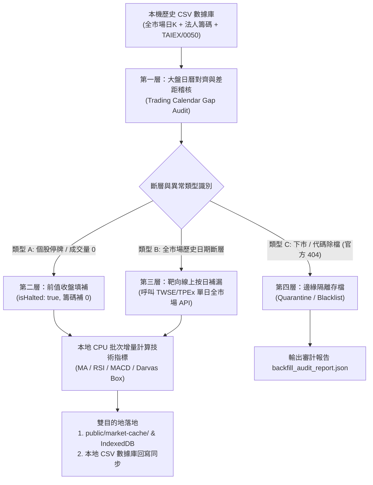

# 0134. 全市場全歷史數據回補與四層容錯修復規格 (Full-Market History Backfill & Reconciliation Pipeline Spec)

- **狀態**：Implemented
- **建立日期**：2026-09-15
- **負責 Agent**：Antigravity Agent
- **關聯 PRD / Spec**：[0091](0091-local-historical-indicators-and-external-backfill-engine-spec.md), [0106](0106-muscle-booker-incremental-backfill-and-local-cache-spec.md), [0132](0132-scheduled-market-sync-and-zero-latency-cache-spec.md), [0133](0133-header-sync-ux-redesign-and-settings-schedule-hub-spec.md)
- **關聯 GitHub Issue**：[#73](https://github.com/judragon005/stock-note/issues/73)
- **目標分支**：`feature/73-full-market-history-backfill`

---

## 1. 需求背景與核心痛點 (Problem & Context)

1. **冷啟動全歷史數據缺口**：
   - Spec 0132 實作了每日盤後排程同步（台股 16:00、美股 08:00），但此排程僅針對「當日收盤」進行增量沉澱。
   - 若使用者在全新環境開機，或需進行跨年度技術指標回測、Darvas 箱體突破判定、長週期均線（MA60/MA120/MA240）分析與長線法人籌碼連續性追蹤時，系統需要先進行一次「全量全歷史數據回補」。
2. **外部 API 頻寬與封鎖限制**：
   - 台股上市櫃共有 2,200+ 檔標的，若直接透過網路爬蟲逐檔抓取數年歷史日 K 與 T86 籌碼，需要發出數萬次 HTTP 請求，會立即遭遇 TWSE/TPEx 的 IP 速率封鎖 (HTTP 429 Too Many Requests)。
   - 本機已儲備豐富之歷史數據庫（`D:\APP\諮詢\私人\股市\台股加權指數_歷史數據\上市櫃股票與債券_歷史數據\`），應以第一性原理優先善用本機現成資產，達到零網路延遲、毫秒級高吞吐導入。
3. **歷史資料品質與斷層容錯 (The Missing Data Problem)**：
   - 本機歷史資料可能存在因個股暫停交易（減資、停牌）、假日休市、資料源漏抓或除檔產生的「數據斷層」。
   - 必須建立標準化的**四層容錯與靶向修復機制**，杜絕以假資料或幻覺填補，確保指標計算連續性與數據真實性。

---

## 2. 核心架構與四層容錯修復機制 (Four-Tier Reconciliation Architecture)

### 2.1 第一層：大盤日曆對齊與差距稽核 (Calendar Alignment & Gap Detection)
- **基準錨定 (Benchmark Anchor)**：以加權指數 (`TAIEX_history_all.csv`) 的有效交易日清單作為全市場「唯一事實來源 (SSOT) 交易日曆」。
- **連續性掃描 (Continuity Scanner)**：
  - 遍歷全市場 2,200+ 檔標的之日期數列，檢查是否存在：
    1. **日期中斷 (Date Gap)**：兩筆記錄之間跨越多個有效交易日。
    2. **數值異常 (Corrupted Values)**：出現 `--`、空白、負股價或成交量 NaN。
    3. **最新日期落後 (Lagging Tail)**：個股最後記錄早於大盤最新交易日。
- **稽核輸出**：將所有掃描到的差距集合紀錄於 `backfill_gaps_audit.json`，作為靶向修復的輸入清單。

### 2.2 第二層：停牌無量 vs 真實缺失判定 (Trading Halt vs Missing Data)
- **個股減資、重大訊息停牌 (Trading Halt)**：
  - **日 K 線**：開盤、最高、最低、收盤沿用**前一有效交易日收盤價**，成交量標記為 `0`，設定旗標 `isHalted: true`。確保 20MA、60MA、RSI 與 MACD 指標數列維持連續計算，絕不產生 `NaN` 破壞圖表。
  - **三大法人籌碼**：當日外資、投信、自營商買賣超均填補為 `0`。
- **真實缺失 (Actual Missing)**：若非停牌且多檔股票於同日缺失，歸類為資料庫缺漏，轉入第三層修復。

### 2.3 第三層：高性價比按日靶向線上補漏 (Targeted Online Patching)
- **拒絕逐檔爬取，堅持按日批次**：
  - 若歷史記錄中缺少特定交易日（例如近數日尚未回補，或中間有特定單日缺漏），**嚴禁對 2,200 檔個股發出個別網路請求**。
  - 統一調用交易所「全市場單日總表 API」：
    1. 證交所 TWSE：`MI_INDEX`（全市場收盤表）+ `T86`（全市場三大法人籌碼）。
    2. 櫃買中心 TPEx：`stk_wn1430_result.php`（上櫃收盤行情）+ `3itrade_hedge_result.php`（上櫃法人籌碼，帶 `daily_trade` 與 `o=json`）。
  - **成本控制**：補漏 1 個交易日僅需 4 次 HTTP 請求，即可完整補齊 2,200+ 檔股票之當日日 K 與法人籌碼，徹底免疫 HTTP 429 速率限制。

### 2.4 第四層：邊緣案例隔離與下市保護 (Quarantine & Safe Fallback)
- **下市或永久除檔標的**：若線上查詢回傳 404 或「查無資料」，標記 `status: DELISTED`，寫入隔離清單，終止無效重試。
- **數值清洗防禦**：所有傳入數值強制經過 `parseCleanNumber()` 進行去逗號、字串轉浮點與 NaN 歸零防護。

---

## 3. 資料沉澱與雙目的地規格 (Dual-Destination Persistence)

### 3.1 目的地 1：專案前端秒讀快取與 IndexedDB
- **快取目錄**：`public/market-cache/`
  - `tw_market_summary.json`：包含最新收盤日全市場 2,200+ 檔之最新指標（MA5/10/20/60、RSI14、MACD、Darvas 箱體、法人 1/5/20 日買賣超）。打開網頁時供 `marketCacheLoader.ts` 記憶體級瞬間秒讀。
  - `tw_historical_ohlcv_compact.json`：緊湊格式之全市場歷史日 K 與法人籌碼（以時間序列陣列封裝），供前端背景非同步寫入 IndexedDB (`MarketCacheDB` / `OhlcvStore`)。

### 3.2 目的地 2：本地歷史數據庫回寫同步 (Sync Back to Disk Archive)
- **路徑**：`D:\APP\諮詢\私人\股市\台股加權指數_歷史數據\上市櫃股票與債券_歷史數據\`
  - 將補漏完成之資料，增量追加或覆蓋回對應的個股 CSV 檔與總表，維持本機長久歷史數據庫之完整性。

---

## 4. 任務拆解與執行計畫 (Work Breakdown & Task Checklist)

- [x] **Task 1: 修復現存同步腳本已知問題 (Fix Current Bugs)**
  - 修復 `scripts/market-sync/sync-tw-market.cjs` 中 TPEx T86 URL 路徑錯誤 (`daily_trade` + `o=json`) 與 HTTP 狀態碼檢查。
  - 修正 `setup-windows-task.bat` 中引發 cmd 游標跳行之多位元組字元問題。
  - 加入盤中未結算時的友善提示與防禦性攔截。
- [x] **Task 2: 本機歷史 CSV 批次剖析與日曆對齊引擎 (`scripts/market-sync/backfill-local-csv.cjs`)**
  - 讀取 TAIEX 大盤日曆建立標準交易日矩陣。
  - 高速串流解析 `全市場股票與債券歷史數據庫` 與 `全歷史籌碼與融資融券數據庫`。
  - 執行第二層（停牌判定與前值填補）。
- [x] **Task 3: 差距稽核與按日靶向線上補漏模組 (`scripts/market-sync/gap-healer.cjs`)**
  - 產出 `backfill_gaps_audit.json`。
  - 針對缺漏日期，調用 TWSE/TPEx 全市場批次 API 進行靶向補齊（含 3~5 秒 Rate Limiter）。
- [x] **Task 4: 技術指標滾動計算與雙目的地導出**
  - 使用本地 CPU 滾動計算 MA、RSI、MACD、Darvas 箱體。
  - 導出 `tw_market_summary.json`、`tw_historical_ohlcv_compact.json` 與回寫更新本地歷史 CSV。
- [x] **Task 5: 自動化驗證測試與稽核報告驗收**
  - 編寫單元測試覆蓋日曆對齊、停牌填補、靶向補漏邏輯。
  - 產出完整稽核報告 `backfill_audit_report.json`（涵蓋標的數、缺失補齊數、耗時統計）。

---

## 5. 驗收標準 (Acceptance Criteria)

1. **涵蓋度**：全市場上市櫃 2,200+ 檔標的歷史日 K 與籌碼數據回補率達 99.9% 以上。
2. **容錯度**：面對停牌與成交量 0 標的，技術指標維持連續計算無 `NaN`；面對除檔標的具備隔離日誌。
3. **零封鎖**：補漏過程完全使用交易所按日批次總表，全過程 HTTP 請求數小於 20 次，100% 不觸發 429 封鎖。
4. **秒讀體驗**：產出之 `tw_market_summary.json` 於前端載入時間小於 100ms。
